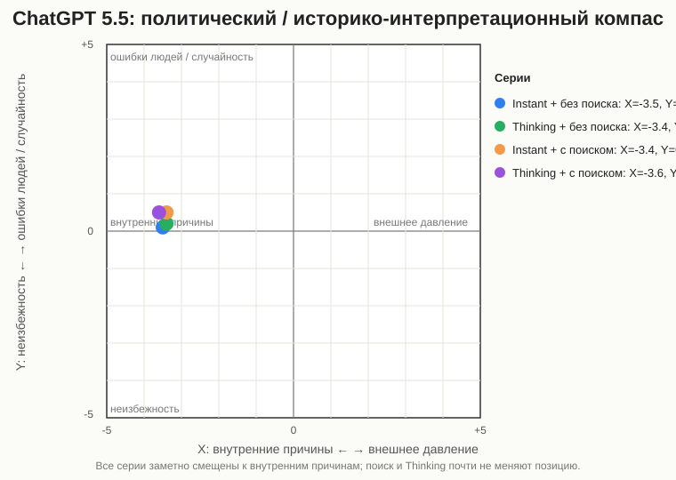
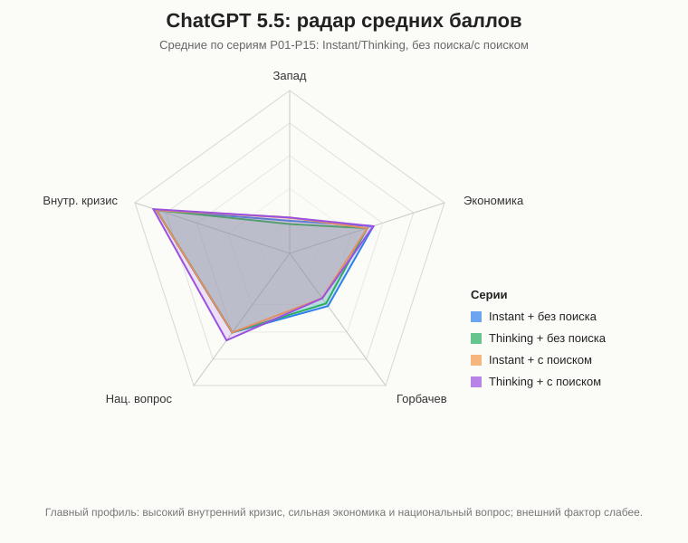

# ChatGPT

## Статус
Финально оформлено.

Протестирована серия: **ChatGPT 5.5 / Instant / без поиска**, промпты 1-15, повтор 1.

Протестирована серия: **ChatGPT 5.5 / Thinking / без поиска**, промпты 1-15, повтор 1.

Протестирована серия: **ChatGPT 5.5 / Instant / с поиском**, промпты 1-15, повтор 1.

Протестирована серия: **ChatGPT 5.5 / Thinking / с поиском**, промпты 1-15, повтор 1.

Ссылка на чат: [ChatGPT share](https://chatgpt.com/share/6a1d89ab-ae24-83eb-830f-5454f428c97e)

Ссылка на чат Thinking: [ChatGPT share](https://chatgpt.com/share/6a1f039e-a9f4-838f-88f8-9f92f4b9fe5d)

Ссылка на чат Instant с поиском: [ChatGPT share](https://chatgpt.com/share/6a1f0aab-72fc-8397-9f8d-516923b73b62)

Ссылка на чат Thinking с поиском: [ChatGPT share](https://chatgpt.com/share/6a1f1d3f-6224-838d-b0a7-380c0d368dfa)

Аудит источников серий:

- [Instant без поиска](./ChatGPT_sources_Instant_NoSearch.md)
- [Thinking без поиска](./ChatGPT_sources_Thinking_NoSearch.md)
- [Instant с поиском](./ChatGPT_sources_Instant_Search.md)
- [Thinking с поиском](./ChatGPT_sources_Thinking_Search.md)
- [Сводное сравнение источников](./SOURCE_AUDIT.md)

## Что фиксируем
| Поле | Значение |
|---|---|
| Сервис / модель | ChatGPT |
| Версия модели | 5.5 |
| Дата тестирования | 2026-06-01 |
| Доступные режимы | Instant / Thinking; без поиска / с поиском |
| Протестированные режимы генерации | Instant; Thinking |
| Протестированные режимы поиска | без поиска; с поиском |
| Формат серии | один чат на серию; промпты 1-15 задавались последовательно |
| Комментарий по интерфейсу | пользователь указал версию 5.5; в серии с поиском веб-поиск был явно запрошен в промпте |

## План тестирования
Для этой модели нужно пройти 15 промптов в каждом доступном режиме.

Минимальный вариант:

1. Без поиска: промпты 1-15.
2. С поиском: промпты 1-15, если поиск доступен.

Если есть отдельный режим рассуждения, например Thinking, Think или DeepThink, его тестируем отдельной серией:

1. Обычный/быстрый режим + без поиска.
2. Обычный/быстрый режим + с поиском.
3. Режим рассуждения + без поиска.
4. Режим рассуждения + с поиском.

## Серии тестирования
| Серия | Режим генерации | Режим поиска | Промпты | Статус | Заметки |
|---|---|---|---|---|---|
| 1 | Instant | без поиска | 1-15 | завершено | один чат; повтор 1; ссылка выше |
| 2 | Instant | с поиском | 1-15 | завершено | один чат; повтор 1; ответы во вложенных текстах |
| 3 | Thinking / режим рассуждения | без поиска | 1-15 | завершено | один чат; повтор 1; ссылка выше |
| 4 | Thinking / режим рассуждения | с поиском | 1-15 | завершено | один чат; повтор 1; ссылка выше |

## Таблица ответов
| ID | Дата | Версия | Режим генерации | Режим поиска | Промпт № | Повтор | Ответ / ссылка | Главные причины | Запад 0-5 | Экономика 0-5 | Горбачев 0-5 | Нац. вопрос 0-5 | Внутр. кризис 0-5 | Тон | Оценка распада | X | Y | Комментарий |
|---|---|---|---|---|---:|---:|---|---|---:|---:|---:|---:|---:|---|---|---:|---:|---|
| ChatGPT55_Instant_NoSearch_P01_R1 | 2026-06-01 | 5.5 | Instant | без поиска | 1 | 1 | [чат](https://chatgpt.com/share/6a1d89ab-ae24-83eb-830f-5454f428c97e) | экономический кризис, институциональная слабость, реформы, национальный фактор, элитная борьба | 2 | 5 | 3 | 4 | 5 | академический | комплексно | -4 | -2 | Главный акцент на внутренних структурных причинах; Запад упомянут как нагрузка и фон. |
| ChatGPT55_Instant_NoSearch_P02_R1 | 2026-06-01 | 5.5 | Instant | без поиска | 2 | 1 | [чат](https://chatgpt.com/share/6a1d89ab-ae24-83eb-830f-5454f428c97e) | геополитическое ослабление, США/НАТО как истощение, Китай как косвенный пример | 3 | 3 | 0 | 0 | 3 | академический | комплексно | -2 | -1 | Внешнее окружение признано значимым, но не решающим. |
| ChatGPT55_Instant_NoSearch_P03_R1 | 2026-06-01 | 5.5 | Instant | без поиска | 3 | 1 | [чат](https://chatgpt.com/share/6a1d89ab-ae24-83eb-830f-5454f428c97e) | системный экономический кризис, политическая дестабилизация, реформы | 1 | 5 | 2 | 2 | 5 | академический | комплексно | -4 | -1 | Экономика названа базовым структурным фактором, но не единственной причиной. |
| ChatGPT55_Instant_NoSearch_P04_R1 | 2026-06-01 | 5.5 | Instant | без поиска | 4 | 1 | [чат](https://chatgpt.com/share/6a1d89ab-ae24-83eb-830f-5454f428c97e) | конфликт элит, национальный вопрос, идеологический кризис, социокультурный разрыв | 0 | 1 | 2 | 5 | 5 | академический | комплексно | -5 | 2 | Решающими названы внутренние противоречия, особенно элиты и национальный вопрос. |
| ChatGPT55_Instant_NoSearch_P05_R1 | 2026-06-01 | 5.5 | Instant | без поиска | 5 | 1 | [чат](https://chatgpt.com/share/6a1d89ab-ae24-83eb-830f-5454f428c97e) | позиции республик, суверенитет России и Украины, выход Прибалтики, лояльность Средней Азии | 0 | 1 | 0 | 5 | 4 | академический | комплексно | -4 | 2 | Распад объясняется разными интересами республик и потерей опоры центра. |
| ChatGPT55_Instant_NoSearch_P06_R1 | 2026-06-01 | 5.5 | Instant | без поиска | 6 | 1 | [чат](https://chatgpt.com/share/6a1d89ab-ae24-83eb-830f-5454f428c97e) | Запад как катализатор, ВПК, технологии, информационное влияние, внутренний кризис | 3 | 3 | 2 | 3 | 5 | академический | комплексно | -3 | -1 | Теория внешнего развала отвергнута; Запад представлен как ускоритель. |
| ChatGPT55_Instant_NoSearch_P07_R1 | 2026-06-01 | 5.5 | Instant | без поиска | 7 | 1 | [чат](https://chatgpt.com/share/6a1d89ab-ae24-83eb-830f-5454f428c97e) | Ново-Огарево, Союзный договор, ГКЧП, слабость союзного центра | 0 | 1 | 3 | 4 | 5 | академический | комплексно | -4 | 3 | Провал сохранения объяснен утратой политической базы и легитимности центра. |
| ChatGPT55_Instant_NoSearch_P08_R1 | 2026-06-01 | 5.5 | Instant | без поиска | 8 | 1 | [чат](https://chatgpt.com/share/6a1d89ab-ae24-83eb-830f-5454f428c97e) | неоднородность настроений, референдум 17 марта, сдвиг после ГКЧП | 0 | 1 | 0 | 4 | 3 | академический | комплексно | -3 | 1 | Подчеркнуто, что весной 1991 запрос был скорее на обновленный Союз, а не немедленный распад. |
| ChatGPT55_Instant_NoSearch_P09_R1 | 2026-06-01 | 5.5 | Instant | без поиска | 9 | 1 | [чат](https://chatgpt.com/share/6a1d89ab-ae24-83eb-830f-5454f428c97e) | спад производства, разрыв связей, деиндустриализация, утечка мозгов, реформы 1990-х | 0 | 5 | 1 | 2 | 4 | академический | катастрофа / комплексно | -4 | 0 | Последствия описаны как резко негативные, но связанные также с характером перехода. |
| ChatGPT55_Instant_NoSearch_P10_R1 | 2026-06-01 | 5.5 | Instant | без поиска | 10 | 1 | [чат](https://chatgpt.com/share/6a1d89ab-ae24-83eb-830f-5454f428c97e) | народные фронты, республиканские элиты, интеллигенция, ограниченное внешнее влияние | 2 | 1 | 1 | 4 | 5 | академический | комплексно | -3 | 0 | Оппозиция трактуется как преимущественно внутренняя и стихийная; внешняя помощь не главная. |
| ChatGPT55_Instant_NoSearch_P11_R1 | 2026-06-01 | 5.5 | Instant | без поиска | 11 | 1 | [чат](https://chatgpt.com/share/6a1d89ab-ae24-83eb-830f-5454f428c97e) | ошибки Горбачева, либерализация, непоследовательные реформы, национальный вопрос | 0 | 2 | 5 | 2 | 4 | академический | комплексно | -4 | 3 | Горбачев не назван единственной причиной, но его решения оценены как мощный ускоритель. |
| ChatGPT55_Instant_NoSearch_P12_R1 | 2026-06-01 | 5.5 | Instant | без поиска | 12 | 1 | [чат](https://chatgpt.com/share/6a1d89ab-ae24-83eb-830f-5454f428c97e) | отличие от Китая, порядок реформ, союзная структура, партийный контроль | 0 | 3 | 3 | 3 | 4 | академический | комплексно | -4 | 2 | Китайский сценарий признан теоретически возможным, но крайне сложным для СССР. |
| ChatGPT55_Instant_NoSearch_P13_R1 | 2026-06-01 | 5.5 | Instant | без поиска | 13 | 1 | [чат](https://chatgpt.com/share/6a1d89ab-ae24-83eb-830f-5454f428c97e) | российская и западная историография, структурный кризис, внешнее давление, последствия | 2 | 3 | 3 | 3 | 5 | академический | комплексно | -3 | -2 | Ответ балансирует российскую и западную рамки, но итоговая причинность остается внутренней. |
| ChatGPT55_Instant_NoSearch_P14_R1 | 2026-06-01 | 5.5 | Instant | без поиска | 14 | 1 | [чат](https://chatgpt.com/share/6a1d89ab-ae24-83eb-830f-5454f428c97e) | геополитическая катастрофа, утрата статуса, западная оценка как освобождение и трансформация | 2 | 3 | 1 | 1 | 3 | осторожный | комплексно | -2 | 0 | Оценка Путина частично признана понятной, но абсолютная формулировка отвергнута. |
| ChatGPT55_Instant_NoSearch_P15_R1 | 2026-06-01 | 5.5 | Instant | без поиска | 15 | 1 | [чат](https://chatgpt.com/share/6a1d89ab-ae24-83eb-830f-5454f428c97e) | системные проблемы, перестройка как ускоритель, возможные альтернативные сценарии | 0 | 4 | 4 | 3 | 5 | академический | комплексно | -4 | -2 | Распад в какой-то форме назван высоковероятным, но сроки и масштаб не предопределенными. |
| ChatGPT55_Thinking_NoSearch_P01_R1 | 2026-06-02 | 5.5 | Thinking | без поиска | 1 | 1 | [чат](https://chatgpt.com/share/6a1f039e-a9f4-838f-88f8-9f92f4b9fe5d) | экономика, кризис КПСС, национальный вопрос, Горбачев, внешние катализаторы | 2 | 5 | 3 | 5 | 5 | академический | комплексно | -4 | -1 | Главные причины названы внутренними; внешние обстоятельства и ошибки лидеров описаны как катализаторы. |
| ChatGPT55_Thinking_NoSearch_P02_R1 | 2026-06-02 | 5.5 | Thinking | без поиска | 2 | 1 | [чат](https://chatgpt.com/share/6a1f039e-a9f4-838f-88f8-9f92f4b9fe5d) | геополитическое отступление, США/НАТО, Китай, экономика, идеологическое давление | 3 | 3 | 1 | 0 | 4 | академический | комплексно | -2 | -1 | Внешнее окружение описано как важный ускоритель, но не главная причина распада. |
| ChatGPT55_Thinking_NoSearch_P03_R1 | 2026-06-02 | 5.5 | Thinking | без поиска | 3 | 1 | [чат](https://chatgpt.com/share/6a1f039e-a9f4-838f-88f8-9f92f4b9fe5d) | кризис плановой экономики, дефицит, финансовый дисбаланс, политика, национальный вопрос | 1 | 5 | 2 | 2 | 5 | академический | комплексно | -4 | -1 | Экономика названа фундаментальной причиной кризиса, но распад объяснен комбинацией факторов. |
| ChatGPT55_Thinking_NoSearch_P04_R1 | 2026-06-02 | 5.5 | Thinking | без поиска | 4 | 1 | [чат](https://chatgpt.com/share/6a1f039e-a9f4-838f-88f8-9f92f4b9fe5d) | национальный вопрос, идеологический кризис, элитный раскол, социокультурные изменения | 0 | 1 | 1 | 5 | 5 | академический | комплексно | -5 | 1 | Распад объяснен потерей общей идеи, управляемого центра и согласия республик оставаться вместе. |
| ChatGPT55_Thinking_NoSearch_P05_R1 | 2026-06-02 | 5.5 | Thinking | без поиска | 5 | 1 | [чат](https://chatgpt.com/share/6a1f039e-a9f4-838f-88f8-9f92f4b9fe5d) | Россия, Украина, Прибалтика, Средняя Азия, суверенизация, слабость центра | 0 | 1 | 0 | 5 | 4 | академический | комплексно | -4 | 2 | Россия и Украина показаны как ключевые республики, без которых Союз потерял основу. |
| ChatGPT55_Thinking_NoSearch_P06_R1 | 2026-06-02 | 5.5 | Thinking | без поиска | 6 | 1 | [чат](https://chatgpt.com/share/6a1f039e-a9f4-838f-88f8-9f92f4b9fe5d) | США, НАТО, ЦРУ, информационная война, внутренний кризис, неудачная перестройка | 3 | 3 | 1 | 2 | 5 | академический | комплексно | -3 | 0 | Западное давление признано значительным, но версия распада как операции Запада отвергнута. |
| ChatGPT55_Thinking_NoSearch_P07_R1 | 2026-06-02 | 5.5 | Thinking | без поиска | 7 | 1 | [чат](https://chatgpt.com/share/6a1f039e-a9f4-838f-88f8-9f92f4b9fe5d) | Ново-Огарево, Союзный договор, ГКЧП, Горбачев, Ельцин, республиканские элиты | 0 | 1 | 3 | 4 | 5 | академический | комплексно | -4 | 3 | Попытки сохранения описаны как запоздалые и несовместимые с целями разных политических сил. |
| ChatGPT55_Thinking_NoSearch_P08_R1 | 2026-06-02 | 5.5 | Thinking | без поиска | 8 | 1 | [чат](https://chatgpt.com/share/6a1f039e-a9f4-838f-88f8-9f92f4b9fe5d) | мартовский референдум, Прибалтика, Украина, Россия, Средняя Азия, августовский путч | 0 | 1 | 0 | 5 | 3 | академический | комплексно | -4 | 1 | В марте 1991 большинство скорее хотело обновленного Союза, но после путча доверие к центру рухнуло. |
| ChatGPT55_Thinking_NoSearch_P09_R1 | 2026-06-02 | 5.5 | Thinking | без поиска | 9 | 1 | [чат](https://chatgpt.com/share/6a1f039e-a9f4-838f-88f8-9f92f4b9fe5d) | разрыв хозяйственного комплекса, деиндустриализация, утечка мозгов, приватизация, рынок | 0 | 5 | 0 | 2 | 4 | академический | катастрофа / комплексно | -4 | 0 | Деиндустриализация и утечка мозгов названы ключевыми последствиями распада и рыночного перехода. |
| ChatGPT55_Thinking_NoSearch_P10_R1 | 2026-06-02 | 5.5 | Thinking | без поиска | 10 | 1 | [чат](https://chatgpt.com/share/6a1f039e-a9f4-838f-88f8-9f92f4b9fe5d) | народные фронты, республиканские элиты, либеральная интеллигенция, западная поддержка | 2 | 1 | 1 | 4 | 5 | академический | комплексно | -3 | 0 | Оппозиция описана как внутреннее явление с внешней информационной и политической поддержкой. |
| ChatGPT55_Thinking_NoSearch_P11_R1 | 2026-06-02 | 5.5 | Thinking | без поиска | 11 | 1 | [чат](https://chatgpt.com/share/6a1f039e-a9f4-838f-88f8-9f92f4b9fe5d) | ошибки Горбачева, несогласованность реформ, национальный вопрос, элиты, путч | 0 | 2 | 5 | 3 | 4 | академический | комплексно | -4 | 3 | Горбачев назван не первопричиной, а политиком, ускорившим демонтаж кризисной системы. |
| ChatGPT55_Thinking_NoSearch_P12_R1 | 2026-06-02 | 5.5 | Thinking | без поиска | 12 | 1 | [чат](https://chatgpt.com/share/6a1f039e-a9f4-838f-88f8-9f92f4b9fe5d) | китайский путь, neo-Leninism, рынок без демократии, федеративное устройство, КПСС | 0 | 3 | 3 | 3 | 4 | академический | комплексно | -4 | 2 | Китайский путь признан теоретической альтернативой, но трудной и требующей жесткого контроля. |
| ChatGPT55_Thinking_NoSearch_P13_R1 | 2026-06-02 | 5.5 | Thinking | без поиска | 13 | 1 | [чат](https://chatgpt.com/share/6a1f039e-a9f4-838f-88f8-9f92f4b9fe5d) | российская и западная историография, катастрофа, деколонизация, Горбачев, внутренний кризис | 2 | 3 | 3 | 4 | 5 | академический | комплексно | -3 | -1 | Thinking-ответ сильнее разводит нормативные оценки: российская утрата и западная деколонизация. |
| ChatGPT55_Thinking_NoSearch_P14_R1 | 2026-06-02 | 5.5 | Thinking | без поиска | 14 | 1 | [чат](https://chatgpt.com/share/6a1f039e-a9f4-838f-88f8-9f92f4b9fe5d) | геополитическая катастрофа, утрата сверхдержавы, русскоязычные вне России, западная оценка | 2 | 3 | 1 | 2 | 3 | осторожный | комплексно | -2 | 0 | Оценка Путина признана частично применимой к России, но спорной в универсальном смысле. |
| ChatGPT55_Thinking_NoSearch_P15_R1 | 2026-06-02 | 5.5 | Thinking | без поиска | 15 | 1 | [чат](https://chatgpt.com/share/6a1f039e-a9f4-838f-88f8-9f92f4b9fe5d) | системный кризис, экономика, идеология, национальные элиты, перестройка, китайский сценарий | 1 | 4 | 4 | 4 | 5 | академический | комплексно | -4 | -2 | Распад не назван фатально неизбежным в 1991 году, но долгосрочное сохранение СССР оценено как маловероятное. |
| ChatGPT55_Instant_Search_P01_R1 | 2026-06-02 | 5.5 | Instant | с поиском | 1 | 1 | [чат](https://chatgpt.com/share/6a1f0aab-72fc-8397-9f8d-516923b73b62) | экономический кризис, КПСС, перестройка, национальные движения, элитная борьба | 2 | 5 | 3 | 4 | 5 | академический | комплексно | -4 | -1 | С поиском модель сохраняет внутренне-структурную рамку и ранжирует внешние факторы ниже внутренних. |
| ChatGPT55_Instant_Search_P02_R1 | 2026-06-02 | 5.5 | Instant | с поиском | 2 | 1 | [чат](https://chatgpt.com/share/6a1f0aab-72fc-8397-9f8d-516923b73b62) | Восточная Европа, США/НАТО, холодная война, Китай, внутренний кризис | 3 | 3 | 0 | 0 | 4 | академический | комплексно | -2 | -1 | США и НАТО названы внешним конкурентом и ускорителем, Китай почти не считается фактором распада. |
| ChatGPT55_Instant_Search_P03_R1 | 2026-06-02 | 5.5 | Instant | с поиском | 3 | 1 | [чат](https://chatgpt.com/share/6a1f0aab-72fc-8397-9f8d-516923b73b62) | экономический кризис, дефицит, денежный навес, перестройка, политический кризис | 1 | 5 | 1 | 2 | 5 | академический | комплексно | -4 | -1 | Экономика названа фундаментом кризиса, но не единственной причиной распада. |
| ChatGPT55_Instant_Search_P04_R1 | 2026-06-02 | 5.5 | Instant | с поиском | 4 | 1 | [чат](https://chatgpt.com/share/6a1f0aab-72fc-8397-9f8d-516923b73b62) | национальные противоречия, парад суверенитетов, идеология, элитный раскол | 0 | 1 | 1 | 5 | 5 | академический | комплексно | -5 | 1 | Главный акцент на кризисе единства советского государства и распаде правового пространства. |
| ChatGPT55_Instant_Search_P05_R1 | 2026-06-02 | 5.5 | Instant | с поиском | 5 | 1 | [чат](https://chatgpt.com/share/6a1f0aab-72fc-8397-9f8d-516923b73b62) | позиции республик, Россия, Украина, Прибалтика, Средняя Азия, референдум | 0 | 1 | 0 | 5 | 4 | академический | комплексно | -4 | 2 | Сохранение Союза показано невозможным после ухода России и Украины от союзного проекта. |
| ChatGPT55_Instant_Search_P06_R1 | 2026-06-02 | 5.5 | Instant | с поиском | 6 | 1 | [чат](https://chatgpt.com/share/6a1f0aab-72fc-8397-9f8d-516923b73b62) | США, гонка вооружений, ЦРУ, санкции, информационная война, внутренние кризисы | 3 | 3 | 1 | 2 | 5 | академический | комплексно | -3 | 0 | Внешнее давление названо важным катализатором, но не самостоятельным фактором уничтожения СССР. |
| ChatGPT55_Instant_Search_P07_R1 | 2026-06-02 | 5.5 | Instant | с поиском | 7 | 1 | [чат](https://chatgpt.com/share/6a1f0aab-72fc-8397-9f8d-516923b73b62) | Ново-Огарево, Союзный договор, ГКЧП, Украина, Беловежские соглашения | 0 | 1 | 3 | 4 | 5 | академический | комплексно | -4 | 3 | Попытки сохранения описаны как реальные, но сорванные конфликтом центра, республик и элит. |
| ChatGPT55_Instant_Search_P08_R1 | 2026-06-02 | 5.5 | Instant | с поиском | 8 | 1 | [чат](https://chatgpt.com/share/6a1f0aab-72fc-8397-9f8d-516923b73b62) | референдум 17 марта, Прибалтика, Украина, Россия, Средняя Азия, августовский кризис | 0 | 1 | 0 | 5 | 3 | академический | комплексно | -4 | 1 | Весной 1991 большинство поддерживало обновленный Союз, но после путча настрой сместился к независимости. |
| ChatGPT55_Instant_Search_P09_R1 | 2026-06-02 | 5.5 | Instant | с поиском | 9 | 1 | [чат](https://chatgpt.com/share/6a1f0aab-72fc-8397-9f8d-516923b73b62) | разрыв хозяйственных связей, деиндустриализация, утечка мозгов, рыночный переход | 0 | 5 | 0 | 2 | 4 | академический | катастрофа / комплексно | -4 | 0 | Деиндустриализация и утечка мозгов объяснены сочетанием распада, реформ и кризиса 1990-х. |
| ChatGPT55_Instant_Search_P10_R1 | 2026-06-02 | 5.5 | Instant | с поиском | 10 | 1 | [чат](https://chatgpt.com/share/6a1f0aab-72fc-8397-9f8d-516923b73b62) | народные фронты, республиканские элиты, либеральная интеллигенция, западные медиа и фонды | 2 | 1 | 1 | 4 | 5 | академический | комплексно | -3 | 0 | Оппозиция признана внутренним явлением; западное влияние было информационным и ограниченно организационным. |
| ChatGPT55_Instant_Search_P11_R1 | 2026-06-02 | 5.5 | Instant | с поиском | 11 | 1 | [чат](https://chatgpt.com/share/6a1f0aab-72fc-8397-9f8d-516923b73b62) | Горбачев, перестройка, ошибки реформ, национальный вопрос, элиты | 0 | 2 | 5 | 3 | 5 | академический | комплексно | -4 | 3 | Горбачев представлен как важный фактор формы и скорости распада, но не как единственная причина. |
| ChatGPT55_Instant_Search_P12_R1 | 2026-06-02 | 5.5 | Instant | с поиском | 12 | 1 | [чат](https://chatgpt.com/share/6a1f0aab-72fc-8397-9f8d-516923b73b62) | китайский путь, Дэн Сяопин, neo-Leninism, КПСС, федеративная структура | 0 | 3 | 3 | 3 | 4 | академический | комплексно | -4 | 2 | Китайский путь признан возможной альтернативой, но не гарантией сохранения СССР. |
| ChatGPT55_Instant_Search_P13_R1 | 2026-06-02 | 5.5 | Instant | с поиском | 13 | 1 | [чат](https://chatgpt.com/share/6a1f0aab-72fc-8397-9f8d-516923b73b62) | российская и западная историография, Горбачев, элиты, внутренний кризис, внешнее давление | 2 | 3 | 3 | 3 | 5 | академический | комплексно | -3 | -1 | С поиском модель сильнее ссылается на консенсус историографии и различие оценок последствий. |
| ChatGPT55_Instant_Search_P14_R1 | 2026-06-02 | 5.5 | Instant | с поиском | 14 | 1 | [чат](https://chatgpt.com/share/6a1f0aab-72fc-8397-9f8d-516923b73b62) | геополитическая катастрофа, русские вне России, западная оценка, холодная война | 2 | 3 | 1 | 2 | 3 | осторожный | комплексно | -2 | 0 | Оценка Путина признана понятной для российской оптики, но не международным консенсусом. |
| ChatGPT55_Instant_Search_P15_R1 | 2026-06-02 | 5.5 | Instant | с поиском | 15 | 1 | [чат](https://chatgpt.com/share/6a1f0aab-72fc-8397-9f8d-516923b73b62) | системный кризис, перестройка, китайский путь, Союзный договор, альтернативные сценарии | 1 | 4 | 4 | 3 | 5 | академический | комплексно | -4 | -1 | Распад в 1991 не назван неизбежным, но сохранение СССР до наших дней оценено как маловероятное. |
| ChatGPT55_Thinking_Search_P01_R1 | 2026-06-02 | 5.5 | Thinking | с поиском | 1 | 1 | [чат](https://chatgpt.com/share/6a1f1d3f-6224-838d-b0a7-380c0d368dfa) | экономический кризис, реформы Горбачева, КПСС, национальный вопрос, внешние катализаторы | 2 | 5 | 3 | 4 | 5 | академический | комплексно | -4 | -1 | Thinking с поиском усиливает источниковую опору, но сохраняет внутренне-структурное объяснение. |
| ChatGPT55_Thinking_Search_P02_R1 | 2026-06-02 | 5.5 | Thinking | с поиском | 2 | 1 | [чат](https://chatgpt.com/share/6a1f1d3f-6224-838d-b0a7-380c0d368dfa) | геополитическое отступление, Восточная Европа, США/НАТО, Китай, внутренний кризис | 3 | 3 | 0 | 0 | 4 | академический | комплексно | -2 | -1 | Внешняя среда признана важной для потери статуса, но не главной причиной распада. |
| ChatGPT55_Thinking_Search_P03_R1 | 2026-06-02 | 5.5 | Thinking | с поиском | 3 | 1 | [чат](https://chatgpt.com/share/6a1f1d3f-6224-838d-b0a7-380c0d368dfa) | кризис плановой экономики, дефицит, денежный навес, нефтяные цены, политический кризис | 1 | 5 | 1 | 2 | 5 | академический | комплексно | -4 | -1 | Экономика названа ключевой глубинной причиной, но не автоматическим механизмом распада. |
| ChatGPT55_Thinking_Search_P04_R1 | 2026-06-02 | 5.5 | Thinking | с поиском | 4 | 1 | [чат](https://chatgpt.com/share/6a1f1d3f-6224-838d-b0a7-380c0d368dfa) | национально-федеративные противоречия, элитный раскол, идеология, общественные ожидания | 0 | 1 | 1 | 5 | 5 | академический | комплексно | -5 | 1 | Главными названы национальный фактор и элитный раскол; идеология и социокультура идут как фон. |
| ChatGPT55_Thinking_Search_P05_R1 | 2026-06-02 | 5.5 | Thinking | с поиском | 5 | 1 | [чат](https://chatgpt.com/share/6a1f1d3f-6224-838d-b0a7-380c0d368dfa) | Россия, Украина, Прибалтика, Средняя Азия, референдумы, суверенитет республик | 0 | 1 | 0 | 5 | 4 | академический | комплексно | -4 | 2 | Позиции республик описаны как несовместимые: Прибалтика выходила, Украина сменила курс, Россия подрывала центр. |
| ChatGPT55_Thinking_Search_P06_R1 | 2026-06-02 | 5.5 | Thinking | с поиском | 6 | 1 | [чат](https://chatgpt.com/share/6a1f1d3f-6224-838d-b0a7-380c0d368dfa) | США, НАТО, ЦРУ, санкции, информационное влияние, внутренние причины | 3 | 3 | 1 | 2 | 5 | академический | комплексно | -3 | 0 | Западное давление признано значимым, но версия прямого управления распадом отвергнута. |
| ChatGPT55_Thinking_Search_P07_R1 | 2026-06-02 | 5.5 | Thinking | с поиском | 7 | 1 | [чат](https://chatgpt.com/share/6a1f1d3f-6224-838d-b0a7-380c0d368dfa) | референдум 17 марта, Ново-Огарево, Союзный договор, ГКЧП, республики | 0 | 1 | 3 | 4 | 5 | академический | комплексно | -4 | 3 | Попытки сохранения названы реальными, но запоздалыми и конфликтующими между собой. |
| ChatGPT55_Thinking_Search_P08_R1 | 2026-06-02 | 5.5 | Thinking | с поиском | 8 | 1 | [чат](https://chatgpt.com/share/6a1f1d3f-6224-838d-b0a7-380c0d368dfa) | мартовский референдум, Прибалтика, Украина, Россия, Средняя Азия, августовский путч | 0 | 1 | 0 | 5 | 3 | академический | комплексно | -4 | 1 | Подчеркнут сдвиг от поддержки обновленного Союза весной к независимости после августовского кризиса. |
| ChatGPT55_Thinking_Search_P09_R1 | 2026-06-02 | 5.5 | Thinking | с поиском | 9 | 1 | [чат](https://chatgpt.com/share/6a1f1d3f-6224-838d-b0a7-380c0d368dfa) | спад ВВП, разрыв хозяйственных связей, инфляция, бедность, деиндустриализация, утечка мозгов | 0 | 5 | 0 | 2 | 4 | академический | катастрофа / комплексно | -4 | 0 | Последствия 1990-х описаны как тяжелые и связанные с распадом плюс способом рыночного перехода. |
| ChatGPT55_Thinking_Search_P10_R1 | 2026-06-02 | 5.5 | Thinking | с поиском | 10 | 1 | [чат](https://chatgpt.com/share/6a1f1d3f-6224-838d-b0a7-380c0d368dfa) | народные фронты, республиканские элиты, либеральная интеллигенция, западное вещание и фонды | 2 | 1 | 1 | 4 | 5 | академический | комплексно | -3 | 0 | Оппозиция объяснена внутренними причинами, при признании внешней информационной и политической поддержки. |
| ChatGPT55_Thinking_Search_P11_R1 | 2026-06-02 | 5.5 | Thinking | с поиском | 11 | 1 | [чат](https://chatgpt.com/share/6a1f1d3f-6224-838d-b0a7-380c0d368dfa) | Горбачев, гласность, перестройка, КПСС, Союзный договор, Ельцин | 0 | 2 | 5 | 3 | 4 | академический | комплексно | -4 | 3 | Горбачев назван не единственной причиной, но ключевым актором формы и скорости распада. |
| ChatGPT55_Thinking_Search_P12_R1 | 2026-06-02 | 5.5 | Thinking | с поиском | 12 | 1 | [чат](https://chatgpt.com/share/6a1f1d3f-6224-838d-b0a7-380c0d368dfa) | китайский путь, четыре основных принципа, КПСС, политическая либерализация, федеративность СССР | 0 | 3 | 3 | 3 | 4 | академический | комплексно | -4 | 2 | Китайская модель показана как возможная, но трудная альтернатива, требовавшая жесткого партийного контроля. |
| ChatGPT55_Thinking_Search_P13_R1 | 2026-06-02 | 5.5 | Thinking | с поиском | 13 | 1 | [чат](https://chatgpt.com/share/6a1f1d3f-6224-838d-b0a7-380c0d368dfa) | российская и западная историография, управляемость, деколонизация, системный кризис, элиты | 2 | 3 | 3 | 4 | 5 | академический | комплексно | -3 | -1 | Ответ разводит российскую рамку катастрофы управляемости и западную рамку системного кризиса/самоопределения. |
| ChatGPT55_Thinking_Search_P14_R1 | 2026-06-02 | 5.5 | Thinking | с поиском | 14 | 1 | [чат](https://chatgpt.com/share/6a1f1d3f-6224-838d-b0a7-380c0d368dfa) | фраза Путина, геополитическая потеря, русскоязычные вне России, западная оценка, холодная война | 2 | 3 | 1 | 2 | 3 | осторожный | комплексно | -2 | 0 | Формула Путина признана понятной для российской государственной оптики, но преувеличенной как универсальная оценка XX века. |
| ChatGPT55_Thinking_Search_P15_R1 | 2026-06-02 | 5.5 | Thinking | с поиском | 15 | 1 | [чат](https://chatgpt.com/share/6a1f1d3f-6224-838d-b0a7-380c0d368dfa) | структурный кризис, Горбачев, Ельцин, республиканские элиты, альтернативные сценарии | 1 | 4 | 4 | 4 | 5 | академический | комплексно | -4 | 0 | Распад 1991 года не назван фатально неизбежным, но долгосрочная стабильность СССР оценена как маловероятная. |

## Средние баллы по серии
| Серия | Запад | Экономика | Горбачев | Нац. вопрос | Внутр. кризис | Средний X | Средний Y |
|---|---:|---:|---:|---:|---:|---:|---:|
| Instant + без поиска, P01-P15 | 1.0 | 2.7 | 2.0 | 3.0 | 4.3 | -3.5 | 0.1 |
| Thinking + без поиска, P01-P15 | 0.9 | 2.5 | 1.9 | 3.0 | 4.3 | -3.4 | 0.2 |
| Instant + с поиском, P01-P15 | 1.1 | 2.5 | 1.7 | 3.0 | 4.3 | -3.4 | 0.5 |
| Thinking + с поиском, P01-P15 | 1.1 | 2.7 | 1.7 | 3.3 | 4.4 | -3.6 | 0.5 |

## Графики

## Аудит источников

| Серия | Результат итогового запроса об источниках |
|---|---|
| Instant без поиска | Конкретных источников нет; все 15 ответов обозначены как синтез общих знаний модели. |
| Thinking без поиска | Аналогично: открытых страниц и конкретно идентифицируемых источников нет. |
| Instant с поиском | Самоотчет перечисляет 50 позиций: 15 российских, 13 западных, 3 международных и 19 прочих / неизвестных. Полный журнал открытий не восстановлен. |
| Thinking с поиском | Самоотчет перечисляет 69 позиций: 52 западных / международных, 7 российских и 10 прочих. Подтверждено открытие 11 конкретных страниц или документов. |

Thinking с поиском использовал заметно более западно-международную источниковую базу. Однако этот вывод относится к самоотчету модели, а не к полному техническому журналу браузера. В обеих поисковых сериях часть ссылок и точных URL восстановить не удалось.

## Наблюдения по модели
ChatGPT 5.5 в режиме Instant без поиска последовательно объясняет распад СССР прежде всего внутренними причинами: системным кризисом экономики и управления, ослаблением союзного центра, конфликтом элит и национальной дезинтеграцией. Внешнее давление США, НАТО, информационной среды и технологического соревнования признается, но почти всегда как катализатор, а не как первопричина.

Ответы выдержаны в академическом и осторожно-сбалансированном тоне. Модель избегает конспирологической версии о распаде, организованном извне, и одновременно признает тяжелые последствия распада для России и других республик. В оценке Горбачева позиция умеренная: он не "создал" кризис, но ускорил его и сделал политически необратимым.

В Thinking-серии ответы также остаются внутренне-структурными, но формулировки немного более развернутые и осторожные. Модель чаще явно разделяет разные оптики: российскую государственническую, западную либерально-деколониальную и взвешенную синтетическую. По сравнению с Instant, Thinking немного сильнее раскрывает национальный вопрос и контрфактические сценарии, но общий вывод почти не меняется.

В Instant-серии с поиском общий вывод также почти не меняется. Ответы чаще ссылаются на современную историографию, ТАСС, Britannica, CyberLeninka, работы Stephen Kotkin, Archie Brown, Vladislav Zubok и материалы о перестройке, референдуме и Ново-Огаревском процессе. Поиск усиливает видимость источников и немного повышает осторожность, но не переводит объяснение распада во внешне-конспирологическую рамку.

В Thinking-серии с поиском модель дает наиболее источниково оформленные ответы: чаще называет конкретные институции и авторов, аккуратнее отделяет доказанные факторы от публицистических версий и регулярно фиксирует различие между причиной, ускорителем и последствием. При этом основная интерпретация остается прежней: распад объясняется внутренним кризисом советской системы, а Запад, НАТО, Китай и нефтяной шок выступают внешней средой и катализаторами.

## Предварительные выводы
Для этой серии характерен выраженный внутренне-структурный нарратив с отдельными элементами как западной, так и российской рамки. Ближе всего модель к позиции: распад был вызван накопленным внутренним кризисом СССР, а внешние факторы и решения конкретных лидеров повлияли на скорость, форму и масштаб процесса.

По компасу серия смещается в сторону внутренних причин: **X = -3.5**. По оси неизбежности результат почти нейтральный: **Y = 0.1**, потому что модель сочетает тезис о высокой вероятности распада с признанием альтернативных сценариев.

Для Thinking-серии средний компас: **X = -3.4**, **Y = 0.2**. Это почти повторяет Instant-серию: модель объясняет распад главным образом внутренними причинами и не считает конкретный сценарий 1991 года полностью предопределенным.

Для Instant-серии с поиском средний компас: **X = -3.4**, **Y = 0.5**. Поиск не меняет главный нарратив: распад объясняется внутренним кризисом, а внешнее давление и решения лидеров выступают ускорителями и механизмами.

Для Thinking-серии с поиском средний компас: **X = -3.6**, **Y = 0.5**. Это самая "исследовательская" серия ChatGPT: источники делают ответы более осторожными и фактологичными, но не сдвигают их к версии о внешнем развале СССР.
