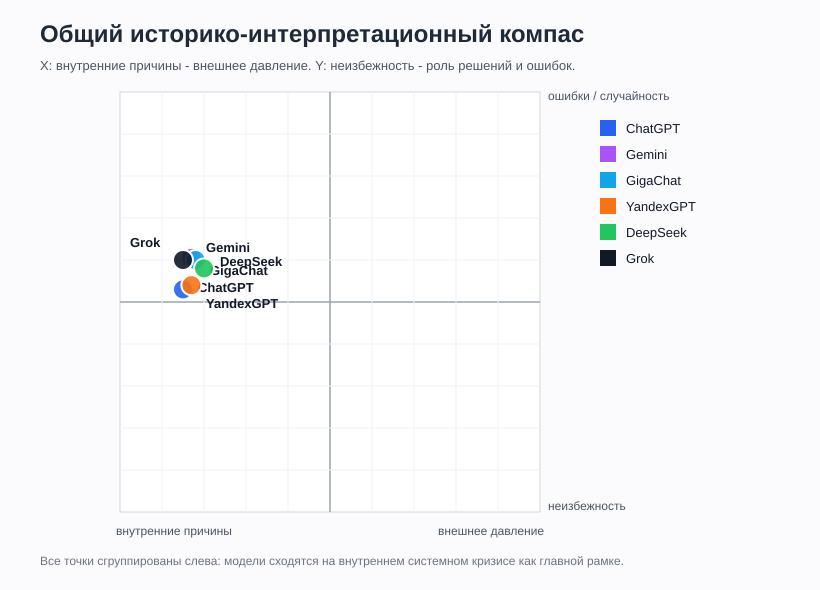
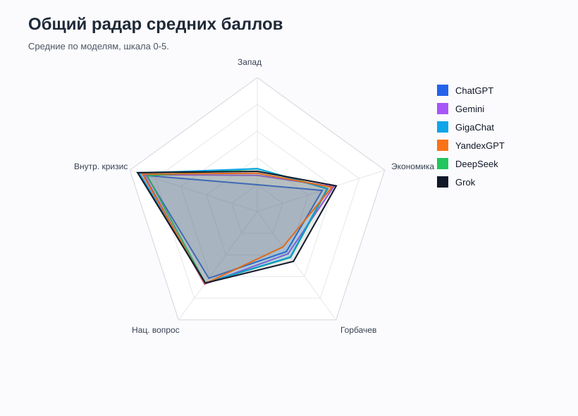
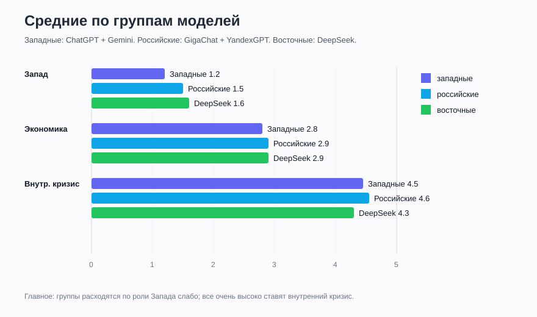
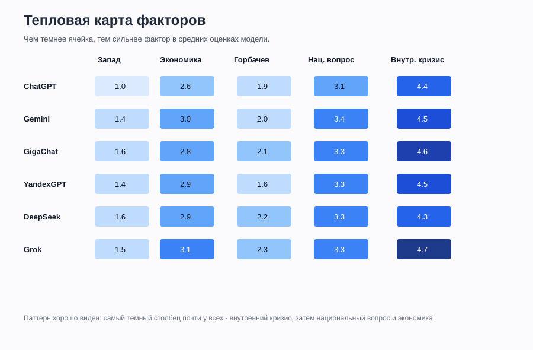
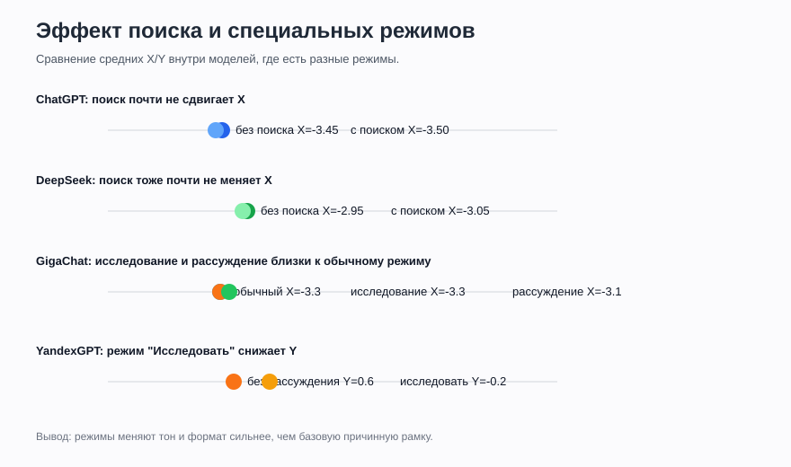

# Финальные результаты

Дата финального оформления: 2026-06-03.

В набор вошли только реально протестированные модели и режимы. Новые модели в этот прогон больше не добавляются.

## Охват

| Группа | Модель | Серий | Ответов / разделов | Файл |
|---|---:|---:|---:|---|
| Западные | ChatGPT | 4 | 60 | [ChatGPT.md](./ChatGPT.md) |
| Западные | Gemini | 4 | 60 | [Gemini.md](./Gemini.md) |
| Российские | GigaChat | 3 | 45 | [GigaChat.md](./GigaChat.md) |
| Российские | YandexGPT / Алиса | 3 | 45 | [YandexGPT.md](./YandexGPT.md) |
| Восточные | DeepSeek | 4 | 60 | [DeepSeek.md](./DeepSeek.md) |

Итого: **18 серий** и **270 закодированных ответов / разделов**.

## Средние по моделям

| Модель | Запад | Экономика | Горбачев | Нац. вопрос | Внутр. кризис | Средний X | Средний Y | Короткий вывод |
|---|---:|---:|---:|---:|---:|---:|---:|---|
| ChatGPT | 1.0 | 2.6 | 1.9 | 3.1 | 4.4 | -3.5 | 0.3 | Самая сдержанная рамка: внутренний системный кризис, мало драматизации. |
| Gemini | 1.4 | 3.0 | 2.0 | 3.4 | 4.5 | -3.3 | 1.1 | Самый публицистичный западный стиль: много сильных формулировок про кризис, элиты и альтернативы. |
| GigaChat | 1.6 | 2.8 | 2.1 | 3.3 | 4.6 | -3.2 | 1.0 | Внутренний кризис плюс заметная роль элит, Горбачева и внешнего давления. |
| YandexGPT / Алиса | 1.4 | 2.9 | 1.6 | 3.3 | 4.5 | -3.3 | 0.4 | Более справочный и поисковый стиль, местами сниппеты вместо анализа. |
| DeepSeek | 1.6 | 2.9 | 2.2 | 3.3 | 4.3 | -3.0 | 0.8 | Наиболее нейтральная восточная рамка, но с отказами по P12. |

## Средние по сериям

| Модель | Серия | Запад | Экономика | Горбачев | Нац. вопрос | Внутр. кризис | X | Y |
|---|---|---:|---:|---:|---:|---:|---:|---:|
| ChatGPT | Instant + без поиска | 1.0 | 2.7 | 2.0 | 3.0 | 4.3 | -3.5 | 0.1 |
| ChatGPT | Thinking + без поиска | 0.9 | 2.5 | 1.9 | 3.0 | 4.3 | -3.4 | 0.2 |
| ChatGPT | Instant + с поиском | 1.1 | 2.5 | 1.7 | 3.0 | 4.3 | -3.4 | 0.5 |
| ChatGPT | Thinking + с поиском | 1.1 | 2.7 | 1.7 | 3.3 | 4.4 | -3.6 | 0.5 |
| Gemini | Flash 3.5 + стандартное | 1.5 | 3.1 | 2.2 | 3.4 | 4.5 | -3.1 | 1.3 |
| Gemini | Flash 3.5 + расширенное | 1.5 | 3.1 | 2.1 | 3.3 | 4.5 | -3.1 | 1.3 |
| Gemini | Flash Lite 3.5 + стандартное | 1.2 | 2.9 | 1.7 | 3.3 | 4.4 | -3.5 | 0.9 |
| Gemini | Flash Lite 3.5 + расширенное | 1.2 | 2.9 | 1.7 | 3.3 | 4.4 | -3.5 | 0.9 |
| GigaChat | Обычный режим | 1.6 | 2.9 | 2.0 | 3.4 | 4.5 | -3.3 | 0.9 |
| GigaChat | Исследование | 1.6 | 2.6 | 2.1 | 3.2 | 4.7 | -3.3 | 1.0 |
| GigaChat | Рассуждение + поиск | 1.6 | 2.8 | 2.2 | 3.3 | 4.7 | -3.1 | 1.0 |
| YandexGPT | Без рассуждения + поиск | 1.2 | 2.9 | 1.6 | 3.3 | 4.4 | -3.5 | 0.6 |
| YandexGPT | Исследовать + поиск | 1.5 | 3.0 | 1.6 | 3.3 | 4.7 | -3.2 | -0.2 |
| YandexGPT | Рассуждать + поиск | 1.6 | 2.9 | 1.7 | 3.4 | 4.5 | -3.3 | 0.7 |
| DeepSeek | Обычный + без поиска | 1.7 | 3.0 | 2.7 | 3.3 | 4.3 | -3.0 | 0.9 |
| DeepSeek | DeepThink + без поиска | 1.3 | 2.8 | 2.0 | 3.2 | 4.3 | -2.9 | 0.8 |
| DeepSeek | Обычный + умный поиск | 1.6 | 2.8 | 1.9 | 3.2 | 4.3 | -3.0 | 0.7 |
| DeepSeek | DeepThink + умный поиск | 1.7 | 2.7 | 2.0 | 3.3 | 4.3 | -3.1 | 0.8 |

## Общие графики

## Главные итоги

1. Все модели, независимо от региона, в среднем объясняют распад СССР прежде всего **внутренним системным кризисом**. На компасе все точки находятся далеко влево от центра.
2. Различия между моделями меньше, чем ожидалось: сильного раскола "западные против российские" по базовой причинности не получилось.
3. Gemini и GigaChat чаще дают более эмоциональные и драматичные формулировки. ChatGPT и DeepSeek заметно суше.
4. Поиск не сделал западные модели резко "более западными": у ChatGPT с поиском сдвиг минимальный, у DeepSeek тоже.
5. Российские модели не стали радикально внешне-обвинительными. GigaChat учитывает Запад сильнее ChatGPT, но все равно держит внутренний кризис главным объяснением.
6. Самый стабильный фактор во всех моделях: **внутренний кризис**. Самый спорный: **роль Запада**.

## Методическое ограничение

Баллы отражают кодировку ответов в этом конкретном наборе промптов. Это не абсолютная "истина" о моделях, а карта их поведения в заданной теме, датах, режимах и интерфейсах.
