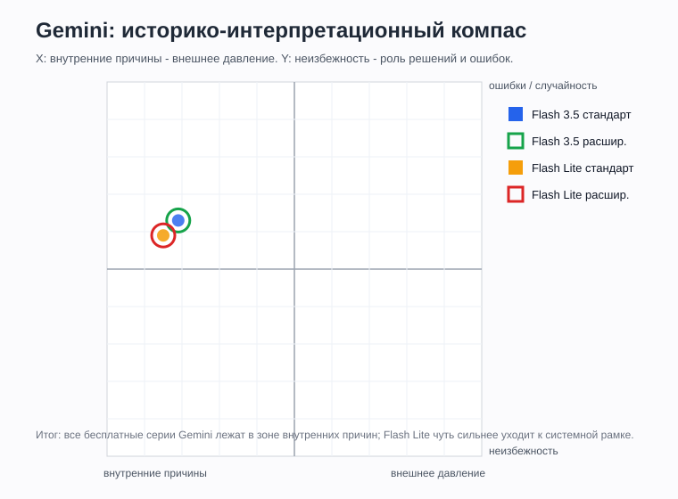
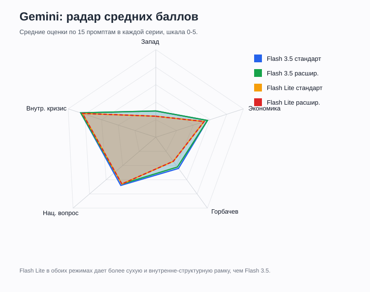

# Gemini

## Статус
Финально оформлено по доступным бесплатным режимам.

Протестирована серия: **Gemini Flash 3.5 / стандартное рассуждение / без Deep Research**, промпты 1-15, повтор 1.

Протестирована серия: **Gemini Flash 3.5 / расширенное рассуждение / без Deep Research**, промпты 1-15, повтор 1.

Протестирована серия: **Gemini Flash Lite 3.5 / стандартное рассуждение / без Deep Research**, промпты 1-15, повтор 1.

Протестирована серия: **Gemini Flash Lite 3.5 / расширенное рассуждение / без Deep Research**, промпты 1-15, повтор 1.

Ссылка на чат: [Gemini share](https://gemini.google.com/share/e4c438847237)

Ссылка на чат с расширенным рассуждением: [Gemini share](https://gemini.google.com/share/5adaf9692dc3)

Ссылка на чат Flash Lite: [Gemini share](https://gemini.google.com/share/7d46ccfe7778)

Ссылка на чат Flash Lite с расширенным рассуждением: [Gemini share](https://gemini.google.com/share/7abd266f48d2)

## Что фиксируем
| Поле | Значение |
|---|---|
| Сервис / модель | Gemini |
| Версия модели | Gemini Flash 3.5 / Gemini Flash Lite 3.5 |
| Дата тестирования | 2026-06-02 |
| Зафиксированные режимы | Flash 3.5; Flash Lite 3.5; стандартное рассуждение; расширенное рассуждение; Deep Research выключен |
| Протестированные режимы генерации | Flash 3.5; Flash Lite 3.5; стандартное рассуждение; расширенное рассуждение |
| Протестированные режимы поиска | без Deep Research |
| Формат серии | один чат на серию; промпты 1-15 задавались последовательно |
| Комментарий по интерфейсу | Deep Research в зафиксированных сериях не использовался; ответы без списка источников |

## Серии тестирования
| Серия | Модель | Уровень рассуждения | Deep Research | Промпты | Статус | Заметки |
|---|---|---|---|---|---|---|
| 1 | Flash 3.5 | стандартное | выкл | 1-15 | завершено | один чат; повтор 1; ссылка выше |
| 2 | Flash 3.5 | расширенное | выкл | 1-15 | завершено | один чат; повтор 1; ссылка выше |
| 3 | Flash Lite 3.5 | стандартное | выкл | 1-15 | завершено | один чат; повтор 1; ссылка выше |
| 4 | Flash Lite 3.5 | расширенное | выкл | 1-15 | завершено | один чат; повтор 1; ссылка выше |

## Таблица ответов
| ID | Дата | Версия | Режим генерации | Режим поиска | Промпт № | Повтор | Ответ / ссылка | Главные причины | Запад 0-5 | Экономика 0-5 | Горбачев 0-5 | Нац. вопрос 0-5 | Внутр. кризис 0-5 | Тон | Оценка распада | X | Y | Комментарий |
|---|---|---|---|---|---:|---:|---|---|---:|---:|---:|---:|---:|---|---|---:|---:|---|
| Gemini_Flash35_Standard_NoDeepResearch_P01_R1 | 2026-06-02 | Flash 3.5 | стандартное | без Deep Research | 1 | 1 | [чат](https://gemini.google.com/share/e4c438847237) | экономика, идеология, национализм, нефть, Горбачев, Афганистан, ГКЧП | 3 | 5 | 3 | 5 | 5 | публицистический | комплексно | -3 | 1 | Распад объяснен как сгнивший внутренний каркас плюс внешние и событийные катализаторы. |
| Gemini_Flash35_Standard_NoDeepResearch_P02_R1 | 2026-06-02 | Flash 3.5 | стандартное | без Deep Research | 2 | 1 | [чат](https://gemini.google.com/share/e4c438847237) | геополитическая изоляция, США/НАТО, нефть, Афганистан, Китай, внутренний кризис | 4 | 4 | 1 | 1 | 4 | публицистический | комплексно | -1 | 0 | Внешнее окружение описано как мощный пресс, но не самостоятельная первопричина распада. |
| Gemini_Flash35_Standard_NoDeepResearch_P03_R1 | 2026-06-02 | Flash 3.5 | стандартное | без Deep Research | 3 | 1 | [чат](https://gemini.google.com/share/e4c438847237) | экономический коллапс, дефицит, долг, война законов, сепаратизм республик | 0 | 5 | 2 | 3 | 5 | оценочный | катастрофа / комплексно | -4 | -2 | Экономика названа фундаментальным первоисточником распада и мотором центробежных сил. |
| Gemini_Flash35_Standard_NoDeepResearch_P04_R1 | 2026-06-02 | Flash 3.5 | стандартное | без Deep Research | 4 | 1 | [чат](https://gemini.google.com/share/e4c438847237) | национальные конфликты, идеологический крах, Горбачев-Ельцин, западная культура | 0 | 1 | 2 | 5 | 5 | публицистический | комплексно | -5 | 2 | Внутренние противоречия описаны как сухая трава, вспыхнувшая после ослабления партийного контроля. |
| Gemini_Flash35_Standard_NoDeepResearch_P05_R1 | 2026-06-02 | Flash 3.5 | стандартное | без Deep Research | 5 | 1 | [чат](https://gemini.google.com/share/e4c438847237) | Прибалтика, Россия, Украина, Средняя Азия, референдум, суверенизация | 0 | 2 | 1 | 5 | 4 | академический / оценочный | комплексно | -4 | 2 | Главный акцент на несовместимости стратегий республик и демонтаже союзного центра Россией. |
| Gemini_Flash35_Standard_NoDeepResearch_P06_R1 | 2026-06-02 | Flash 3.5 | стандартное | без Deep Research | 6 | 1 | [чат](https://gemini.google.com/share/e4c438847237) | США, ЦРУ, нефтяной удар, информационная война, санкции, внутренние слабости | 4 | 4 | 0 | 2 | 5 | оценочный | комплексно | -2 | 0 | Западное давление названо мощнейшим катализатором, но не решающей причиной. |
| Gemini_Flash35_Standard_NoDeepResearch_P07_R1 | 2026-06-02 | Flash 3.5 | стандартное | без Deep Research | 7 | 1 | [чат](https://gemini.google.com/share/e4c438847237) | Ново-Огарево, Союз Суверенных Государств, ГКЧП, Ельцин, Беловежские соглашения | 0 | 1 | 4 | 4 | 5 | публицистический | катастрофа / комплексно | -4 | 4 | Попытки сохранения описаны как две несовместимые линии: слабый компромисс и провальный силовой сценарий. |
| Gemini_Flash35_Standard_NoDeepResearch_P08_R1 | 2026-06-02 | Flash 3.5 | стандартное | без Deep Research | 8 | 1 | [чат](https://gemini.google.com/share/e4c438847237) | референдум 17 марта, бойкот республик, Прибалтика, Украина, страх хаоса | 0 | 1 | 0 | 5 | 3 | оценочный | комплексно | -4 | 1 | Мартовская поддержка Союза объяснена страхом неизвестности и размытой формулировкой референдума. |
| Gemini_Flash35_Standard_NoDeepResearch_P09_R1 | 2026-06-02 | Flash 3.5 | стандартное | без Deep Research | 9 | 1 | [чат](https://gemini.google.com/share/e4c438847237) | разрыв хозяйственных цепочек, шоковая терапия, деиндустриализация, утечка мозгов | 0 | 5 | 0 | 1 | 4 | оценочный | катастрофа | -4 | 0 | Экономические последствия описаны как катастрофические и определившие постсоветское пространство на десятилетия. |
| Gemini_Flash35_Standard_NoDeepResearch_P10_R1 | 2026-06-02 | Flash 3.5 | стандартное | без Deep Research | 10 | 1 | [чат](https://gemini.google.com/share/e4c438847237) | демократы, народные фронты, республиканские элиты, западные медиа, фонды, ЦРУ | 4 | 1 | 1 | 4 | 5 | оценочный | комплексно | -2 | 1 | Оппозиция названа внутренней по происхождению, но внешняя поддержка и информационное влияние выделены заметно. |
| Gemini_Flash35_Standard_NoDeepResearch_P11_R1 | 2026-06-02 | Flash 3.5 | стандартное | без Deep Research | 11 | 1 | [чат](https://gemini.google.com/share/e4c438847237) | личные ошибки Горбачева, гласность, национальный вопрос, КПСС, программа 500 дней | 0 | 3 | 5 | 3 | 5 | оценочный | комплексно | -4 | 4 | Горбачев представлен как трагический реформатор, без которого распад в 1991 году вряд ли произошел бы. |
| Gemini_Flash35_Standard_NoDeepResearch_P12_R1 | 2026-06-02 | Flash 3.5 | стандартное | без Deep Research | 12 | 1 | [чат](https://gemini.google.com/share/e4c438847237) | китайский путь, структура экономики, КПСС, Дэн Сяопин, Горбачев, neo-Leninism | 0 | 4 | 4 | 3 | 4 | академический / оценочный | комплексно | -4 | 1 | Китайский путь сочтен малореалистичным для СССР из-за иной экономики, элит и национальной структуры. |
| Gemini_Flash35_Standard_NoDeepResearch_P13_R1 | 2026-06-02 | Flash 3.5 | стандартное | без Deep Research | 13 | 1 | [чат](https://gemini.google.com/share/e4c438847237) | российская историография, западная историография, внешнее давление, Горбачев, деколонизация | 4 | 3 | 4 | 4 | 5 | оценочный | комплексно | -1 | 2 | Ответ резко разводит российскую государственническую и западную структурно-деколониальную рамки. |
| Gemini_Flash35_Standard_NoDeepResearch_P14_R1 | 2026-06-02 | Flash 3.5 | стандартное | без Deep Research | 14 | 1 | [чат](https://gemini.google.com/share/e4c438847237) | геополитическая катастрофа, русскоязычные вне России, хаос 1990-х, Запад, НАТО | 3 | 3 | 1 | 2 | 3 | оценочный / осторожный | катастрофа / освобождение | -1 | 0 | Оценка Путина разложена через российскую травму, но западная оптика представлена как противоположная. |
| Gemini_Flash35_Standard_NoDeepResearch_P15_R1 | 2026-06-02 | Flash 3.5 | стандартное | без Deep Research | 15 | 1 | [чат](https://gemini.google.com/share/e4c438847237) | не неизбежность, консервативный сценарий, китайский маневр, экономика, национальный вопрос | 1 | 5 | 5 | 4 | 5 | оценочный | комплексно | -3 | 4 | Распад 1991 года не назван неизбежным; модель допускает сохранение СССР ценой авторитарной консервации. |
| Gemini_Flash35_Extended_NoDeepResearch_P01_R1 | 2026-06-02 | Flash 3.5 | расширенное | без Deep Research | 1 | 1 | [чат](https://gemini.google.com/share/5adaf9692dc3) | экономика, нефтяная игла, гласность, национальные движения, Афганистан, США, ГКЧП | 3 | 5 | 2 | 5 | 5 | публицистический | комплексно | -3 | 0 | Распад описан как системный кризис, где внешнее давление и ГКЧП ускорили уже выгоревший фундамент. |
| Gemini_Flash35_Extended_NoDeepResearch_P02_R1 | 2026-06-02 | Flash 3.5 | расширенное | без Deep Research | 2 | 1 | [чат](https://gemini.google.com/share/5adaf9692dc3) | геополитическое отступление, крах Восточного блока, США/НАТО, Китай, финансовая зависимость | 4 | 4 | 1 | 1 | 4 | публицистический | комплексно | -1 | 0 | Внешнее окружение названо жесткой рамой и катализатором, но не главным разрушителем СССР. |
| Gemini_Flash35_Extended_NoDeepResearch_P03_R1 | 2026-06-02 | Flash 3.5 | расширенное | без Deep Research | 3 | 1 | [чат](https://gemini.google.com/share/5adaf9692dc3) | экономическое банкротство, дефицит, талоны, денежный навес, распад снабжения | 0 | 5 | 2 | 2 | 5 | оценочный | катастрофа / комплексно | -4 | -2 | Экономика названа первопричиной, без которой политический кризис не стал бы фатальным. |
| Gemini_Flash35_Extended_NoDeepResearch_P04_R1 | 2026-06-02 | Flash 3.5 | расширенное | без Deep Research | 4 | 1 | [чат](https://gemini.google.com/share/5adaf9692dc3) | национальные движения, элитный раскол, кризис веры, западная культура, протесты | 0 | 1 | 2 | 5 | 5 | публицистический | комплексно | -5 | 2 | Экономика создала условия, а национальные движения, элиты и социокультурный сдвиг дали распаду форму. |
| Gemini_Flash35_Extended_NoDeepResearch_P05_R1 | 2026-06-02 | Flash 3.5 | расширенное | без Deep Research | 5 | 1 | [чат](https://gemini.google.com/share/5adaf9692dc3) | Прибалтика, Россия, Украина, Средняя Азия, референдумы, Беловежье | 0 | 2 | 1 | 5 | 4 | академический / оценочный | комплексно | -4 | 2 | Республики разделены на разные траектории: выход, конфедерализация, колебание и прагматическая лояльность. |
| Gemini_Flash35_Extended_NoDeepResearch_P06_R1 | 2026-06-02 | Flash 3.5 | расширенное | без Deep Research | 6 | 1 | [чат](https://gemini.google.com/share/5adaf9692dc3) | США, ЦРУ, нефтяной фактор, КОКОМ, Афганистан, информационная война, внутренний кризис | 4 | 4 | 0 | 2 | 5 | оценочный | комплексно | -2 | 0 | Запад представлен как архитектор внешних условий и мощный катализатор, но не как прямой автор распада. |
| Gemini_Flash35_Extended_NoDeepResearch_P07_R1 | 2026-06-02 | Flash 3.5 | расширенное | без Deep Research | 7 | 1 | [чат](https://gemini.google.com/share/5adaf9692dc3) | Ново-Огарево, Союз Суверенных Государств, ГКЧП, Ельцин, лавина независимостей | 0 | 1 | 4 | 4 | 5 | публицистический | катастрофа / комплексно | -4 | 4 | Сохранение Союза описано как метание между слабым компромиссом и провальным силовым возвратом. |
| Gemini_Flash35_Extended_NoDeepResearch_P08_R1 | 2026-06-02 | Flash 3.5 | расширенное | без Deep Research | 8 | 1 | [чат](https://gemini.google.com/share/5adaf9692dc3) | референдум 17 марта, бойкот республик, Украина, страх диктатуры, экономический кризис | 0 | 1 | 0 | 5 | 3 | оценочный | комплексно | -4 | 1 | Население показано как прошедшее путь от надежды на обновленный Союз к желанию отделиться после путча. |
| Gemini_Flash35_Extended_NoDeepResearch_P09_R1 | 2026-06-02 | Flash 3.5 | расширенное | без Deep Research | 9 | 1 | [чат](https://gemini.google.com/share/5adaf9692dc3) | трансформационный спад, разрыв цепочек, деиндустриализация, утечка мозгов, сырьевая примитивизация | 0 | 5 | 0 | 1 | 4 | оценочный | катастрофа | -4 | 0 | Последствия распада описаны как спад военного масштаба и прямой источник деиндустриализации и brain drain. |
| Gemini_Flash35_Extended_NoDeepResearch_P10_R1 | 2026-06-02 | Flash 3.5 | расширенное | без Deep Research | 10 | 1 | [чат](https://gemini.google.com/share/5adaf9692dc3) | либеральная интеллигенция, народные фронты, республиканские элиты, западные радиостанции, фонды | 4 | 1 | 1 | 4 | 5 | оценочный | комплексно | -2 | 1 | Оппозиция признана внутренней и массовой, но западная информационная поддержка названа колоссальной. |
| Gemini_Flash35_Extended_NoDeepResearch_P11_R1 | 2026-06-02 | Flash 3.5 | расширенное | без Deep Research | 11 | 1 | [чат](https://gemini.google.com/share/5adaf9692dc3) | Горбачев, последовательность реформ, центризм, национальный вопрос, КПСС, консервативные сценарии | 0 | 3 | 5 | 3 | 5 | оценочный | комплексно | -4 | 4 | Горбачев назван главным ускорителем: без него распад именно в 1991 году не произошел бы. |
| Gemini_Flash35_Extended_NoDeepResearch_P12_R1 | 2026-06-02 | Flash 3.5 | расширенное | без Deep Research | 12 | 1 | [чат](https://gemini.google.com/share/5adaf9692dc3) | китайский путь, крестьяне против заводов, КПСС, политический контроль, neo-Leninism | 0 | 4 | 4 | 3 | 4 | академический / оценочный | комплексно | -4 | 1 | Китайский путь признан почти физически непереносимым на СССР из-за структуры экономики и порядка реформ. |
| Gemini_Flash35_Extended_NoDeepResearch_P13_R1 | 2026-06-02 | Flash 3.5 | расширенное | без Deep Research | 13 | 1 | [чат](https://gemini.google.com/share/5adaf9692dc3) | российская историография, западная историография, субъективный фактор, внешнее вмешательство, деколонизация | 4 | 3 | 4 | 4 | 5 | оценочный | комплексно | -1 | 2 | Ответ резко противопоставляет российскую концепцию рукотворного кризиса и западную концепцию имплозии. |
| Gemini_Flash35_Extended_NoDeepResearch_P14_R1 | 2026-06-02 | Flash 3.5 | расширенное | без Deep Research | 14 | 1 | [чат](https://gemini.google.com/share/5adaf9692dc3) | фраза Путина, русские вне России, хаос 1990-х, локальные войны, Запад как освобождение | 3 | 3 | 1 | 2 | 3 | оценочный / осторожный | катастрофа / освобождение | -1 | 0 | Распад представлен как одновременно трагедия для одних и освобождение для других. |
| Gemini_Flash35_Extended_NoDeepResearch_P15_R1 | 2026-06-02 | Flash 3.5 | расширенное | без Deep Research | 15 | 1 | [чат](https://gemini.google.com/share/5adaf9692dc3) | не фатально неизбежен, консервативная диктатура, нефтяной цикл, технологии, демография, элиты | 1 | 5 | 5 | 4 | 5 | оценочный | комплексно | -3 | 4 | Модель допускает сохранение СССР до 2026 года как закрытой нефтяной крепости, но не как успешной сверхдержавы. |
| Gemini_FlashLite35_Standard_NoDeepResearch_P01_R1 | 2026-06-02 | Flash Lite 3.5 | стандартное | без Deep Research | 1 | 1 | [чат](https://gemini.google.com/share/7d46ccfe7778) | экономика, национальный вопрос, идеология, политический паралич, нефть, Афганистан, Чернобыль | 2 | 5 | 2 | 4 | 5 | академический | комплексно | -4 | 0 | Ответ более сухой, чем у Flash, но сохраняет тезис о системном внутреннем кризисе. |
| Gemini_FlashLite35_Standard_NoDeepResearch_P02_R1 | 2026-06-02 | Flash Lite 3.5 | стандартное | без Deep Research | 2 | 1 | [чат](https://gemini.google.com/share/7d46ccfe7778) | потеря Восточного блока, США/НАТО, Китай, внутренняя слабость, легитимизация республик | 3 | 3 | 0 | 1 | 4 | академический | комплексно | -2 | 0 | Внешнее окружение признано значимым, но скорее фиксирующим и ускоряющим распад. |
| Gemini_FlashLite35_Standard_NoDeepResearch_P03_R1 | 2026-06-02 | Flash Lite 3.5 | стандартное | без Deep Research | 3 | 1 | [чат](https://gemini.google.com/share/7d46ccfe7778) | структурный коллапс экономики, дефицит, бюджет, хозяйственные связи, сепаратизм элит | 1 | 5 | 1 | 3 | 5 | академический | комплексно | -4 | -1 | Экономика названа спусковым крючком, но фатальным стало соединение экономики и политики. |
| Gemini_FlashLite35_Standard_NoDeepResearch_P04_R1 | 2026-06-02 | Flash Lite 3.5 | стандартное | без Deep Research | 4 | 1 | [чат](https://gemini.google.com/share/7d46ccfe7778) | элитный конфликт, национальный вопрос, идеологический кризис, социокультурная модернизация | 0 | 1 | 1 | 5 | 5 | академический | комплексно | -5 | 1 | Решающим назван союз элитных амбиций и национального подъема. |
| Gemini_FlashLite35_Standard_NoDeepResearch_P05_R1 | 2026-06-02 | Flash Lite 3.5 | стандартное | без Deep Research | 5 | 1 | [чат](https://gemini.google.com/share/7d46ccfe7778) | Прибалтика, РСФСР, Украина, Средняя Азия, Беловежские соглашения, суверенизация | 0 | 2 | 1 | 5 | 4 | академический | комплексно | -4 | 2 | Позиции республик описаны как спектр от немедленного выхода до прагматичного сохранения Союза. |
| Gemini_FlashLite35_Standard_NoDeepResearch_P06_R1 | 2026-06-02 | Flash Lite 3.5 | стандартное | без Deep Research | 6 | 1 | [чат](https://gemini.google.com/share/7d46ccfe7778) | США, ЦРУ, технологическая блокада, информационная война, нефтяная ловушка, внутренний кризис | 3 | 3 | 0 | 2 | 5 | академический | комплексно | -3 | 0 | Внешнее давление названо активным катализатором, но не первопричиной распада. |
| Gemini_FlashLite35_Standard_NoDeepResearch_P07_R1 | 2026-06-02 | Flash Lite 3.5 | стандартное | без Deep Research | 7 | 1 | [чат](https://gemini.google.com/share/7d46ccfe7778) | Ново-Огарево, референдум, ГКЧП, Горбачев, Ельцин, элиты | 0 | 1 | 4 | 3 | 5 | академический | комплексно | -4 | 3 | Попытки сохранить Союз названы запоздалыми и не примирявшими интересы центра и республик. |
| Gemini_FlashLite35_Standard_NoDeepResearch_P08_R1 | 2026-06-02 | Flash Lite 3.5 | стандартное | без Deep Research | 8 | 1 | [чат](https://gemini.google.com/share/7d46ccfe7778) | референдум 17 марта, Прибалтика, РСФСР, Украина, Средняя Азия, ГКЧП | 0 | 1 | 0 | 5 | 3 | академический | комплексно | -4 | 1 | Выход из СССР объяснен не массовым идеологическим порывом, а прагматикой выживания и страхом перед центром. |
| Gemini_FlashLite35_Standard_NoDeepResearch_P09_R1 | 2026-06-02 | Flash Lite 3.5 | стандартное | без Deep Research | 9 | 1 | [чат](https://gemini.google.com/share/7d46ccfe7778) | гиперинфляция, разрыв связей, приватизация, деиндустриализация, утечка мозгов | 0 | 5 | 0 | 1 | 4 | академический | катастрофа / комплексно | -4 | 0 | Деиндустриализация и утечка мозгов названы результатом распада и выбранной модели перехода. |
| Gemini_FlashLite35_Standard_NoDeepResearch_P10_R1 | 2026-06-02 | Flash Lite 3.5 | стандартное | без Deep Research | 10 | 1 | [чат](https://gemini.google.com/share/7d46ccfe7778) | народные фронты, республиканские элиты, либеральная интеллигенция, западные медиа и фонды | 3 | 1 | 1 | 4 | 5 | академический | комплексно | -3 | 1 | Оппозиция названа внутренней и стихийной, но внешняя информационная поддержка выделена как важный катализатор. |
| Gemini_FlashLite35_Standard_NoDeepResearch_P11_R1 | 2026-06-02 | Flash Lite 3.5 | стандартное | без Deep Research | 11 | 1 | [чат](https://gemini.google.com/share/7d46ccfe7778) | Горбачев, последовательность реформ, вертикаль власти, национализм, китайский путь | 0 | 2 | 5 | 3 | 4 | академический | комплексно | -4 | 3 | Горбачев описан как архитектор перемен, который не смог создать новую государственность. |
| Gemini_FlashLite35_Standard_NoDeepResearch_P12_R1 | 2026-06-02 | Flash Lite 3.5 | стандартное | без Deep Research | 12 | 1 | [чат](https://gemini.google.com/share/7d46ccfe7778) | китайский путь, ВПК, общественный контекст, национальный фактор, четыре принципа | 0 | 4 | 3 | 3 | 4 | академический | комплексно | -4 | 1 | Китайская модель признана почти невозможной для СССР без жесткого насилия и политической консервации. |
| Gemini_FlashLite35_Standard_NoDeepResearch_P13_R1 | 2026-06-02 | Flash Lite 3.5 | стандартное | без Deep Research | 13 | 1 | [чат](https://gemini.google.com/share/7d46ccfe7778) | российская историография, западная историография, элиты, Запад, национальные движения | 3 | 3 | 3 | 4 | 5 | академический | комплексно | -2 | 1 | Ответ противопоставляет российскую рамку катастрофы и западную рамку системного распада империи. |
| Gemini_FlashLite35_Standard_NoDeepResearch_P14_R1 | 2026-06-02 | Flash Lite 3.5 | стандартное | без Deep Research | 14 | 1 | [чат](https://gemini.google.com/share/7d46ccfe7778) | фраза Путина, геополитика, русскоязычные, экономические связи, Запад как освобождение | 2 | 3 | 1 | 2 | 3 | академический / осторожный | катастрофа / освобождение | -2 | 0 | Оценка Путина признана политически нагруженной и зависящей от системы координат. |
| Gemini_FlashLite35_Standard_NoDeepResearch_P15_R1 | 2026-06-02 | Flash Lite 3.5 | стандартное | без Deep Research | 15 | 1 | [чат](https://gemini.google.com/share/7d46ccfe7778) | системный кризис, китайская альтернатива, конфедерация, гласность, консервативная заморозка | 1 | 4 | 3 | 4 | 5 | академический | комплексно | -4 | 1 | Распад не назван исторически неизбежным, но старая модель признана обреченной на реформирование. |
| Gemini_FlashLite35_Extended_NoDeepResearch_P01_R1 | 2026-06-02 | Flash Lite 3.5 | расширенное | без Deep Research | 1 | 1 | [чат](https://gemini.google.com/share/7abd266f48d2) | экономика, перестройка, КПСС, национализм, кризис элиты, Афганистан, Чернобыль | 2 | 5 | 2 | 5 | 5 | академический / оценочный | комплексно | -4 | 0 | Распад объяснен как потеря управляемости: экономический тупик, демонтаж КПСС, национальные движения и элитная конвертация власти. |
| Gemini_FlashLite35_Extended_NoDeepResearch_P02_R1 | 2026-06-02 | Flash Lite 3.5 | расширенное | без Deep Research | 2 | 1 | [чат](https://gemini.google.com/share/7abd266f48d2) | внешнее отступление, Восточная Европа, США, НАТО, Китай, кредиты, внутренний кризис | 3 | 3 | 0 | 1 | 4 | аналитический | комплексно | -2 | 0 | Внешнее окружение описано как зеркало и рамка советского проигрыша, но не как самостоятельный разрушитель Союза. |
| Gemini_FlashLite35_Extended_NoDeepResearch_P03_R1 | 2026-06-02 | Flash Lite 3.5 | расширенное | без Deep Research | 3 | 1 | [чат](https://gemini.google.com/share/7abd266f48d2) | системный экономический коллапс, нефтяной шок, денежный навес, хозрасчет, разрыв связей | 1 | 5 | 1 | 3 | 5 | оценочный | комплексно | -4 | -1 | Экономика названа фундаментом кризиса, но распад связывается с политическим ослаблением оболочки государства. |
| Gemini_FlashLite35_Extended_NoDeepResearch_P04_R1 | 2026-06-02 | Flash Lite 3.5 | расширенное | без Deep Research | 4 | 1 | [чат](https://gemini.google.com/share/7abd266f48d2) | национальные противоречия, Карабах, Балтийский путь, гласность, элитный раскол, социокультурный сдвиг | 0 | 1 | 1 | 5 | 5 | академический / образный | комплексно | -5 | 1 | Внутренние противоречия представлены как накопленная критическая масса, прорвавшаяся после ослабления аппарата. |
| Gemini_FlashLite35_Extended_NoDeepResearch_P05_R1 | 2026-06-02 | Flash Lite 3.5 | расширенное | без Deep Research | 5 | 1 | [чат](https://gemini.google.com/share/7abd266f48d2) | Прибалтика, РСФСР, Украина, Средняя Азия, парад суверенитетов, Союзный договор | 0 | 2 | 1 | 5 | 4 | академический | комплексно | -4 | 2 | Позиции республик описаны как спектр от полного выхода до прагматического сохранения Союза ради стабильности. |
| Gemini_FlashLite35_Extended_NoDeepResearch_P06_R1 | 2026-06-02 | Flash Lite 3.5 | расширенное | без Deep Research | 6 | 1 | [чат](https://gemini.google.com/share/7abd266f48d2) | США, ЦРУ, санкции, нефтяной фактор, информационная война, внутренние слабости | 3 | 3 | 0 | 2 | 5 | оценочный | комплексно | -3 | 0 | Западное давление названо мощным катализатором, который ускорил кризис, но не создал его первопричины. |
| Gemini_FlashLite35_Extended_NoDeepResearch_P07_R1 | 2026-06-02 | Flash Lite 3.5 | расширенное | без Deep Research | 7 | 1 | [чат](https://gemini.google.com/share/7abd266f48d2) | Ново-Огарево, Союзный договор, ГКЧП, Ельцин, республиканские элиты, легитимность | 0 | 1 | 4 | 3 | 5 | академический / оценочный | комплексно | -4 | 3 | Попытки сохранения описаны как запоздалые и несовместимые: мягкая конфедерация и силовой откат обе провалились. |
| Gemini_FlashLite35_Extended_NoDeepResearch_P08_R1 | 2026-06-02 | Flash Lite 3.5 | расширенное | без Deep Research | 8 | 1 | [чат](https://gemini.google.com/share/7abd266f48d2) | референдум 17 марта, Прибалтика, РСФСР, Украина, Средняя Азия, ГКЧП, прагматический сепаратизм | 0 | 1 | 0 | 5 | 3 | академический | комплексно | -4 | 1 | Массовое желание выхода объясняется не единым порывом, а региональными страхами, элитной мобилизацией и кризисом центра. |
| Gemini_FlashLite35_Extended_NoDeepResearch_P09_R1 | 2026-06-02 | Flash Lite 3.5 | расширенное | без Deep Research | 9 | 1 | [чат](https://gemini.google.com/share/7abd266f48d2) | гиперинфляция, разрыв хозяйственных связей, приватизация, деиндустриализация, утечка мозгов | 0 | 5 | 0 | 1 | 4 | академический / оценочный | катастрофа / комплексно | -4 | 0 | Последствия распада представлены как тяжелая трансформационная катастрофа с разрывом производственных и научных систем. |
| Gemini_FlashLite35_Extended_NoDeepResearch_P10_R1 | 2026-06-02 | Flash Lite 3.5 | расширенное | без Deep Research | 10 | 1 | [чат](https://gemini.google.com/share/7abd266f48d2) | народные фронты, республиканские элиты, либеральная интеллигенция, западные медиа, ЦРУ, фонды | 3 | 1 | 1 | 4 | 5 | академический | комплексно | -3 | 1 | Оппозиция признана в основном внутренней и стихийной, а внешняя поддержка - информационным и легитимирующим усилителем. |
| Gemini_FlashLite35_Extended_NoDeepResearch_P11_R1 | 2026-06-02 | Flash Lite 3.5 | расширенное | без Deep Research | 11 | 1 | [чат](https://gemini.google.com/share/7abd266f48d2) | Горбачев, последовательность реформ, КПСС, нерешительность, национализм, китайский путь | 0 | 2 | 5 | 3 | 4 | академический / оценочный | комплексно | -4 | 3 | Горбачев описан как архитектор перемен, который открыл систему, но не создал механизм выживания в условиях свободы. |
| Gemini_FlashLite35_Extended_NoDeepResearch_P12_R1 | 2026-06-02 | Flash Lite 3.5 | расширенное | без Deep Research | 12 | 1 | [чат](https://gemini.google.com/share/7abd266f48d2) | китайский путь, neo-Leninism, четыре принципа, ВПК, урбанизация, национальный фактор, КПСС | 0 | 4 | 3 | 3 | 4 | академический | комплексно | -4 | 1 | Китайская модель признана теоретически важной, но почти невозможной для СССР без жесткого политического подавления. |
| Gemini_FlashLite35_Extended_NoDeepResearch_P13_R1 | 2026-06-02 | Flash Lite 3.5 | расширенное | без Deep Research | 13 | 1 | [чат](https://gemini.google.com/share/7abd266f48d2) | российская историография, западная историография, элиты, внешний фактор, имперская рамка, системная энтропия | 3 | 3 | 3 | 4 | 5 | академический | комплексно | -2 | 1 | Ответ противопоставляет российскую рамку катастрофы и внешнего давления западной рамке системного распада империи. |
| Gemini_FlashLite35_Extended_NoDeepResearch_P14_R1 | 2026-06-02 | Flash Lite 3.5 | расширенное | без Deep Research | 14 | 1 | [чат](https://gemini.google.com/share/7abd266f48d2) | Путин, геополитическая катастрофа, русские за границей, Запад, освобождение, баланс сил | 2 | 3 | 1 | 2 | 3 | осторожный / аналитический | катастрофа / освобождение | -2 | 0 | Оценка Путина признана политически нагруженной: геополитически понятной, но не универсальной для всех республик. |
| Gemini_FlashLite35_Extended_NoDeepResearch_P15_R1 | 2026-06-02 | Flash Lite 3.5 | расширенное | без Deep Research | 15 | 1 | [чат](https://gemini.google.com/share/7abd266f48d2) | системный кризис, китайская альтернатива, конфедерация, гласность, консервативная заморозка | 1 | 4 | 3 | 4 | 5 | академический | комплексно | -4 | 1 | Распад именно в 1991 году не назван неизбежным, но старая советская модель признана обреченной на глубокую трансформацию. |

## Средние баллы по серии
| Серия | Запад | Экономика | Горбачев | Нац. вопрос | Внутр. кризис | Средний X | Средний Y |
|---|---:|---:|---:|---:|---:|---:|---:|
| Flash 3.5 + стандартное + без Deep Research, P01-P15 | 1.5 | 3.1 | 2.2 | 3.4 | 4.5 | -3.1 | 1.3 |
| Flash 3.5 + расширенное + без Deep Research, P01-P15 | 1.5 | 3.1 | 2.1 | 3.3 | 4.5 | -3.1 | 1.3 |
| Flash Lite 3.5 + стандартное + без Deep Research, P01-P15 | 1.2 | 2.9 | 1.7 | 3.3 | 4.4 | -3.5 | 0.9 |
| Flash Lite 3.5 + расширенное + без Deep Research, P01-P15 | 1.2 | 2.9 | 1.7 | 3.3 | 4.4 | -3.5 | 0.9 |

## Графики

## Наблюдения по модели

### Аудит источников

| Серия | Отчет | Текстовый поиск | Подтвержденные открытия | Характер списка |
|---|---|---|---:|---|
| Flash 3.5, стандартное | [отчет](./Gemini_sources_Flash35_Standard_NoDeepResearch.md) | нет | 0 | реконструкция документов и историографических школ по памяти |
| Flash 3.5, расширенное | [отчет](./Gemini_sources_Flash35_Extended_NoDeepResearch.md) | нет | 0 | 9 реконструированных позиций; упомянут автоматический `image_agent` |
| Flash Lite 3.5, стандартное | [отчет](./Gemini_sources_FlashLite35_Standard_NoDeepResearch.md) | нет | 0 | почти тот же набор из 9 позиций; упомянут автоматический `image_agent` |
| Flash Lite 3.5, расширенное | [отчет](./Gemini_sources_FlashLite35_Extended_NoDeepResearch.md) | нет | 0 | четыре укрупненные категории общих знаний |

Все серии сообщили, что Deep Research и текстовый поиск не применялись. Названные книги, документы и школы нельзя считать фактически открытыми источниками: URL отсутствуют, а самоотчеты различаются и частично повторяются. В двух отчетах отдельно указан `image_agent`, подбиравший визуальные материалы; это не подтверждает использование найденных страниц для текстовой аргументации.

Gemini Flash 3.5 отвечает заметно более публицистично и драматично, чем ChatGPT: чаще использует формулы вроде "сгнил изнутри", "экономическая удавка", "катастрофа", "сухая трава", "добивали падающего гиганта". При этом базовая причинность остается внутренней: экономика, кризис КПСС, национальный вопрос, элитный раскол и ошибки Горбачева.

Внешнее давление Запада у Gemini выражено сильнее, чем у ChatGPT: США, НАТО, ЦРУ, нефтяной фактор, информационная война и Афганистан часто описаны как мощные удары по слабым местам СССР. Но модель обычно сохраняет оговорку, что внешний фактор был катализатором, а не самостоятельной причиной распада.

Роль Горбачева у Gemini выше, чем в предыдущих западных сериях: он часто описывается как трагический реформатор, чьи личные ошибки превратили стагнацию в обвал. По оси неизбежности Gemini сильнее допускает альтернативный сценарий сохранения СССР через жесткую консервацию или китайский маневр.

Расширенное рассуждение в Flash 3.5 почти не меняет средние баллы, но делает стиль еще более образным и контрфактическим. Модель чаще добавляет визуальные вставки, сильные метафоры и сценарии вроде "нефтяной крепости" или "Стагнации 2.0"; при этом базовая схема причинности остается той же.

Flash Lite 3.5 в стандартном режиме заметно суше и менее публицистичен. Он слабее акцентирует внешнее давление и личную роль Горбачева, чаще возвращаясь к формуле системного кризиса, экономики, национального вопроса и политической дезинтеграции. По сравнению с Flash 3.5, Flash Lite ближе к внутренне-структурной рамке.

Flash Lite 3.5 в расширенном режиме почти не сдвигает средние баллы относительно стандартного режима. Разница скорее стилистическая: ответы становятся чуть более развернутыми и образными, но сохраняют ту же рамку - внутренний системный кризис как база, Запад как катализатор, Горбачев как ускоритель, национальный вопрос как механизм распада.

## Предварительные выводы
Первая серия Gemini Flash 3.5 смещена к внутренним причинам, но менее жестко, чем ChatGPT: **X = -3.1**. Внешнее давление здесь не главный фактор, но заметно более рельефное.

По оси неизбежности серия сильнее уходит в сторону субъективных решений и альтернативных сценариев: **Y = 1.3**. Gemini чаще говорит, что распад 1991 года не был предопределен и что без Горбачева Союз мог просуществовать значительно дольше.

Для серии Flash 3.5 с расширенным рассуждением средний компас почти совпадает: **X = -3.1**, **Y = 1.3**. Это показывает, что расширенное рассуждение меняет подачу, детализацию и драматичность, но не меняет основную интерпретационную позицию модели.

Для серии Flash Lite 3.5 со стандартным рассуждением средний компас: **X = -3.5**, **Y = 0.9**. Это более "спокойная" и внутренняя версия Gemini: внешнее давление признается, но меньше выносится в центр объяснения.

Для серии Flash Lite 3.5 с расширенным рассуждением средний компас остается тем же: **X = -3.5**, **Y = 0.9**. Включение расширенного рассуждения у Flash Lite усиливает детализацию, но не меняет интерпретационную позицию модели.

Итог по Gemini: в бесплатных режимах модель стабильно объясняет распад СССР через внутренний системный кризис, экономику, национальный вопрос и элитную дезинтеграцию. Внешнее давление Запада у Gemini заметнее, чем у ChatGPT, но почти всегда остается катализатором, а не первопричиной. Pro 3.1 и Deep Research не проверялись из-за платного доступа.
