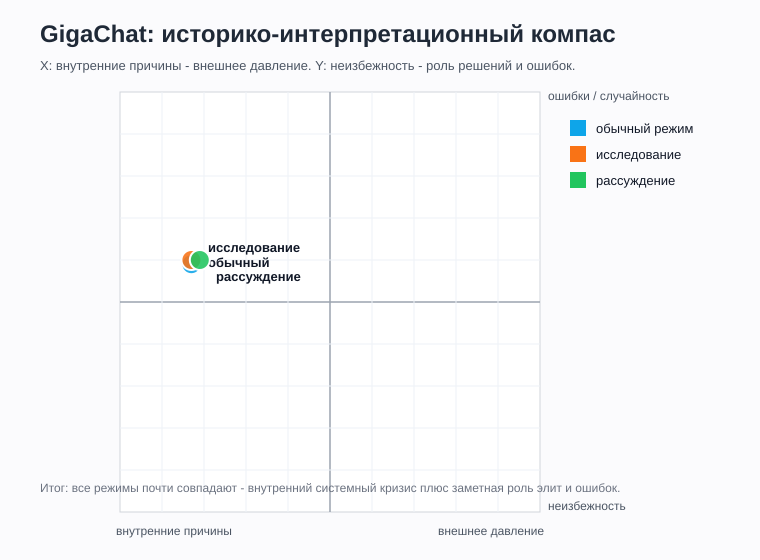
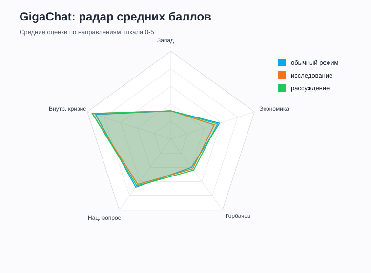

# GigaChat

## Статус
Финально оформлено.

Протестированы серии:

1. **Гига / обычный режим / без явного поиска**, промпты 1-15, повтор 1.
2. **Гига / режим исследования / с источниками**, единый исследовательский отчет по промптам 1-15, повтор 1.
3. **Гига / режим рассуждения / с поиском**, промпты 1-15, повтор 1.

Ссылки на чаты:

- Обычный режим: [GigaChat share](https://giga.chat/link/gcspvndZby)
- Режим исследования: [GigaChat research share](https://giga.chat/link/gcsUGgfVht)
- Режим рассуждения: [GigaChat reasoning share](https://giga.chat/link/gcsKeYacBn)

P15 был из сообщения пользователя, остальные ответы - из вложенных текстов.

## Что фиксируем
| Поле | Значение |
|---|---|
| Сервис / модель | GigaChat |
| Версия модели | Гига, дефолтная; точный номер версии не указан |
| Дата тестирования | 2026-06-03 |
| Зафиксированные режимы | обычный режим; режим исследования; режим рассуждения |
| Протестированные режимы генерации | обычный режим; режим исследования; режим рассуждения |
| Протестированные режимы поиска | без явного поиска; исследование / с источниками; рассуждение / с поиском |
| Формат серии | обычная серия: отдельные ответы; исследование: единый отчет по промптам 1-15; рассуждение: отдельные ответы |
| Комментарий по интерфейсу | Пользователь указал, что модель называется "Гига"; точная версия в интерфейсе не отображалась |

## Серии тестирования
| Серия | Режим генерации | Режим поиска | Промпты | Статус | Заметки |
|---|---|---|---|---|---|
| 1 | обычный режим | без явного поиска | 1-15 | завершено | ответы из сообщения пользователя и вложенных текстов |
| 2 | режим исследования | с источниками | 1-15 | завершено | единый исследовательский отчет; источники в ответе: РУВИКИ и БРЭ |
| 3 | режим рассуждения | с поиском | 1-15 | завершено | ссылка: https://giga.chat/link/gcsKeYacBn; P05 из сообщения пользователя, остальные из вложений |

## Таблица ответов
| ID | Дата | Версия | Режим генерации | Режим поиска | Промпт № | Повтор | Ответ / ссылка | Главные причины | Запад 0-5 | Экономика 0-5 | Горбачев 0-5 | Нац. вопрос 0-5 | Внутр. кризис 0-5 | Тон | Оценка распада | X | Y | Комментарий |
|---|---|---|---|---|---:|---:|---|---|---:|---:|---:|---:|---:|---|---|---:|---:|---|
| Giga_Default_NoSearch_P01_R1 | 2026-06-03 | Гига, точная версия не указана | обычный режим | без явного поиска | 1 | 1 | [чат](https://giga.chat/link/gcspvndZby) | экономика, политический кризис, КПСС, национальное движение, центр-республики, Горбачев, ГКЧП | 2 | 5 | 2 | 5 | 5 | академический | комплексно | -3 | 0 | Главными названы экономика, политическая система и национальные движения; ошибки руководства и ГКЧП - триггеры. |
| Giga_Default_NoSearch_P02_R1 | 2026-06-03 | Гига, точная версия не указана | обычный режим | без явного поиска | 2 | 1 | [чат](https://giga.chat/link/gcspvndZby) | окончание холодной войны, Восточная Европа, США/НАТО, Китай, экономический кризис, помощь Запада | 3 | 3 | 1 | 1 | 4 | академический | комплексно | -2 | 0 | Внешний фактор описан как существенный катализатор, но внутренний кризис признан решающим. |
| Giga_Default_NoSearch_P03_R1 | 2026-06-03 | Гига, точная версия не указана | обычный режим | без явного поиска | 3 | 1 | [чат](https://giga.chat/link/gcspvndZby) | экономический кризис, спад производства, бюджетный дефицит, нефтяной шок, реформы, сепаратизм | 1 | 5 | 1 | 2 | 5 | академический / оценочный | комплексно | -4 | -1 | Экономика названа фундаментальной материальной причиной распада и основой политического паралича. |
| Giga_Default_NoSearch_P04_R1 | 2026-06-03 | Гига, точная версия не указана | обычный режим | без явного поиска | 4 | 1 | [чат](https://giga.chat/link/gcspvndZby) | национальные противоречия, парад суверенитетов, идеологический кризис, конфликт элит, РСФСР, Ельцин | 0 | 2 | 2 | 5 | 5 | академический | комплексно | -5 | 1 | Внутренние противоречия описаны как накопленный комплекс, где национальный вопрос и элитный раскол стали решающими. |
| Giga_Default_NoSearch_P05_R1 | 2026-06-03 | Гига, точная версия не указана | обычный режим | без явного поиска | 5 | 1 | [чат](https://giga.chat/link/gcspvndZby) | Россия, Украина, Прибалтика, Средняя Азия, независимость, Ельцин, референдум Украины | 0 | 1 | 1 | 5 | 3 | справочный | комплексно | -4 | 2 | Ответ краткий и несколько упрощенный: позиции республик сведены к движению большинства к независимости. |
| Giga_Default_NoSearch_P06_R1 | 2026-06-03 | Гига, точная версия не указана | обычный режим | без явного поиска | 6 | 1 | [чат](https://giga.chat/link/gcspvndZby) | США, СОИ, нефть, Голос Америки, Радио Свобода, Восточная Европа, ЦРУ, внутренний кризис | 4 | 3 | 0 | 2 | 5 | академический / оценочный | комплексно | -2 | 0 | Западное давление названо мощным катализатором, но не решающей причиной; прямой сценарий "ЦРУ развалило СССР" отвергнут. |
| Giga_Default_NoSearch_P07_R1 | 2026-06-03 | Гига, точная версия не указана | обычный режим | без явного поиска | 7 | 1 | [чат](https://giga.chat/link/gcspvndZby) | Ново-Огарево, Союзный договор, ГКЧП, Горбачев, Ельцин, Беловежские соглашения, республиканские элиты | 0 | 1 | 4 | 4 | 5 | академический / публицистический | комплексно | -4 | 3 | Попытки сохранения описаны как запоздалые: слабый договор напугал силовиков, а ГКЧП окончательно разрушил центр. |
| Giga_Default_NoSearch_P08_R1 | 2026-06-03 | Гига, точная версия не указана | обычный режим | без явного поиска | 8 | 1 | [чат](https://giga.chat/link/gcspvndZby) | референдум 17 марта, Средняя Азия, РСФСР, Украина, Прибалтика, ГКЧП, элиты | 0 | 1 | 1 | 5 | 4 | академический | комплексно | -4 | 2 | Подчеркнут разрыв между поддержкой обновленного Союза населением и действиями республиканских элит после ГКЧП. |
| Giga_Default_NoSearch_P09_R1 | 2026-06-03 | Гига, точная версия не указана | обычный режим | без явного поиска | 9 | 1 | [чат](https://giga.chat/link/gcspvndZby) | разрыв хозяйственных связей, шоковая терапия, гиперинфляция, деиндустриализация, утечка мозгов, приватизация | 0 | 5 | 0 | 1 | 4 | оценочный | катастрофа / комплексно | -4 | 0 | Последствия распада представлены как экономический шок, напрямую породивший деиндустриализацию и утечку мозгов. |
| Giga_Default_NoSearch_P10_R1 | 2026-06-03 | Гига, точная версия не указана | обычный режим | без явного поиска | 10 | 1 | [чат](https://giga.chat/link/gcspvndZby) | либеральная интеллигенция, народные фронты, республиканские элиты, западные радиостанции, внешняя поддержка | 3 | 1 | 1 | 4 | 5 | академический | комплексно | -3 | 1 | Оппозиция названа внутренней мозаикой, а западное влияние - фоновым катализатором, не главной движущей силой. |
| Giga_Default_NoSearch_P11_R1 | 2026-06-03 | Гига, точная версия не указана | обычный режим | без явного поиска | 11 | 1 | [чат](https://giga.chat/link/gcspvndZby) | Горбачев, гласность, новое мышление, перестройка, Союзный договор, Ельцин, ГКЧП | 2 | 3 | 5 | 3 | 5 | публицистический / аналитический | комплексно | -4 | 3 | Роль Горбачева оценена как огромная и, возможно, решающая в финальном акте распада, но системный кризис не сведен к личности. |
| Giga_Default_NoSearch_P12_R1 | 2026-06-03 | Гига, точная версия не указана | обычный режим | без явного поиска | 12 | 1 | [чат](https://giga.chat/link/gcspvndZby) | китайский путь, Дэн Сяопин, КПСС, отмена 6-й статьи, национальный вопрос, neo-Leninism | 1 | 4 | 4 | 4 | 5 | аналитический | комплексно | -4 | 1 | Китайский путь признан теоретически возможным, но практически маловероятным для СССР конца 1980-х. |
| Giga_Default_NoSearch_P13_R1 | 2026-06-03 | Гига, точная версия не указана | обычный режим | без явного поиска | 13 | 1 | [чат](https://giga.chat/link/gcspvndZby) | западная историография, российская историография, тоталитарная парадигма, внешний заговор, Горбачев, Ельцин | 4 | 2 | 4 | 4 | 5 | академический / сравнительный | комплексно | -2 | 1 | Ответ ярко разводит западную системную рамку и российскую рамку катастрофы, предательства элит и внешнего давления. |
| Giga_Default_NoSearch_P14_R1 | 2026-06-03 | Гига, точная версия не указана | обычный режим | без явного поиска | 14 | 1 | [чат](https://giga.chat/link/gcspvndZby) | Путин, геополитическая катастрофа, русские за границей, экономика 1990-х, НАТО, западный триумф | 3 | 4 | 1 | 2 | 3 | оценочный / сравнительный | катастрофа / освобождение | -1 | 0 | Оценка Путина признана обоснованной с российской перспективы, но зависящей от точки зрения разных акторов. |
| Giga_Default_NoSearch_P15_R1 | 2026-06-03 | Гига, точная версия не указана | обычный режим | без явного поиска | 15 | 1 | [чат](https://giga.chat/link/gcspvndZby) | экономика, идеология, национальный вопрос, элиты, Горбачев, китайский путь, конфедерация | 1 | 4 | 3 | 4 | 5 | эссеистический / аналитический | комплексно | -4 | 1 | Распад как конечный итог назван практически неизбежным, но форма и скорость 1991 года - результатом решений политиков. |
| Giga_Research_Search_P01_R1 | 2026-06-03 | Гига, точная версия не указана | режим исследования | с источниками | 1 | 1 | [исследование](https://giga.chat/link/gcsUGgfVht) | экономика, КПСС, национальный вопрос, внешнее давление, Горбачев | 2 | 5 | 2 | 4 | 5 | исследовательский / академический | системный кризис | -3 | 0 | Исследовательский режим дает синтетический отчет, а не отдельный ответ. По P01 причины разложены на главные и второстепенные; источниковая база почти целиком РУВИКИ. |
| Giga_Research_Search_P02_R1 | 2026-06-03 | Гига, точная версия не указана | режим исследования | с источниками | 2 | 1 | [исследование](https://giga.chat/link/gcsUGgfVht) | стратегическое отступление, США, НАТО, Китай, гонка вооружений | 4 | 3 | 1 | 1 | 4 | исследовательский / академический | внешняя среда как катализатор | -2 | 0 | Внешнее окружение описано жестче, чем в обычной серии: США "воспользовались ослаблением", но первопричиной назван внутренний кризис. |
| Giga_Research_Search_P03_R1 | 2026-06-03 | Гига, точная версия не указана | режим исследования | с источниками | 3 | 1 | [исследование](https://giga.chat/link/gcsUGgfVht) | экономический коллапс, бюджетный дефицит, товарный голод, нефть, долги | 1 | 5 | 2 | 2 | 5 | исследовательский / оценочный | экономика как главная причина | -4 | -1 | Экономика названа не просто фактором, а главной причиной распада; формулировки более категоричные, чем в обычной серии. |
| Giga_Research_Search_P04_R1 | 2026-06-03 | Гига, точная версия не указана | режим исследования | с источниками | 4 | 1 | [исследование](https://giga.chat/link/gcsUGgfVht) | национальные конфликты, гласность, элиты, молодежь, шахтеры | 0 | 2 | 2 | 5 | 5 | исследовательский / академический | внутренние разломы | -5 | 1 | Хорошо фиксирует четыре внутренних слоя: национальный, идеологический, элитный и социокультурный. |
| Giga_Research_Search_P05_R1 | 2026-06-03 | Гига, точная версия не указана | режим исследования | с источниками | 5 | 1 | [исследование](https://giga.chat/link/gcsUGgfVht) | РСФСР, Прибалтика, Украина, Средняя Азия, Беловежские соглашения | 0 | 1 | 1 | 5 | 4 | исследовательский / справочный | разные позиции республик | -4 | 2 | Раздел по республикам краткий; особенно спорно упрощена Средняя Азия, но общий вектор позиций передан. |
| Giga_Research_Search_P06_R1 | 2026-06-03 | Гига, точная версия не указана | режим исследования | с источниками | 6 | 1 | [исследование](https://giga.chat/link/gcsUGgfVht) | Запад, диссиденты, гуманитарная помощь, радио, Перестройка | 4 | 2 | 1 | 2 | 4 | исследовательский / академический | Запад как значимый катализатор | -2 | 0 | Внешнее давление признано значительным, но прямо не решающим. ЦРУ не выносится в главную причину. |
| Giga_Research_Search_P07_R1 | 2026-06-03 | Гига, точная версия не указана | режим исследования | с источниками | 7 | 1 | [исследование](https://giga.chat/link/gcsUGgfVht) | Ново-Огарево, ГКЧП, Беловежские соглашения, Ельцин, элиты | 0 | 1 | 4 | 4 | 5 | исследовательский / академический | попытки сохранения провалились из-за раскола элит | -4 | 3 | Лаконично, но полно: договор, путч и Беловежье связаны в одну цепочку потери контроля центра. |
| Giga_Research_Search_P08_R1 | 2026-06-03 | Гига, точная версия не указана | режим исследования | с источниками | 8 | 1 | [исследование](https://giga.chat/link/gcsUGgfVht) | референдум 17 марта, бойкот республик, элиты, воля населения | 0 | 1 | 1 | 5 | 4 | исследовательский / справочный | население за обновленный Союз, элиты за разрыв | -4 | 2 | Делает сильный акцент на разрыве между голосованием населения и поведением республиканских элит. |
| Giga_Research_Search_P09_R1 | 2026-06-03 | Гига, точная версия не указана | режим исследования | с источниками | 9 | 1 | [исследование](https://giga.chat/link/gcsUGgfVht) | деиндустриализация, утечка мозгов, гиперинфляция, раздел собственности | 0 | 5 | 0 | 1 | 4 | исследовательский / оценочный | катастрофические последствия | -4 | 0 | Экономические последствия описаны как катастрофические и прямо связанные с распадом. |
| Giga_Research_Search_P10_R1 | 2026-06-03 | Гига, точная версия не указана | режим исследования | с источниками | 10 | 1 | [исследование](https://giga.chat/link/gcsUGgfVht) | неформальные движения, народные фронты, МДГ, западные фонды, внутреннее недовольство | 3 | 1 | 1 | 4 | 5 | исследовательский / академический | оппозиция внутренняя, помощь внешняя | -3 | 1 | Признает внешнее финансирование некоторых НКО, но главной силой считает внутреннее недовольство системой. |
| Giga_Research_Search_P11_R1 | 2026-06-03 | Гига, точная версия не указана | режим исследования | с источниками | 11 | 1 | [исследование](https://giga.chat/link/gcsUGgfVht) | Горбачев, нерешительность, гласность, демократизация, потеря рычагов | 1 | 3 | 5 | 3 | 5 | исследовательский / оценочный | Горбачев как фатальный ускоритель | -4 | 3 | Роль Горбачева сформулирована очень сильно: личные решения сыграли фатальную роль, но без него Союз лишь просуществовал бы дольше. |
| Giga_Research_Search_P12_R1 | 2026-06-03 | Гига, точная версия не указана | режим исследования | с источниками | 12 | 1 | [исследование](https://giga.chat/link/gcsUGgfVht) | китайский путь, структура экономики, политическая воля, Тяньаньмэнь, соцлагерь | 1 | 4 | 4 | 3 | 5 | исследовательский / сравнительный | китайская модель малореализуема | -4 | 1 | Ответ уверенно объясняет, почему китайская модель была маловероятна для позднего СССР. |
| Giga_Research_Search_P13_R1 | 2026-06-03 | Гига, точная версия не указана | режим исследования | с источниками | 13 | 1 | [исследование](https://giga.chat/link/gcsUGgfVht) | российская трагедия, предательство элит, внешний заговор, западная закономерность, самоопределение | 4 | 2 | 4 | 4 | 5 | исследовательский / сравнительный | российская трагедия vs западная закономерность | -2 | 1 | Различия историографий переданы схематично, но ясно: российский акцент на трагедии и заговоре, западный - на крахе империи. |
| Giga_Research_Search_P14_R1 | 2026-06-03 | Гига, точная версия не указана | режим исследования | с источниками | 14 | 1 | [исследование](https://giga.chat/link/gcsUGgfVht) | Путин, геополитическая катастрофа, локальные войны, Запад, имперское мышление | 3 | 3 | 1 | 2 | 3 | исследовательский / оценочный | оценка зависит от перспективы | -1 | 0 | Формула Путина признается исторически понятной для России, но западная критика тоже дана. |
| Giga_Research_Search_P15_R1 | 2026-06-03 | Гига, точная версия не указана | режим исследования | с источниками | 15 | 1 | [исследование](https://giga.chat/link/gcsUGgfVht) | экономический кризис, национальный сепаратизм, моральное банкротство элиты, Перестройка | 1 | 4 | 3 | 4 | 5 | исследовательский / аналитический | распад высоковероятен, прежний СССР невозможен | -4 | 1 | Итоговая позиция: распад был высоковероятен, а сохранение СССР в неизменном виде до сегодняшнего дня практически невозможно. |
| Giga_Reasoning_Search_P01_R1 | 2026-06-03 | Гига, точная версия не указана | режим рассуждения | с поиском | 1 | 1 | [рассуждение](https://giga.chat/link/gcsKeYacBn) | экономика, перестройка, национальные движения, этнические конфликты, идеология, внешнее давление | 3 | 5 | 3 | 4 | 5 | рассуждающий / аналитический | комплексный системный кризис | -2 | 0 | Ответ сначала рассуждает без источников, затем включает поиск. Главными выделены экономика и политическая трансформация. |
| Giga_Reasoning_Search_P02_R1 | 2026-06-03 | Гига, точная версия не указана | режим рассуждения | с поиском | 2 | 1 | [рассуждение](https://giga.chat/link/gcsKeYacBn) | геополитическое отступление, США, НАТО, Китай, Восточная Европа, внутренний кризис | 4 | 3 | 2 | 2 | 4 | рассуждающий / аналитический | внешняя среда как ускоритель | -1 | 0 | Внешняя роль сформулирована жестко: США и НАТО использовали слабость СССР, но внутренний кризис остается фоном. |
| Giga_Reasoning_Search_P03_R1 | 2026-06-03 | Гига, точная версия не указана | режим рассуждения | с поиском | 3 | 1 | [рассуждение](https://giga.chat/link/gcsKeYacBn) | плановая экономика, нефть, дефицит, инфляция, политические реформы, национальные элиты | 1 | 5 | 2 | 2 | 5 | рассуждающий / аналитический | экономика ключевая, но не единственная | -4 | -1 | Экономика названа ключевой, но ответ оговаривает, что быстрый распад невозможен без политической либерализации и национального вопроса. |
| Giga_Reasoning_Search_P04_R1 | 2026-06-03 | Гига, точная версия не указана | режим рассуждения | с поиском | 4 | 1 | [рассуждение](https://giga.chat/link/gcsKeYacBn) | национальные противоречия, гласность, элитный раскол, идеология, социокультурный сдвиг | 0 | 3 | 2 | 5 | 5 | рассуждающий / аналитический | внутренние противоречия решающие | -5 | 1 | Хороший внутренний разбор: национальный вопрос и элиты поставлены в центр, идеология и культура усиливают распад. |
| Giga_Reasoning_Search_P05_R1 | 2026-06-03 | Гига, точная версия не указана | режим рассуждения | с поиском | 5 | 1 | [рассуждение](https://giga.chat/link/gcsKeYacBn) | Россия, Украина, Прибалтика, Средняя Азия, независимость, обновленный Союз | 0 | 2 | 1 | 5 | 4 | рассуждающий / справочный | разные позиции республик | -4 | 2 | Ответ из сообщения пользователя. Позиции республик переданы верно в общем виде; есть мелкая небрежность с флагами Средней Азии. |
| Giga_Reasoning_Search_P06_R1 | 2026-06-03 | Гига, точная версия не указана | режим рассуждения | с поиском | 6 | 1 | [рассуждение](https://giga.chat/link/gcsKeYacBn) | Запад, ЦРУ, санкции, информационная война, внутренний кризис, катализатор | 4 | 2 | 1 | 2 | 4 | рассуждающий / аналитический | внешнее давление значимо, но не решающе | -2 | 0 | Типичная для Гиги позиция: внешнее давление усиливало кризис, но не могло само разрушить устойчивую систему. |
| Giga_Reasoning_Search_P07_R1 | 2026-06-03 | Гига, точная версия не указана | режим рассуждения | с поиском | 7 | 1 | [рассуждение](https://giga.chat/link/gcsKeYacBn) | Ново-Огарево, Союзный договор, ГКЧП, Ельцин, Горбачев, Беловежские соглашения | 0 | 1 | 4 | 4 | 5 | рассуждающий / аналитический | попытки сохранения запоздали | -4 | 3 | Делает акцент на провале компромисса и силового сценария; личные решения лидеров сильно важны. |
| Giga_Reasoning_Search_P08_R1 | 2026-06-03 | Гига, точная версия не указана | режим рассуждения | с поиском | 8 | 1 | [рассуждение](https://giga.chat/link/gcsKeYacBn) | референдум 17 марта, Прибалтика, Украина, Средняя Азия, ГКЧП, элиты | 0 | 1 | 1 | 5 | 4 | рассуждающий / справочный | от поддержки Союза к независимости | -4 | 2 | Хорошо фиксирует динамику: мартовская лояльность к обновленному Союзу была сломана после ГКЧП и кризиса. |
| Giga_Reasoning_Search_P09_R1 | 2026-06-03 | Гига, точная версия не указана | режим рассуждения | с поиском | 9 | 1 | [рассуждение](https://giga.chat/link/gcsKeYacBn) | разрыв связей, гиперинфляция, приватизация, деиндустриализация, утечка мозгов | 0 | 5 | 0 | 1 | 4 | рассуждающий / оценочный | тяжелые прямые последствия | -4 | 0 | Экономические последствия поданы как прямой и болезненный результат распада и перехода к рынку. |
| Giga_Reasoning_Search_P10_R1 | 2026-06-03 | Гига, точная версия не указана | режим рассуждения | с поиском | 10 | 1 | [рассуждение](https://giga.chat/link/gcsKeYacBn) | оппозиция, народные фронты, республиканские элиты, интеллигенция, западная поддержка | 3 | 1 | 1 | 4 | 5 | рассуждающий / аналитический | оппозиция в основном внутренняя | -3 | 1 | Внешняя помощь признается, но главной движущей силой названы внутреннее недовольство и союз элит с массовыми движениями. |
| Giga_Reasoning_Search_P11_R1 | 2026-06-03 | Гига, точная версия не указана | режим рассуждения | с поиском | 11 | 1 | [рассуждение](https://giga.chat/link/gcsKeYacBn) | Горбачев, перестройка, гласность, нерешительность, потеря контроля, альтернативы | 2 | 3 | 5 | 3 | 5 | рассуждающий / аналитический | Горбачев как ключевой ускоритель | -4 | 3 | Роль Горбачева очень сильная: он не создал все проблемы, но именно его решения открыли процесс и сделали распад быстрым. |
| Giga_Reasoning_Search_P12_R1 | 2026-06-03 | Гига, точная версия не указана | режим рассуждения | с поиском | 12 | 1 | [рассуждение](https://giga.chat/link/gcsKeYacBn) | китайский путь, Дэн Сяопин, политический контроль, структура экономики, национальный вопрос | 1 | 4 | 4 | 3 | 5 | рассуждающий / сравнительный | китайский путь маловероятен | -4 | 1 | Разбор строится на различиях СССР и Китая: экономика, общество, национальный фактор и готовность к жесткому контролю. |
| Giga_Reasoning_Search_P13_R1 | 2026-06-03 | Гига, точная версия не указана | режим рассуждения | с поиском | 13 | 1 | [рассуждение](https://giga.chat/link/gcsKeYacBn) | российская историография, западная историография, элиты, внешний фактор, системный кризис | 4 | 2 | 4 | 4 | 5 | рассуждающий / сравнительный | российская трагедия vs западная закономерность | -2 | 1 | Разводит рамки почти как исследовательская серия: российский акцент на элитах и внешнем давлении, западный - на системном крахе. |
| Giga_Reasoning_Search_P14_R1 | 2026-06-03 | Гига, точная версия не указана | режим рассуждения | с поиском | 14 | 1 | [рассуждение](https://giga.chat/link/gcsKeYacBn) | Путин, русские за границей, социальный кризис, референдум, Запад, свобода республик | 3 | 4 | 1 | 2 | 4 | рассуждающий / оценочный | катастрофа для одних, освобождение для других | -1 | 0 | Ответ более эмпатичный к путинской рамке, но сохраняет оговорку о перспективе республик и западной трактовке. |
| Giga_Reasoning_Search_P15_R1 | 2026-06-03 | Гига, точная версия не указана | режим рассуждения | с поиском | 15 | 1 | [рассуждение](https://giga.chat/link/gcsKeYacBn) | экономика, идеология, национальный вопрос, Горбачев, китайский путь, федерализация | 2 | 4 | 4 | 4 | 5 | рассуждающий / аналитический | распад не абсолютно неизбежен, но очень вероятен | -3 | 2 | Итог: без перестройки СССР мог просуществовать дольше, но в прежнем виде до сегодняшнего дня едва ли сохранился бы. |

## Средние баллы по серии
| Серия | Запад | Экономика | Горбачев | Нац. вопрос | Внутр. кризис | Средний X | Средний Y |
|---|---:|---:|---:|---:|---:|---:|---:|
| Гига + обычный режим + без явного поиска, P01-P15 | 1.6 | 2.9 | 2.0 | 3.4 | 4.5 | -3.3 | 0.9 |
| Гига + режим исследования + с источниками, P01-P15 | 1.6 | 2.6 | 2.1 | 3.2 | 4.7 | -3.3 | 1.0 |
| Гига + режим рассуждения + с поиском, P01-P15 | 1.6 | 2.8 | 2.2 | 3.3 | 4.7 | -3.1 | 1.0 |

## Графики

## Наблюдения по модели
GigaChat отвечает цельнее и эссеистичнее, чем Алиса в поисковых режимах: меньше сниппетов, больше самостоятельной причинной схемы. Базовая рамка внутренняя: экономический кризис, распад легитимности КПСС, национальный вопрос, элитный раскол и конфликт Горбачева с Ельциным.

При этом Гига заметно сильнее, чем ChatGPT и часть серий Алисы, подчеркивает роль конкретных лидеров, элит и вариантов альтернативной истории. Внешний фактор присутствует регулярно: США, НАТО, СОИ, нефтяной шок, западные радиостанции и поддержка оппозиции, но почти всегда с оговоркой, что это катализатор уже существующего кризиса.

Режим исследования отличается форматом: вместо 15 самостоятельных ответов он выдал единый отчет с разделами по всем промптам. Источниковая база узкая и явно завязана на РУВИКИ / БРЭ, поэтому тон выглядит более справочным, но местами менее самостоятельным и менее разнообразным по источникам.

Режим рассуждения устроен иначе: модель часто сначала дает предварительный ответ, затем явно пишет про поиск в интернете и после этого формирует финальный блок. По сути это не только "thinking", но и серия с веб-поиском. Акценты почти совпадают с обычной серией, но рассуждение чуть сильнее фиксирует роль Горбачева и альтернативных сценариев.

Тон местами более публицистический: "джинн из бутылки", "система прогнила", "жизнь больного на аппаратах". Это усиливает драматичность, но не превращает ответ в прямую конспирологическую версию.

## Предварительные выводы
Средний компас обычной серии: **X = -3.3**, **Y = 0.9**. Средний компас исследования: **X = -3.3**, **Y = 1.0**. Средний компас рассуждения: **X = -3.1**, **Y = 1.0**. Все серии почти совпадают: Гига стабильно смещен к внутренним причинам, но оставляет заметное место внешнему давлению и субъективным решениям.

По оси неизбежности модель ближе к сценарию "распад не был фатален именно в декабре 1991 года, но системный кризис был почти неизбежен". Главная особенность Гиги - сочетание внутренне-структурного объяснения с сильным акцентом на элиты, Горбачева, Ельцина и упущенные альтернативы.
