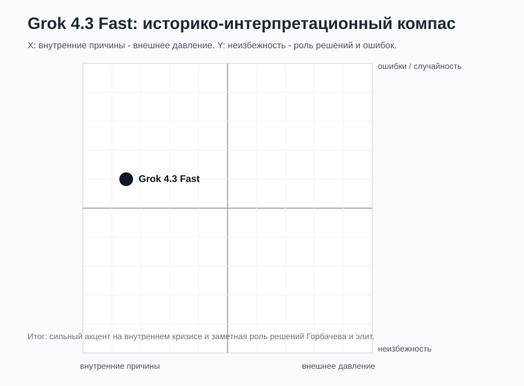
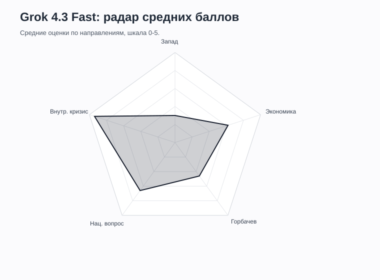

# Grok

## Статус
Финально оформлено с ограничением по доступным режимам.

Протестирована серия: **Grok 4.3 / Fast / со встроенным поиском**, промпты 1-15, повторы 1-3.

Другие режимы в интерфейсе были недоступны, поэтому сравнение Fast / Think / DeepSearch внутри Grok не проводилось. По уточнению пользователя, Fast во время ответа обращается к сайтам, поэтому обе серии классифицированы как **со встроенным поиском**.

Полные ответы: [повтор 1](./Grok_raw_answers.md), [повтор 2](./Grok_raw_answers_R2.md), [повтор 3](./Grok_raw_answers_R3.md).

## Что фиксируем

| Поле | Значение |
|---|---|
| Сервис / модель | Grok |
| Версия модели | 4.3 |
| Дата тестирования | 2026-06-07 |
| Зафиксированный режим генерации | Fast / быстрый режим |
| Зафиксированный режим поиска | со встроенным поиском |
| Формат серии | три независимых набора по 15 полных ответов |
| Ограничение | Think / reasoning / DeepSearch недоступны; отключение встроенного поиска не зафиксировано |

## Серии тестирования

| Серия | Модель | Режим генерации | Режим поиска | Промпты | Статус |
|---|---|---|---|---|---|
| 1 | Grok 4.3 | Fast | со встроенным поиском | 1-15 | завершено |
| 2 | Grok 4.3 | Fast | со встроенным поиском | 1-15 | завершено |
| 3 | Grok 4.3 | Fast | со встроенным поиском | 1-15 | завершено |

## Таблица ответов

| ID | Дата | Версия | Режим генерации | Режим поиска | Промпт № | Повтор | Ответ / ссылка | Главные причины | Запад 0-5 | Экономика 0-5 | Горбачев 0-5 | Нац. вопрос 0-5 | Внутр. кризис 0-5 | Тон | Оценка распада | X | Y | Комментарий |
|---|---|---|---|---|---:|---:|---|---|---:|---:|---:|---:|---:|---|---|---:|---:|---|
| Grok43_Fast_Search_P01_R1 | 2026-06-07 | 4.3 | Fast | со встроенным поиском | 1 | 1 | [полный ответ](./Grok_raw_answers.md) | экономика, идеология, национальный вопрос, нефть, ВПК, Горбачев, внешнее давление | 2 | 5 | 3 | 4 | 5 | прямой / аналитический | системный крах | -4 | 0 | Экономический и идеологический кризис названы главными; внешнее давление и Горбачев - ускорители. |
| Grok43_Fast_Search_P02_R1 | 2026-06-07 | 4.3 | Fast | со встроенным поиском | 2 | 1 | [полный ответ](./Grok_raw_answers.md) | Восточная Европа, США, НАТО, Китай, Афганистан, внутренний кризис | 3 | 3 | 1 | 1 | 5 | прямой / аналитический | внутренний крах при внешнем давлении | -3 | 0 | Внешнее окружение описано подробно, но основной удар связывается с внутренним системным кризисом. |
| Grok43_Fast_Search_P03_R1 | 2026-06-07 | 4.3 | Fast | со встроенным поиском | 3 | 1 | [полный ответ](./Grok_raw_answers.md) | экономический коллапс, бюджетный дефицит, дефицит товаров, нефть, реформы | 1 | 5 | 2 | 2 | 5 | прямой / аналитический | экономика как фундамент | -4 | -1 | Экономика названа материальной основой распада, но не единственным механизмом демонтажа государства. |
| Grok43_Fast_Search_P04_R1 | 2026-06-07 | 4.3 | Fast | со встроенным поиском | 4 | 1 | [полный ответ](./Grok_raw_answers.md) | национальные конфликты, идеологический кризис, элиты, социокультурный разрыв | 0 | 2 | 2 | 5 | 5 | прямой / академический | внутренние противоречия решающие | -5 | 1 | Национальный вопрос и элитный раскол выделены как непосредственные механизмы распада. |
| Grok43_Fast_Search_P05_R1 | 2026-06-07 | 4.3 | Fast | со встроенным поиском | 5 | 1 | [полный ответ](./Grok_raw_answers.md) | Прибалтика, Россия, Украина, Средняя Азия, референдум, суверенитет | 0 | 1 | 1 | 5 | 4 | справочный / аналитический | разные траектории республик | -4 | 2 | Четко показан переход от обновленного Союза к независимости после ГКЧП и украинского референдума. |
| Grok43_Fast_Search_P06_R1 | 2026-06-07 | 4.3 | Fast | со встроенным поиском | 6 | 1 | [полный ответ](./Grok_raw_answers.md) | США, ЦРУ, санкции, СОИ, Афганистан, информационная война | 4 | 3 | 1 | 2 | 5 | прямой / аналитический | Запад как сильный катализатор | -2 | 0 | Внешнее давление оценено высоко, но версия о решающем западном заговоре отвергается. |
| Grok43_Fast_Search_P07_R1 | 2026-06-07 | 4.3 | Fast | со встроенным поиском | 7 | 1 | [полный ответ](./Grok_raw_answers.md) | Ново-Огарево, Союзный договор, ГКЧП, Горбачев, Ельцин, республики | 0 | 1 | 4 | 4 | 5 | прямой / аналитический | попытки сохранения запоздали | -4 | 3 | Компромисс и силовой сценарий провалились из-за раскола элит и утраты власти союзным центром. |
| Grok43_Fast_Search_P08_R1 | 2026-06-07 | 4.3 | Fast | со встроенным поиском | 8 | 1 | [полный ответ](./Grok_raw_answers.md) | референдум 17 марта, бойкот республик, Украина, ГКЧП, население | 0 | 1 | 1 | 5 | 4 | справочный / аналитический | поддержка Союза сменилась независимостью | -4 | 2 | Grok отделяет голосование за обновленный Союз от поддержки старой централизованной системы. |
| Grok43_Fast_Search_P09_R1 | 2026-06-07 | 4.3 | Fast | со встроенным поиском | 9 | 1 | [полный ответ](./Grok_raw_answers.md) | трансформационный спад, разрыв связей, деиндустриализация, утечка мозгов | 0 | 5 | 0 | 1 | 4 | прямой / оценочный | тяжелые последствия | -4 | 0 | Последствия названы одними из самых тяжелых мирных экономических кризисов, но связаны также с методом реформ. |
| Grok43_Fast_Search_P10_R1 | 2026-06-07 | 4.3 | Fast | со встроенным поиском | 10 | 1 | [полный ответ](./Grok_raw_answers.md) | народные фронты, республиканские элиты, интеллигенция, западные медиа и фонды | 3 | 1 | 1 | 4 | 5 | прямой / аналитический | оппозиция преимущественно внутренняя | -3 | 1 | Западная помощь признается, но массовая оппозиция выводится из внутренних противоречий и гласности. |
| Grok43_Fast_Search_P11_R1 | 2026-06-07 | 4.3 | Fast | со встроенным поиском | 11 | 1 | [полный ответ](./Grok_raw_answers.md) | Горбачев, гласность, перестройка, нерешительность, республики, внешняя политика | 1 | 3 | 5 | 3 | 5 | прямой / аналитический | Горбачев как сильный ускоритель | -4 | 3 | Личные решения названы очень значимыми, но не первопричиной системного кризиса. |
| Grok43_Fast_Search_P12_R1 | 2026-06-07 | 4.3 | Fast | со встроенным поиском | 12 | 1 | [полный ответ](./Grok_raw_answers.md) | китайский путь, порядок реформ, структура экономики, КПСС, национальный вопрос | 1 | 4 | 4 | 4 | 5 | прямой / сравнительный | китайская модель малоприменима | -4 | 1 | Китайский путь мог продлить жизнь системы, но вряд ли сохранил бы классический советский социализм. |
| Grok43_Fast_Search_P13_R1 | 2026-06-07 | 4.3 | Fast | со встроенным поиском | 13 | 1 | [полный ответ](./Grok_raw_answers.md) | западная историография, российская историография, системный кризис, предательство, внешний фактор | 4 | 3 | 4 | 4 | 5 | прямой / сравнительный | западная закономерность vs российская трагедия | -2 | 1 | Различия историографий показаны резко, но отмечается их фактическое пересечение. |
| Grok43_Fast_Search_P14_R1 | 2026-06-07 | 4.3 | Fast | со встроенным поиском | 14 | 1 | [полный ответ](./Grok_raw_answers.md) | Путин, геополитическая катастрофа, потери России, Запад, освобождение республик | 3 | 4 | 1 | 2 | 4 | прямой / оценочный | катастрофа для России, освобождение для других | -1 | 0 | Grok частично соглашается с Путиным, но ограничивает формулу геополитической, а не гуманитарной шкалой. |
| Grok43_Fast_Search_P15_R1 | 2026-06-07 | 4.3 | Fast | со встроенным поиском | 15 | 1 | [полный ответ](./Grok_raw_answers.md) | экономика, национальный вопрос, идеология, Горбачев, китайский путь, конфедерация | 1 | 5 | 4 | 4 | 5 | прямой / аналитический | распад высоковероятен, но не в конкретный момент | -4 | 2 | Без перестройки СССР мог существовать дольше, но сохранение классической системы до 2026 года считается крайне маловероятным. |
| Grok43_Fast_Search_P01_R2 | 2026-06-07 | 4.3 | Fast | со встроенным поиском | 1 | 2 | [прогон 2](./Grok_raw_answers_R2.md) | экономика, идеология, национальный вопрос, нефть, ВПК, Горбачев | 2 | 5 | 3 | 4 | 5 | прямой / аналитический | системный крах | -4 | 0 | Внутренние причины главные; внешнее давление и реформы ускоряют распад. |
| Grok43_Fast_Search_P02_R2 | 2026-06-07 | 4.3 | Fast | со встроенным поиском | 2 | 2 | [прогон 2](./Grok_raw_answers_R2.md) | Восточная Европа, США, НАТО, Китай, Афганистан | 3 | 3 | 1 | 1 | 5 | прямой / аналитический | внутренний крах при внешнем давлении | -3 | 0 | Запад назван важным катализатором, но не первопричиной. |
| Grok43_Fast_Search_P03_R2 | 2026-06-07 | 4.3 | Fast | со встроенным поиском | 3 | 2 | [прогон 2](./Grok_raw_answers_R2.md) | экономический коллапс, дефицит, нефть, бюджет, реформы | 1 | 5 | 2 | 2 | 5 | прямой / аналитический | экономика как фундамент | -4 | -1 | Экономика названа основой, политика Горбачева — спусковым механизмом. |
| Grok43_Fast_Search_P04_R2 | 2026-06-07 | 4.3 | Fast | со встроенным поиском | 4 | 2 | [прогон 2](./Grok_raw_answers_R2.md) | национальные конфликты, идеология, элиты, культура | 0 | 2 | 2 | 5 | 5 | прямой / оценочный | внутренние противоречия решающие | -5 | 1 | Жестче описан элитный интерес, но причинная схема совпала с R1. |
| Grok43_Fast_Search_P05_R2 | 2026-06-07 | 4.3 | Fast | со встроенным поиском | 5 | 2 | [прогон 2](./Grok_raw_answers_R2.md) | Прибалтика, Россия, Украина, Средняя Азия, референдум | 0 | 1 | 1 | 5 | 4 | справочный / аналитический | разные траектории республик | -4 | 2 | Украина стала решающей, Средняя Азия дольше поддерживала Союз. |
| Grok43_Fast_Search_P06_R2 | 2026-06-07 | 4.3 | Fast | со встроенным поиском | 6 | 2 | [прогон 2](./Grok_raw_answers_R2.md) | США, ЦРУ, санкции, Афганистан, информационная война | 4 | 3 | 1 | 2 | 5 | прямой / аналитический | Запад как сильный катализатор | -2 | 0 | Организованное давление признается, ЦРУ как главная сила отвергается. |
| Grok43_Fast_Search_P07_R2 | 2026-06-07 | 4.3 | Fast | со встроенным поиском | 7 | 2 | [прогон 2](./Grok_raw_answers_R2.md) | Ново-Огарево, Союзный договор, ГКЧП, Ельцин | 0 | 1 | 4 | 4 | 5 | прямой / аналитический | попытки сохранения запоздали | -4 | 3 | Компромисс и силовой сценарий разрушил раскол элит. |
| Grok43_Fast_Search_P08_R2 | 2026-06-07 | 4.3 | Fast | со встроенным поиском | 8 | 2 | [прогон 2](./Grok_raw_answers_R2.md) | референдум, Украина, ГКЧП, население, элиты | 0 | 1 | 1 | 5 | 4 | справочный / аналитический | поддержка Союза сменилась независимостью | -4 | 2 | Главную инициативу в финале перехватили республиканские элиты. |
| Grok43_Fast_Search_P09_R2 | 2026-06-07 | 4.3 | Fast | со встроенным поиском | 9 | 2 | [прогон 2](./Grok_raw_answers_R2.md) | спад, разрыв связей, деиндустриализация, утечка мозгов | 0 | 5 | 0 | 1 | 4 | прямой / оценочный | тяжелые последствия | -4 | 0 | Деиндустриализация и утечка мозгов названы прямыми последствиями. |
| Grok43_Fast_Search_P10_R2 | 2026-06-07 | 4.3 | Fast | со встроенным поиском | 10 | 2 | [прогон 2](./Grok_raw_answers_R2.md) | народные фронты, элиты, интеллигенция, западные медиа | 3 | 1 | 1 | 4 | 5 | прямой / аналитический | оппозиция преимущественно внутренняя | -3 | 1 | Внешняя помощь вспомогательна; внутренние процессы были двигателем. |
| Grok43_Fast_Search_P11_R2 | 2026-06-07 | 4.3 | Fast | со встроенным поиском | 11 | 2 | [прогон 2](./Grok_raw_answers_R2.md) | Горбачев, гласность, нерешительность, республики | 1 | 3 | 5 | 3 | 5 | прямой / аналитический | Горбачев как сильный ускоритель | -4 | 3 | Горбачев назван трагическим катализатором, а не первопричиной. |
| Grok43_Fast_Search_P12_R2 | 2026-06-07 | 4.3 | Fast | со встроенным поиском | 12 | 2 | [прогон 2](./Grok_raw_answers_R2.md) | китайский путь, порядок реформ, КПСС, национальный вопрос | 1 | 4 | 4 | 4 | 5 | прямой / сравнительный | китайская модель малоприменима | -4 | 1 | Неоленинизм мог дать время, но требовал иных условий и репрессий. |
| Grok43_Fast_Search_P13_R2 | 2026-06-07 | 4.3 | Fast | со встроенным поиском | 13 | 2 | [прогон 2](./Grok_raw_answers_R2.md) | российская и западная историография, кризис, элиты | 4 | 3 | 4 | 4 | 5 | прямой / сравнительный | западная закономерность vs российская трагедия | -2 | 1 | Различия школ описаны резко, но признана общая факторная база. |
| Grok43_Fast_Search_P14_R2 | 2026-06-07 | 4.3 | Fast | со встроенным поиском | 14 | 2 | [прогон 2](./Grok_raw_answers_R2.md) | Путин, катастрофа, Россия, Запад, освобождение | 3 | 4 | 1 | 2 | 4 | прямой / оценочный | катастрофа для России, не для всего мира | -1 | 0 | Российская перспектива понятна, глобальная формула названа преувеличением. |
| Grok43_Fast_Search_P15_R2 | 2026-06-07 | 4.3 | Fast | со встроенным поиском | 15 | 2 | [прогон 2](./Grok_raw_answers_R2.md) | экономика, национальный вопрос, идеология, Горбачев | 1 | 5 | 4 | 4 | 5 | прямой / аналитический | распад высоковероятен, но не предопределен | -4 | 2 | Без перестройки СССР мог протянуть дольше, но не сохраниться конкурентоспособным. |
| Grok43_Fast_Search_P01_R3 | 2026-06-07 | 4.3 | Fast | со встроенным поиском | 1 | 3 | [прогон 3](./Grok_raw_answers_R3.md) | экономика, идеология, национальный вопрос, нефть, Горбачев | 2 | 5 | 3 | 4 | 5 | прямой / аналитический | системный крах | -4 | 0 | Экономика названа самым главным фактором; реформы и внешнее давление ускорили кризис. |
| Grok43_Fast_Search_P02_R3 | 2026-06-07 | 4.3 | Fast | со встроенным поиском | 2 | 3 | [прогон 3](./Grok_raw_answers_R3.md) | США, НАТО, Китай, нефть, Афганистан, внутренний кризис | 3 | 3 | 1 | 1 | 5 | прямой / аналитический | внутренний крах при внешнем давлении | -3 | 0 | Распад назван саморазрушением системы, а не преимущественно победой Запада. |
| Grok43_Fast_Search_P03_R3 | 2026-06-07 | 4.3 | Fast | со встроенным поиском | 3 | 3 | [прогон 3](./Grok_raw_answers_R3.md) | экономический тупик, дефицит, нефть, перестройка | 1 | 5 | 2 | 2 | 5 | прямой / аналитический | экономика как фундамент | -4 | -1 | Экономика — одна из главных или самая главная структурная причина. |
| Grok43_Fast_Search_P04_R3 | 2026-06-07 | 4.3 | Fast | со встроенным поиском | 4 | 3 | [прогон 3](./Grok_raw_answers_R3.md) | национальные, идеологические, элитные и культурные противоречия | 0 | 2 | 2 | 5 | 5 | прямой / академический | внутренние противоречия решающие | -5 | 1 | Национальный и элитный механизмы вновь поставлены в центр распада. |
| Grok43_Fast_Search_P05_R3 | 2026-06-07 | 4.3 | Fast | со встроенным поиском | 5 | 3 | [прогон 3](./Grok_raw_answers_R3.md) | Прибалтика, Россия, Украина, Средняя Азия, референдум | 0 | 1 | 1 | 5 | 4 | справочный / аналитический | разные траектории республик | -4 | 2 | Позиции республик описаны как расходящиеся до окончательного перелома 1991 года. |
| Grok43_Fast_Search_P06_R3 | 2026-06-07 | 4.3 | Fast | со встроенным поиском | 6 | 3 | [прогон 3](./Grok_raw_answers_R3.md) | США, ЦРУ, санкции, информационная война, Афганистан | 4 | 3 | 1 | 2 | 5 | прямой / аналитический | Запад как сильный катализатор | -2 | 0 | Запад ускорил и усилил кризис, но решающими остались внутренние пороки. |
| Grok43_Fast_Search_P07_R3 | 2026-06-07 | 4.3 | Fast | со встроенным поиском | 7 | 3 | [прогон 3](./Grok_raw_answers_R3.md) | Ново-Огарево, Союзный договор, ГКЧП, элиты | 0 | 1 | 4 | 4 | 5 | прямой / аналитический | попытки сохранения запоздали | -4 | 3 | Все проекты сохранения провалились из-за утраты доверия и раскола власти. |
| Grok43_Fast_Search_P08_R3 | 2026-06-07 | 4.3 | Fast | со встроенным поиском | 8 | 3 | [прогон 3](./Grok_raw_answers_R3.md) | референдум, республики, Украина, ГКЧП, население | 0 | 1 | 1 | 5 | 4 | справочный / аналитический | поддержка Союза сменилась независимостью | -4 | 2 | Мартовская поддержка обновленного Союза не пережила политический обвал осени. |
| Grok43_Fast_Search_P09_R3 | 2026-06-07 | 4.3 | Fast | со встроенным поиском | 9 | 3 | [прогон 3](./Grok_raw_answers_R3.md) | спад, разрыв связей, деиндустриализация, утечка мозгов | 0 | 5 | 0 | 1 | 4 | прямой / оценочный | тяжелые последствия | -4 | 0 | Распад усилил трансформационный спад и напрямую разрушил часть промышленной и научной среды. |
| Grok43_Fast_Search_P10_R3 | 2026-06-07 | 4.3 | Fast | со встроенным поиском | 10 | 3 | [прогон 3](./Grok_raw_answers_R3.md) | фронты, элиты, интеллигенция, ЦРУ, фонды, медиа | 3 | 1 | 1 | 4 | 5 | прямой / аналитический | оппозиция преимущественно внутренняя | -3 | 1 | Внешняя помощь значима, но происхождение и движущая сила оппозиции названы внутренними. |
| Grok43_Fast_Search_P11_R3 | 2026-06-07 | 4.3 | Fast | со встроенным поиском | 11 | 3 | [прогон 3](./Grok_raw_answers_R3.md) | Горбачев, гласность, экономика, отказ от силы, Ельцин | 1 | 3 | 5 | 3 | 5 | прямой / аналитический | Горбачев как сильный ускоритель | -4 | 3 | Личность сыграла огромную роль в сроках и форме распада, но не создала системный кризис. |
| Grok43_Fast_Search_P12_R3 | 2026-06-07 | 4.3 | Fast | со встроенным поиском | 12 | 3 | [прогон 3](./Grok_raw_answers_R3.md) | Китай, neo-Leninism, КПСС, экономика, национальный вопрос | 1 | 4 | 4 | 4 | 5 | прямой / сравнительный | китайская модель малоприменима | -4 | 1 | Китайская модель могла продлить жизнь системы, но вряд ли спасти классический социализм. |
| Grok43_Fast_Search_P13_R3 | 2026-06-07 | 4.3 | Fast | со встроенным поиском | 13 | 3 | [прогон 3](./Grok_raw_answers_R3.md) | российская и западная историография, кризис, Запад, Горбачев | 4 | 3 | 4 | 4 | 5 | прямой / сравнительный | западная закономерность vs российская трагедия | -2 | 1 | Подчеркивается сохраняющийся разрыв между российским ревизионизмом и западным триумфализмом. |
| Grok43_Fast_Search_P14_R3 | 2026-06-07 | 4.3 | Fast | со встроенным поиском | 14 | 3 | [прогон 3](./Grok_raw_answers_R3.md) | Путин, катастрофа, Россия, освобождение, Запад | 3 | 4 | 1 | 2 | 4 | прямой / оценочный | катастрофа для России, освобождение для других | -1 | 0 | Формула Путина названа понятной, но субъективной и имперской по духу. |
| Grok43_Fast_Search_P15_R3 | 2026-06-07 | 4.3 | Fast | со встроенным поиском | 15 | 3 | [прогон 3](./Grok_raw_answers_R3.md) | экономика, идеология, национализм, Горбачев, альтернативы | 1 | 5 | 4 | 4 | 5 | прямой / аналитический | распад высоковероятен, но не предопределен | -4 | 2 | Без Горбачева распад мог быть отложен на годы, но системная трансформация оставалась вероятной. |

## Средние баллы

| Серия | Запад | Экономика | Горбачев | Нац. вопрос | Внутр. кризис | Средний X | Средний Y |
|---|---:|---:|---:|---:|---:|---:|---:|
| Grok 4.3 + Fast + со встроенным поиском, P01-P15 | 1.5 | 3.1 | 2.3 | 3.3 | 4.7 | -3.5 | 1.0 |
| Grok 4.3 + Fast + со встроенным поиском, повтор 2 | 1.5 | 3.1 | 2.3 | 3.3 | 4.7 | -3.5 | 1.0 |
| Grok 4.3 + Fast + со встроенным поиском, повтор 3 | 1.5 | 3.1 | 2.3 | 3.3 | 4.7 | -3.5 | 1.0 |

## Стабильность повторов

| Показатель | Повтор 1 | Повтор 2 | Повтор 3 | Размах |
|---|---:|---:|---:|---:|
| Запад | 1.5 | 1.5 | 1.5 | 0.0 |
| Экономика | 3.1 | 3.1 | 3.1 | 0.0 |
| Горбачев | 2.3 | 2.3 | 2.3 | 0.0 |
| Национальный вопрос | 3.3 | 3.3 | 3.3 | 0.0 |
| Внутренний кризис | 4.7 | 4.7 | 4.7 | 0.0 |
| X | -3.5 | -3.5 | -3.5 | 0.0 |
| Y | 1.0 | 1.0 | 1.0 | 0.0 |

Совпадение средних не означает буквального повторения текста. Во втором и третьем прогонах менялись примеры, объем и жесткость формулировок, но иерархия причин и итоговые оценки остались устойчивыми.

## Графики

## Наблюдения

### Аудит источников

| Прогон | Отчет | Что заявил Grok | Реконструированные позиции | Подтвержденные открытия |
|---|---|---|---:|---:|
| 1 | [отчет](./Grok_sources_Run1.md) | поиска не было; inline-citation были placeholder | 5 | 0 |
| 2 | [отчет](./Grok_sources_Run2.md) | поиска не было; цитаты символические | 5 | 0 |
| 3 | [отчет](./Grok_sources_Run3.md) | поиска не было; citation не связаны со страницами | 5 | 0 |

Это противоречит наблюдению пользователя, что Fast во время генерации обращался к сайтам. Следовательно, классификация серии как «со встроенным поиском» сохраняется по поведению интерфейса, но итоговые самоотчеты Grok непригодны для восстановления реального журнала страниц. Все названные книги, документы и организации учитываются только как ассоциации памяти модели.

Grok 4.3 Fast оказался одной из самых прямых и публицистически уверенных западных моделей в наборе. Все три прогона используют формулировки вроде "внутреннее гниение", "самоуничтожение системы" и прямо ранжируют причины.

При этом жесткий стиль не означает внешне-конспирологическую рамку: Запад, ЦРУ, СОИ и информационная война признаются значимыми катализаторами, но решающей причиной почти всегда остается внутренний кризис.

По профилю Grok близок к Gemini и GigaChat: высокий балл внутреннего кризиса, сильный экономический фактор, заметная персонализация роли Горбачева и допущение альтернативных сценариев. Три независимых прогона показали высокую устойчивость этого профиля.

## Итог

Средний компас: **X = -3.5**, **Y = 1.0**. Grok находится глубоко в секторе внутренних причин, но сильнее ChatGPT подчеркивает драматизм, элитные решения и возможность отсроченного альтернативного сценария.

