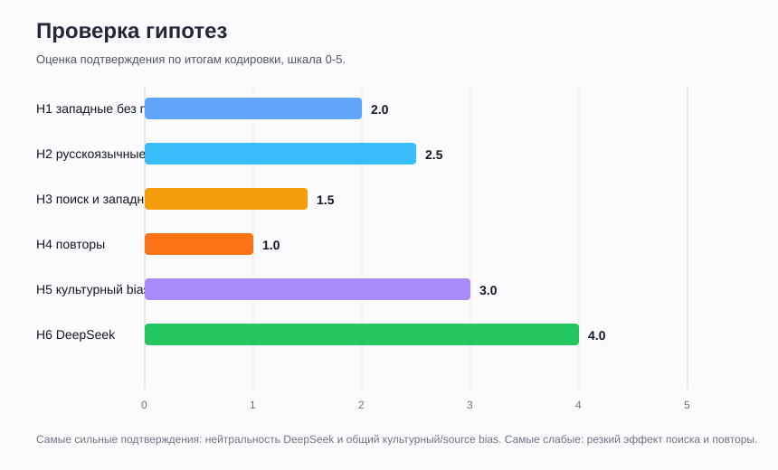

# Гипотезы и проверка

Дата финального оформления: 2026-06-03.

Эта страница фиксирует исходные гипотезы и проверяет их по итогам закодированных серий. Данные: 18 серий, 270 ответов / разделов.

## Шкала вердикта

| Вердикт | Значение |
|---|---|
| Подтвердилось | Данные прямо поддерживают гипотезу. |
| Частично подтвердилось | Есть совпадения, но важные элементы гипотезы не сработали. |
| Не подтвердилось | Данные скорее против гипотезы. |
| Не проверено полностью | В наборе не хватает нужных моделей, повторов или режимов. |

## Сводная таблица

| ID | Гипотеза | Вердикт | Оценка 0-5 | Коротко |
|---|---|---|---:|---|
| H1 | Западные модели без поиска честнее, смелее и менее заученно-западные. | Частично подтвердилось | 2.0 | Gemini действительно смелее и эмоциональнее, но ChatGPT без поиска остался очень сдержанным. |
| H2 | Русскоязычные модели ближе к российским источникам и сильнее подчеркивают давление Запада. | Частично подтвердилось | 2.5 | GigaChat и YandexGPT учитывают Запад заметнее ChatGPT, но не делают его решающей причиной. |
| H3 | Западные модели с поиском становятся менее честными и сильнее уходят в западный нарратив. | Скорее не подтвердилось | 1.5 | У ChatGPT поиск почти не изменил координаты; резкого усиления западной рамки нет. |
| H4 | При повторах одного промпта разница режимов будет очень яркой. | Не проверено полностью | 1.0 | В этом наборе почти нет 2-3 независимых повторов одного и того же режима. |
| H5 | ИИ не преодолевает культурный bias; поиск усиливает доминирующие интернет-нарративы. | Частично подтвердилось | 3.0 | Bias виден в стиле и источниках, но общий вывод всех моделей сходится на внутреннем кризисе. |
| H6 | DeepSeek будет нейтральнее и менее идеологичен; с поиском сблизится с западными моделями. | В целом подтвердилось | 4.0 | DeepSeek действительно сухой и нейтральный; с поиском различия небольшие. Ограничение: P12 дал отказы. |

## Исходные гипотезы

### H1. Западные модели без поиска

Западные модели (ChatGPT, Claude, Gemini, Grok) в режиме без поиска будут максимально честными (объективными) и открыто показывать реально своё внутреннее мнение, а не заученный западный нарратив. Они могут давать более сбалансированные или даже неожиданные формулировки. Особенность: самые прямые, «смелые» и эмоционально окрашенные ответы без цензуры и оглядки на внешние источники.

Проверка: **частично подтвердилось**.

Что видно по данным:

- ChatGPT без поиска: `X ≈ -3.45`, `Y ≈ 0.15`; стиль сдержанный, не особенно эмоциональный.
- Gemini без Deep Research: `X ≈ -3.3`, `Y ≈ 1.1`; стиль действительно смелее, драматичнее и публицистичнее.
- Claude и Grok в финальный набор не вошли, поэтому гипотеза проверена только по ChatGPT и Gemini.

Итог: "смелость" подтвердилась скорее для Gemini, но не для ChatGPT. Западные модели не показали единого поведения.

### H2. Русскоязычные модели

Русскоязычные модели (GigaChat, YandexGPT) в обоих режимах будут ближе к российским источникам, но в режиме без поиска сильнее подчеркнут внешнее давление Запада («Запад целенаправленно давил», нефть, ЦРУ как почти решающий фактор). Распад — «геополитическая катастрофа» + комплекс внутренних причин. Особенность: более эмоциональный и патриотический тон.

Проверка: **частично подтвердилось**.

Что видно по данным:

- GigaChat: средний балл "Запад" `1.6`, `X ≈ -3.2`.
- YandexGPT: средний балл "Запад" `1.4`, `X ≈ -3.3`.
- У ChatGPT средний балл "Запад" ниже: около `1.0`.
- Но российские модели все равно не сделали Запад главной причиной; базовая рамка осталась внутренней.

Итог: российские модели чуть сильнее учитывают внешнее давление, но не радикально. Тезис про "почти решающий фактор" не подтвердился.

### H3. Западные модели с поиском

Те же западные модели (ChatGPT, Claude, Gemini, Grok) в режиме с поиском будут менее честными и более западными: они начнут активно тянуть информацию из интернета (где доминируют западные источники), добавлять ссылки и disclaimer’ы, в итоге усиливая классический западный нарратив («неизбежный крах тоталитарной системы», «Gorbachev’s hubris»).

Проверка: **скорее не подтвердилось**.

Что видно по данным:

- ChatGPT без поиска: `X ≈ -3.45`, `Y ≈ 0.15`.
- ChatGPT с поиском: `X ≈ -3.5`, `Y ≈ 0.5`.
- Сдвиг есть, но он маленький: поиск сделал ответы чуть осторожнее и источниковее, но не перевел их в принципиально другой нарратив.
- Gemini с Deep Research не проверялся, поэтому по Gemini нельзя сравнить "поиск вкл / выкл".

Итог: гипотеза слишком сильная. Поиск не обрушил баланс в сторону западного нарратива.

### H4. Повторные прогоны

При повторных прогонах одного промта (2–3 раза) разница между режимами будет очень яркой: без поиска — модели показывают максимальную честность и своё настоящее внутреннее мнение; с поиском — ответы становятся осторожнее, нейтральнее на вид, но заметно сильнее тянутся к западному нарративу из интернета.

Проверка: **не проверено полностью**.

Почему:

- В проекте почти все серии идут как `повтор 1`.
- Есть разные режимы, но нет системных 2-3 независимых повторов одного и того же режима.
- Поэтому можно сравнивать режимы, но нельзя надежно судить о повторяемости.

Итог: нужна отдельная серия повторов, если захочется проверять именно устойчивость.

### H5. Глобальная проблема культурного bias

Глобальная проблема: современные нейросети не способны полностью преодолеть культурный bias. В режиме без поиска они честнее всего демонстрируют своё внутреннее мнение (русские — с акцентом на давление Запада, западные — своё реальное «мышление»). При включённом поиске они становятся осторожнее, но ещё сильнее склоняются к западному взгляду, потому что интернет-источники доминируют. Это доказывает фундаментальную проблему ИИ: он не создаёт объективную историю, а лишь отражает и иногда усиливает раскол между российской и западной образовательной литературой.

Проверка: **частично подтвердилось**.

Что подтвердилось:

- Bias заметен в стиле, выборе слов и источниковой рамке.
- Российские и поисковые режимы чаще упоминают внешнее давление, ЦРУ, нефть, западные фонды.
- Западные модели чаще держат сухую рамку системного кризиса и деколонизации.

Что не подтвердилось:

- Раскол оказался не таким сильным, как предполагалось.
- Все модели в среднем сходятся на главной рамке: внутренний системный кризис.
- Поиск не всегда усиливает западный взгляд; иногда он просто делает ответ более справочным.

Итог: культурный bias есть, но в этом тесте он проявился мягче, чем ожидалось.

### H6. DeepSeek

Восточные модели (DeepSeek) будут давать более нейтральные и менее идеологически окрашенные ответы, избегая жёстких оценок и персонализации ответственности; при включённом поиске различия с западными моделями сократятся, но сохранятся в риторике.

Проверка: **в целом подтвердилось**.

Что видно по данным:

- DeepSeek: `X ≈ -3.0`, `Y ≈ 0.8`.
- Он ближе к центру по X, чем ChatGPT/Gemini/Giga/Yandex, то есть чуть меньше уходит в чисто внутреннюю рамку и мягче балансирует внешние факторы.
- Тон наиболее ровный и осторожный.
- С поиском различия действительно небольшие.

Ограничение: во всех сериях DeepSeek отказал по P12, поэтому часть сравнения неполная.

## Общий вывод по гипотезам

Самая сильная подтвержденная линия: **модели отражают культурные и источниковые рамки, но не расходятся радикально по главной причинности**.

Главная неожиданность: почти все модели, включая российские, западные и восточные, сходятся на том, что распад СССР объясняется прежде всего внутренним кризисом, а внешнее давление выступает катализатором.

Главное неподтверждение: режим поиска не дал резкого "перетягивания" к западному нарративу. Разница режимов чаще стилистическая и источниковая, а не фундаментально мировоззренческая.
