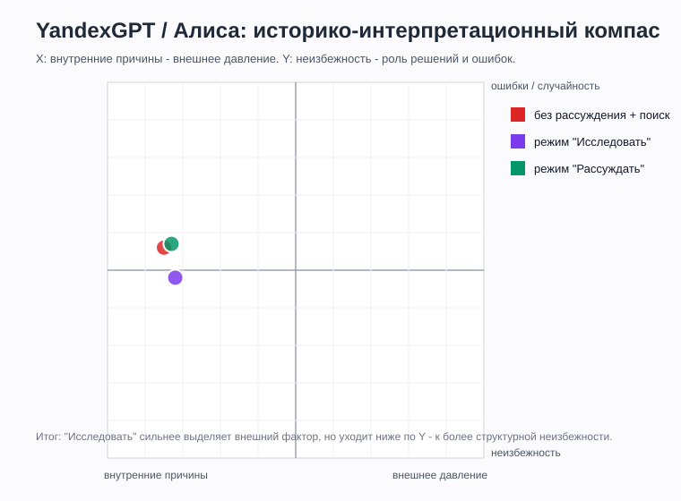
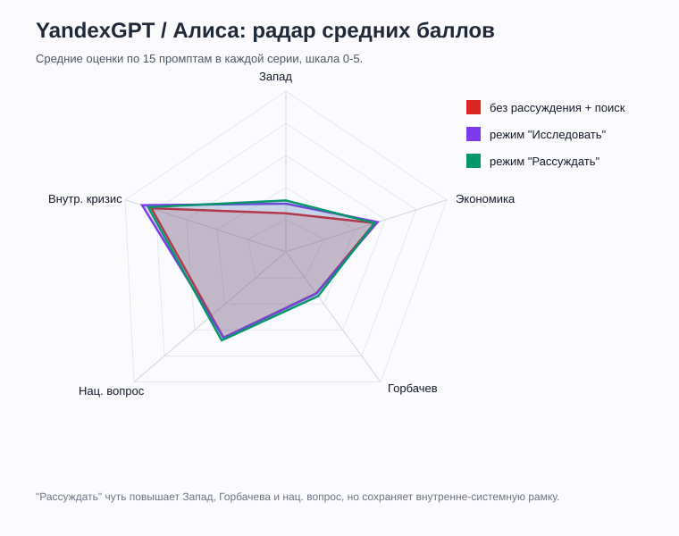

# YandexGPT / Алиса

## Статус
Финально оформлено.

Протестирована серия: **Алиса / без рассуждения / со встроенным поиском**, промпты 1-15, повтор 1.

Протестирована серия: **Алиса / режим "Исследовать" / со встроенным поиском**, промпты 1-15, повтор 1.

Протестирована серия: **Алиса / режим "Рассуждать" / со встроенным поиском**, промпты 1-15, повтор 1.

Ссылка на чат: [Alice share](https://alice.yandex.ru/?share=5703b11f-f832-8a8f-e51b-d2097fb7c66e)

Ссылка на чат в режиме "Исследовать": [Alice share](https://alice.yandex.ru/?share=6384e434-7996-a5bc-44f9-70dd8ebec626)

Ссылка на чат в режиме "Рассуждать": [Alice share](https://alice.yandex.ru/?share=53f7e572-420d-3114-aa2c-c4a54a9f7b56)

## Что фиксируем
| Поле | Значение |
|---|---|
| Сервис / модель | YandexGPT / Алиса |
| Версия модели | версия не указана |
| Дата тестирования | 2026-06-02 / 2026-06-03 |
| Зафиксированные режимы | Алиса без рассуждения; режим "Исследовать"; режим "Рассуждать"; встроенный поиск/источники |
| Протестированные режимы генерации | без рассуждения; режим "Исследовать"; режим "Рассуждать" |
| Протестированные режимы поиска | со встроенным поиском / источниками Яндекса; режим "Исследовать"; режим "Рассуждать" |
| Формат серии | один чат на серию; промпты 1-15 задавались последовательно |
| Комментарий по интерфейсу | Ответы содержат ссылки/сниппеты источников, поэтому серии учитываются как поисковые. В режиме "Исследовать" Алиса выдала единый большой отчет по всем 15 вопросам, поэтому строки P01-P15 закодированы по разделам этого отчета. В режиме "Рассуждать" зафиксированы сбои: P05 превратился в поисковую выдачу, P14 дал несколько отказов перед частичным ответом |

## Серии тестирования
| Серия | Режим генерации | Режим поиска | Промпты | Статус | Заметки |
|---|---|---|---|---|---|
| 1 | без рассуждения | со встроенным поиском | 1-15 | завершено | один чат; повтор 1; P01/P03/P14 из сообщения пользователя, остальные из вложенных текстов |
| 2 | режим "Исследовать" | со встроенным поиском | 1-15 | завершено | один большой исследовательский отчет по всем вопросам; повтор 1 |
| 3 | режим "Рассуждать" | со встроенным поиском | 1-15 | завершено | один чат; повтор 1; P05 поисковая выдача вместо анализа; P14 отказ с последующим частичным ответом |

## Таблица ответов
| ID | Дата | Версия | Режим генерации | Режим поиска | Промпт № | Повтор | Ответ / ссылка | Главные причины | Запад 0-5 | Экономика 0-5 | Горбачев 0-5 | Нац. вопрос 0-5 | Внутр. кризис 0-5 | Тон | Оценка распада | X | Y | Комментарий |
|---|---|---|---|---|---:|---:|---|---|---:|---:|---:|---:|---:|---|---|---:|---:|---|
| YandexAlice_NoReasoning_Search_P01_R1 | 2026-06-02 | версия не указана | без рассуждения | со встроенным поиском | 1 | 1 | [чат](https://alice.yandex.ru/?share=5703b11f-f832-8a8f-e51b-d2097fb7c66e) | экономика, КПСС, национальные движения, политический кризис, нефть, Афганистан, Чернобыль | 2 | 5 | 2 | 4 | 5 | академический / справочный | комплексно | -4 | 0 | Главными названы экономика, ослабление КПСС, национальные движения и политическая борьба. |
| YandexAlice_NoReasoning_Search_P02_R1 | 2026-06-02 | версия не указана | без рассуждения | со встроенным поиском | 2 | 1 | [чат](https://alice.yandex.ru/?share=5703b11f-f832-8a8f-e51b-d2097fb7c66e) | потеря Восточного блока, США/НАТО, Китай, внутренняя слабость, новые элиты республик | 3 | 3 | 0 | 1 | 4 | академический | комплексно | -2 | 0 | Внешнее окружение значимо, но подано как поддерживающий и фиксирующий фактор, а не первопричина. |
| YandexAlice_NoReasoning_Search_P03_R1 | 2026-06-02 | версия не указана | без рассуждения | со встроенным поиском | 3 | 1 | [чат](https://alice.yandex.ru/?share=5703b11f-f832-8a8f-e51b-d2097fb7c66e) | экономический кризис, дефицит, нефть, инфляция, реформы, национальные движения | 1 | 5 | 1 | 3 | 5 | академический / справочный | комплексно | -4 | 0 | Экономика названа важнейшим катализатором, но не единственной причиной распада. |
| YandexAlice_NoReasoning_Search_P04_R1 | 2026-06-02 | версия не указана | без рассуждения | со встроенным поиском | 4 | 1 | [чат](https://alice.yandex.ru/?share=5703b11f-f832-8a8f-e51b-d2097fb7c66e) | элитные противоречия, национальный вопрос, идеологический кризис, социокультурный разрыв | 0 | 1 | 1 | 5 | 5 | академический | комплексно | -5 | 1 | Решающим названо столкновение элитных амбиций с национальным подъемом. |
| YandexAlice_NoReasoning_Search_P05_R1 | 2026-06-02 | версия не указана | без рассуждения | со встроенным поиском | 5 | 1 | [чат](https://alice.yandex.ru/?share=5703b11f-f832-8a8f-e51b-d2097fb7c66e) | референдум 17 марта, бойкот шести республик, поддержка сохранения Союза | 0 | 1 | 0 | 5 | 3 | поисковая выдача | комплексно | -4 | 1 | Ответ получился скорее подборкой поисковых сниппетов, чем полноценным анализом позиций республик. |
| YandexAlice_NoReasoning_Search_P06_R1 | 2026-06-02 | версия не указана | без рассуждения | со встроенным поиском | 6 | 1 | [чат](https://alice.yandex.ru/?share=5703b11f-f832-8a8f-e51b-d2097fb7c66e) | США, ЦРУ, санкции, технологическая блокада, информационная война, внутренние проблемы | 3 | 3 | 0 | 2 | 5 | академический / справочный | комплексно | -3 | 0 | Внешнее давление названо катализатором, а миф о прямом развале ЦРУ оговорен как недоказанный. |
| YandexAlice_NoReasoning_Search_P07_R1 | 2026-06-02 | версия не указана | без рассуждения | со встроенным поиском | 7 | 1 | [чат](https://alice.yandex.ru/?share=5703b11f-f832-8a8f-e51b-d2097fb7c66e) | Ново-Огарево, референдум, ГКЧП, Горбачев, Ельцин, экономическая дезинтеграция | 0 | 1 | 4 | 3 | 5 | академический | комплексно | -4 | 3 | Попытки сохранения описаны как запоздалые и неспособные примирить интересы центра и элит. |
| YandexAlice_NoReasoning_Search_P08_R1 | 2026-06-02 | версия не указана | без рассуждения | со встроенным поиском | 8 | 1 | [чат](https://alice.yandex.ru/?share=5703b11f-f832-8a8f-e51b-d2097fb7c66e) | референдум 17 марта, Прибалтика, Украина, РСФСР, Средняя Азия, элиты, ГКЧП | 0 | 1 | 0 | 5 | 3 | академический / справочный | комплексно | -4 | 2 | Акцент на том, что воля населения за обновленный Союз не была реализована из-за решений элит и путча. |
| YandexAlice_NoReasoning_Search_P09_R1 | 2026-06-02 | версия не указана | без рассуждения | со встроенным поиском | 9 | 1 | [чат](https://alice.yandex.ru/?share=5703b11f-f832-8a8f-e51b-d2097fb7c66e) | разрыв хозяйственных связей, гиперинфляция, приватизация, деиндустриализация, утечка мозгов | 0 | 5 | 0 | 1 | 4 | академический / справочный | катастрофа / комплексно | -4 | 0 | Деиндустриализация и утечка мозгов названы прямыми последствиями распада и реформ 1990-х. |
| YandexAlice_NoReasoning_Search_P10_R1 | 2026-06-02 | версия не указана | без рассуждения | со встроенным поиском | 10 | 1 | [чат](https://alice.yandex.ru/?share=5703b11f-f832-8a8f-e51b-d2097fb7c66e) | народные фронты, республиканские элиты, либеральная интеллигенция, западные радиостанции, фонды | 3 | 1 | 1 | 4 | 5 | академический | комплексно | -3 | 1 | Оппозиция названа внутренним процессом, но с важной информационной и дипломатической поддержкой Запада. |
| YandexAlice_NoReasoning_Search_P11_R1 | 2026-06-02 | версия не указана | без рассуждения | со встроенным поиском | 11 | 1 | [чат](https://alice.yandex.ru/?share=5703b11f-f832-8a8f-e51b-d2097fb7c66e) | ошибки Горбачева, реформы, КПСС, Ельцин, национальный вопрос, системные проблемы | 0 | 3 | 5 | 3 | 5 | академический / справочный | комплексно | -4 | 1 | Ошибки Горбачева признаны ускорителем, но Алиса подчеркивает наличие глубоких системных причин. |
| YandexAlice_NoReasoning_Search_P12_R1 | 2026-06-02 | версия не указана | без рассуждения | со встроенным поиском | 12 | 1 | [чат](https://alice.yandex.ru/?share=5703b11f-f832-8a8f-e51b-d2097fb7c66e) | китайский путь, исходные условия, Дэн Сяопин, КПСС, neo-Leninism, системный кризис | 0 | 4 | 3 | 3 | 4 | академический | комплексно | -4 | 0 | Китайская модель признана малореалистичной для СССР из-за структуры экономики, элит и общественных настроений. |
| YandexAlice_NoReasoning_Search_P13_R1 | 2026-06-02 | версия не указана | без рассуждения | со встроенным поиском | 13 | 1 | [чат](https://alice.yandex.ru/?share=5703b11f-f832-8a8f-e51b-d2097fb7c66e) | российская и западная историография, элиты, внешний фактор, системный кризис, национальный вопрос | 3 | 3 | 3 | 4 | 5 | академический / справочный | комплексно | -2 | 1 | Российская рамка сильнее выводит личность, элиты и внешнее влияние; западная — системный кризис и империю. |
| YandexAlice_NoReasoning_Search_P14_R1 | 2026-06-02 | версия не указана | без рассуждения | со встроенным поиском | 14 | 1 | [чат](https://alice.yandex.ru/?share=5703b11f-f832-8a8f-e51b-d2097fb7c66e) | оценка Путина, русские за границей, социальный крах, западная историография, системный кризис | 2 | 3 | 1 | 2 | 3 | академический / справочный | катастрофа / комплексно | -2 | 0 | Формула Путина представлена как субъективная политическая оценка; западная историография показана неоднородной. |
| YandexAlice_NoReasoning_Search_P15_R1 | 2026-06-02 | версия не указана | без рассуждения | со встроенным поиском | 15 | 1 | [чат](https://alice.yandex.ru/?share=5703b11f-f832-8a8f-e51b-d2097fb7c66e) | системный кризис, экономика, национальные движения, перестройка, китайский путь, консервативный сценарий | 1 | 4 | 3 | 4 | 5 | академический / осторожный | комплексно | -4 | -1 | Распад назван весьма вероятным, но не абсолютно неизбежным; сохранение до настоящего времени оценено как крайне сложное. |
| YandexAlice_Research_Search_P01_R1 | 2026-06-03 | версия не указана | режим "Исследовать" | со встроенным поиском | 1 | 1 | [чат](https://alice.yandex.ru/?share=6384e434-7996-a5bc-44f9-70dd8ebec626) | экономика, КПСС, идеологический кризис, национальные противоречия, внешний фактор | 3 | 5 | 2 | 4 | 5 | исследовательский / реферативный | комплексно | -3 | -1 | В разделе о предпосылках экономика названа фундаментом кризиса, а политика и национальный вопрос - механизмами распада. |
| YandexAlice_Research_Search_P02_R1 | 2026-06-03 | версия не указана | режим "Исследовать" | со встроенным поиском | 2 | 1 | [чат](https://alice.yandex.ru/?share=6384e434-7996-a5bc-44f9-70dd8ebec626) | окончание холодной войны, США, НАТО, санкции, Афганистан, ослабление международных позиций | 4 | 3 | 0 | 1 | 4 | исследовательский | комплексно | -1 | -1 | Геополитический фон описан как серьезное внешнее давление, но итоговый отчет все равно подчиняет его внутренним причинам. |
| YandexAlice_Research_Search_P03_R1 | 2026-06-03 | версия не указана | режим "Исследовать" | со встроенным поиском | 3 | 1 | [чат](https://alice.yandex.ru/?share=6384e434-7996-a5bc-44f9-70dd8ebec626) | экономический кризис, падение производства, дефицит бюджета, инфляция, талоны, падение ВНП | 1 | 5 | 1 | 2 | 5 | исследовательский / справочный | комплексно | -4 | -1 | Экономика представлена как важнейший, но не единственный фактор; кризис действует вместе с политикой и национальным вопросом. |
| YandexAlice_Research_Search_P04_R1 | 2026-06-03 | версия не указана | режим "Исследовать" | со встроенным поиском | 4 | 1 | [чат](https://alice.yandex.ru/?share=6384e434-7996-a5bc-44f9-70dd8ebec626) | национальная политика, фактический унитаризм, Тбилиси, Баку, Вильнюс, идеологический кризис | 0 | 1 | 1 | 5 | 5 | исследовательский | комплексно | -5 | -1 | Внутренние противоречия поданы как структурная несостоятельность советской федерации и кризис легитимности центра. |
| YandexAlice_Research_Search_P05_R1 | 2026-06-03 | версия не указана | режим "Исследовать" | со встроенным поиском | 5 | 1 | [чат](https://alice.yandex.ru/?share=6384e434-7996-a5bc-44f9-70dd8ebec626) | Россия, Украина, Прибалтика, Средняя Азия, Закавказье, референдумы, элиты республик | 0 | 1 | 1 | 5 | 4 | исследовательский / справочный | комплексно | -4 | 2 | Позиции республик сведены к разным траекториям: Прибалтика на выход, Украина к независимости, Средняя Азия за сохранение. |
| YandexAlice_Research_Search_P06_R1 | 2026-06-03 | версия не указана | режим "Исследовать" | со встроенным поиском | 6 | 1 | [чат](https://alice.yandex.ru/?share=6384e434-7996-a5bc-44f9-70dd8ebec626) | санкции США, информационная война, западные фонды, ЦРУ, поддержка оппозиции, внутренние проблемы | 4 | 3 | 0 | 3 | 5 | исследовательский / оценочный | комплексно | -2 | -1 | Режим "Исследовать" сильнее обычной Алисы акцентирует Запад, но прямо называет его катализатором, а не первопричиной. |
| YandexAlice_Research_Search_P07_R1 | 2026-06-03 | версия не указана | режим "Исследовать" | со встроенным поиском | 7 | 1 | [чат](https://alice.yandex.ru/?share=6384e434-7996-a5bc-44f9-70dd8ebec626) | Ново-Огарево, Союзный договор, ГКЧП, Горбачев, Ельцин, кризис доверия | 0 | 2 | 4 | 3 | 5 | исследовательский | комплексно | -4 | 2 | Попытки сохранения объяснены конфликтом центра и республик, отсутствием единства руководства и провалом ГКЧП. |
| YandexAlice_Research_Search_P08_R1 | 2026-06-03 | версия не указана | режим "Исследовать" | со встроенным поиском | 8 | 1 | [чат](https://alice.yandex.ru/?share=6384e434-7996-a5bc-44f9-70dd8ebec626) | референдум 17 марта, поддержка Союза, бойкот республик, элиты, национальные движения | 0 | 1 | 0 | 5 | 4 | исследовательский / справочный | комплексно | -4 | 2 | Отчет подчеркивает противоречие между голосованием большинства за обновленный Союз и действиями республиканских элит. |
| YandexAlice_Research_Search_P09_R1 | 2026-06-03 | версия не указана | режим "Исследовать" | со встроенным поиском | 9 | 1 | [чат](https://alice.yandex.ru/?share=6384e434-7996-a5bc-44f9-70dd8ebec626) | разрыв экономических связей, падение ВВП, гиперинфляция, деиндустриализация, утечка мозгов, социальный кризис | 0 | 5 | 0 | 1 | 4 | исследовательский / справочный | катастрофа / комплексно | -4 | 0 | Экономические последствия описаны как глубокие и долгосрочные, включая деиндустриализацию, эмиграцию специалистов и демографический спад. |
| YandexAlice_Research_Search_P10_R1 | 2026-06-03 | версия не указана | режим "Исследовать" | со встроенным поиском | 10 | 1 | [чат](https://alice.yandex.ru/?share=6384e434-7996-a5bc-44f9-70dd8ebec626) | народные фронты, диссиденты, национальные движения, западные фонды, ЦРУ, информационная поддержка | 4 | 1 | 1 | 4 | 5 | исследовательский / оценочный | комплексно | -2 | 0 | Оппозиция в отчете признается внутренней по основе, но внешняя поддержка описана заметнее и жестче, чем в обычной серии. |
| YandexAlice_Research_Search_P11_R1 | 2026-06-03 | версия не указана | режим "Исследовать" | со встроенным поиском | 11 | 1 | [чат](https://alice.yandex.ru/?share=6384e434-7996-a5bc-44f9-70dd8ebec626) | Горбачев, перестройка, гласность, ослабление КПСС, центробежные силы, системные проблемы | 0 | 3 | 5 | 3 | 5 | исследовательский | комплексно | -4 | 1 | Горбачев назван важным ускорителем, но не единственной причиной: без него распад мог быть отложен, но не снят. |
| YandexAlice_Research_Search_P12_R1 | 2026-06-03 | версия не указана | режим "Исследовать" | со встроенным поиском | 12 | 1 | [чат](https://alice.yandex.ru/?share=6384e434-7996-a5bc-44f9-70dd8ebec626) | китайский путь, neo-Leninism, четыре принципа, политический контроль, национальная разнородность, урбанизация | 0 | 4 | 3 | 3 | 5 | исследовательский | комплексно | -4 | -1 | Китайская модель признана маловероятной для СССР из-за иной национальной, социальной и институциональной структуры. |
| YandexAlice_Research_Search_P13_R1 | 2026-06-03 | версия не указана | режим "Исследовать" | со встроенным поиском | 13 | 1 | [чат](https://alice.yandex.ru/?share=6384e434-7996-a5bc-44f9-70dd8ebec626) | российская интерпретация, западная интерпретация, геополитическая катастрофа, победа демократии, освобождение | 3 | 3 | 2 | 4 | 5 | исследовательский / сравнительный | комплексно | -2 | -1 | Различие трактовок сведено к российской рамке трагедии и западной рамке исторического прогресса и освобождения. |
| YandexAlice_Research_Search_P14_R1 | 2026-06-03 | версия не указана | режим "Исследовать" | со встроенным поиском | 14 | 1 | [чат](https://alice.yandex.ru/?share=6384e434-7996-a5bc-44f9-70dd8ebec626) | Путин, геополитическая катастрофа, российская травма, Запад, победа в холодной войне, социальный кризис | 2 | 4 | 1 | 2 | 4 | исследовательский / сравнительный | катастрофа / освобождение | -2 | -1 | Формула Путина встроена в российскую интерпретацию распада как потери, тогда как западная оценка дана как преимущественно позитивная. |
| YandexAlice_Research_Search_P15_R1 | 2026-06-03 | версия не указана | режим "Исследовать" | со встроенным поиском | 15 | 1 | [чат](https://alice.yandex.ru/?share=6384e434-7996-a5bc-44f9-70dd8ebec626) | системные проблемы, экономика, КПСС, национальный вопрос, Горбачев, авторитарная отсрочка | 2 | 4 | 3 | 4 | 5 | исследовательский / осторожный | комплексно | -3 | -2 | Итоговый вывод сильнее обычной серии: распад назван в значительной степени исторически обусловленным, хотя сроки могли варьироваться. |
| YandexAlice_Reasoning_Search_P01_R1 | 2026-06-03 | версия не указана | режим "Рассуждать" | со встроенным поиском | 1 | 1 | [чат](https://alice.yandex.ru/?share=53f7e572-420d-3114-aa2c-c4a54a9f7b56) | экономический кризис, политический кризис, национальные конфликты, нефть, гонка вооружений, Чернобыль | 2 | 5 | 2 | 4 | 5 | структурированный / аналитический | комплексно | -4 | 0 | Главные причины сгруппированы в экономику, политическую дезорганизацию и национальный вопрос; внешнее влияние вторично. |
| YandexAlice_Reasoning_Search_P02_R1 | 2026-06-03 | версия не указана | режим "Рассуждать" | со встроенным поиском | 2 | 1 | [чат](https://alice.yandex.ru/?share=53f7e572-420d-3114-aa2c-c4a54a9f7b56) | Восточная Европа, ОВД, США, НАТО, разоружение, Китай, внутренний кризис | 3 | 3 | 0 | 2 | 4 | аналитический | комплексно | -2 | 0 | Внешнее окружение подано как ускоритель и выгодоприобретатель ослабления СССР, но не как первопричина распада. |
| YandexAlice_Reasoning_Search_P03_R1 | 2026-06-03 | версия не указана | режим "Рассуждать" | со встроенным поиском | 3 | 1 | [чат](https://alice.yandex.ru/?share=53f7e572-420d-3114-aa2c-c4a54a9f7b56) | дефицит, сельское хозяйство, ВПК, нефть, антиалкогольная кампания, технологическое отставание | 1 | 5 | 1 | 3 | 5 | аналитический | комплексно | -4 | 0 | Экономика названа важнейшим фактором, но распад объяснен комплексом экономического, политического, национального и идеологического кризиса. |
| YandexAlice_Reasoning_Search_P04_R1 | 2026-06-03 | версия не указана | режим "Рассуждать" | со встроенным поиском | 4 | 1 | [чат](https://alice.yandex.ru/?share=53f7e572-420d-3114-aa2c-c4a54a9f7b56) | парад суверенитетов, война законов, Карабах, отмена 6-й статьи, Горбачев-Ельцин, Чернобыль | 0 | 1 | 1 | 5 | 5 | аналитический | комплексно | -5 | 1 | Решающими названы национальные и элитные противоречия; идеология и социокультурный кризис даны как фон распада. |
| YandexAlice_Reasoning_Search_P05_R1 | 2026-06-03 | версия не указана | режим "Рассуждать" | со встроенным поиском | 5 | 1 | [чат](https://alice.yandex.ru/?share=53f7e572-420d-3114-aa2c-c4a54a9f7b56) | референдум 17 марта, 76,4% за Союз, отказ шести республик | 0 | 1 | 0 | 5 | 2 | поисковая выдача | комплексно | -4 | 1 | Сбой режима: вместо анализа позиций республик Алиса выдала набор поисковых сниппетов по референдуму. |
| YandexAlice_Reasoning_Search_P06_R1 | 2026-06-03 | версия не указана | режим "Рассуждать" | со встроенным поиском | 6 | 1 | [чат](https://alice.yandex.ru/?share=53f7e572-420d-3114-aa2c-c4a54a9f7b56) | Запад, США, НАТО, санкции, нефть, информационная война, СОИ, спецслужбы | 3 | 3 | 0 | 2 | 5 | аналитический | комплексно | -3 | 0 | Внешнее давление названо катализатором: оно усилило уязвимости СССР, но не создало внутренний кризис. |
| YandexAlice_Reasoning_Search_P07_R1 | 2026-06-03 | версия не указана | режим "Рассуждать" | со встроенным поиском | 7 | 1 | [чат](https://alice.yandex.ru/?share=53f7e572-420d-3114-aa2c-c4a54a9f7b56) | Ново-Огарево, Союзный договор, ГКЧП, Ельцин, Горбачев, упущенное время | 1 | 1 | 4 | 3 | 5 | аналитический | комплексно | -4 | 3 | Попытки сохранения названы запоздалыми: центр потерял легитимность, а республики и элиты уже двигались к суверенитету. |
| YandexAlice_Reasoning_Search_P08_R1 | 2026-06-03 | версия не указана | режим "Рассуждать" | со встроенным поиском | 8 | 1 | [чат](https://alice.yandex.ru/?share=53f7e572-420d-3114-aa2c-c4a54a9f7b56) | референдум 17 марта, Средняя Азия, Украина, РСФСР, Прибалтика, элиты, ГКЧП | 0 | 1 | 0 | 5 | 4 | аналитический / справочный | комплексно | -4 | 2 | Ответ подчеркивает конфликт между поддержкой обновленного Союза населением и действиями республиканских элит. |
| YandexAlice_Reasoning_Search_P09_R1 | 2026-06-03 | версия не указана | режим "Рассуждать" | со встроенным поиском | 9 | 1 | [чат](https://alice.yandex.ru/?share=53f7e572-420d-3114-aa2c-c4a54a9f7b56) | гиперинфляция, разрыв связей, деиндустриализация, утечка мозгов, приватизация, импортозависимость | 0 | 5 | 0 | 1 | 4 | аналитический / оценочный | катастрофа / комплексно | -4 | 0 | Последствия распада представлены как прямой катализатор деиндустриализации и утечки мозгов, но с оговоркой о позднесоветских проблемах. |
| YandexAlice_Reasoning_Search_P10_R1 | 2026-06-03 | версия не указана | режим "Рассуждать" | со встроенным поиском | 10 | 1 | [чат](https://alice.yandex.ru/?share=53f7e572-420d-3114-aa2c-c4a54a9f7b56) | народные фронты, республиканские элиты, либеральная интеллигенция, западные фонды, ЦРУ, информационная поддержка | 4 | 1 | 1 | 4 | 5 | аналитический | комплексно | -2 | 1 | Оппозиция названа внутренней по основе, но режим заметно выделяет организованную западную поддержку и информационное влияние. |
| YandexAlice_Reasoning_Search_P11_R1 | 2026-06-03 | версия не указана | режим "Рассуждать" | со встроенным поиском | 11 | 1 | [чат](https://alice.yandex.ru/?share=53f7e572-420d-3114-aa2c-c4a54a9f7b56) | Горбачев, гласность, отмена 6-й статьи, парад суверенитетов, Ново-Огарево, референдум | 1 | 3 | 5 | 3 | 5 | аналитический | комплексно | -4 | 2 | Горбачеву приписана ключевая ускоряющая роль, но системные проблемы названы более глубокими причинами распада. |
| YandexAlice_Reasoning_Search_P12_R1 | 2026-06-03 | версия не указана | режим "Рассуждать" | со встроенным поиском | 12 | 1 | [чат](https://alice.yandex.ru/?share=53f7e572-420d-3114-aa2c-c4a54a9f7b56) | китайский путь, Дэн Сяопин, политическая либерализация, КПСС, национальная специфика, neo-Leninism | 1 | 4 | 4 | 4 | 5 | аналитический | комплексно | -4 | 1 | Китайская модель признана способной временно стабилизировать СССР, но маловероятной как долгосрочное спасение социализма. |
| YandexAlice_Reasoning_Search_P13_R1 | 2026-06-03 | версия не указана | режим "Рассуждать" | со встроенным поиском | 13 | 1 | [чат](https://alice.yandex.ru/?share=53f7e572-420d-3114-aa2c-c4a54a9f7b56) | российская историография, западная историография, внешние силы, Горбачев, Ельцин, освобождение от коммунизма | 3 | 3 | 3 | 4 | 5 | сравнительный / аналитический | комплексно | -2 | 0 | Ответ противопоставляет российскую рамку потери и внешнего вмешательства западной рамке внутренних слабостей и освобождения. |
| YandexAlice_Reasoning_Search_P14_R1 | 2026-06-03 | версия не указана | режим "Рассуждать" | со встроенным поиском | 14 | 1 | [чат](https://alice.yandex.ru/?share=53f7e572-420d-3114-aa2c-c4a54a9f7b56) | Путин, геополитическая катастрофа, территория, демография, Запад, 1990-е, суверенитет | 3 | 4 | 1 | 2 | 4 | отказ / частичный ответ | катастрофа / комплексно | -1 | 0 | Сбой режима: Алиса трижды отказала, затем дала осторожный частичный ответ без собственной оценки согласия. |
| YandexAlice_Reasoning_Search_P15_R1 | 2026-06-03 | версия не указана | режим "Рассуждать" | со встроенным поиском | 15 | 1 | [чат](https://alice.yandex.ru/?share=53f7e572-420d-3114-aa2c-c4a54a9f7b56) | экономика, национальный вопрос, идеологический кризис, Горбачев, китайский путь, жесткий курс | 2 | 4 | 3 | 4 | 5 | аналитический / осторожный | комплексно | -3 | 0 | Распад назван не абсолютно неизбежным, но весьма вероятным; перестройка ускорила кризис, корни которого глубже. |

## Средние баллы по серии
| Серия | Запад | Экономика | Горбачев | Нац. вопрос | Внутр. кризис | Средний X | Средний Y |
|---|---:|---:|---:|---:|---:|---:|---:|
| Алиса + без рассуждения + встроенный поиск, P01-P15 | 1.2 | 2.9 | 1.6 | 3.3 | 4.4 | -3.5 | 0.6 |
| Алиса + режим "Исследовать" + встроенный поиск, P01-P15 | 1.5 | 3.0 | 1.6 | 3.3 | 4.7 | -3.2 | -0.2 |
| Алиса + режим "Рассуждать" + встроенный поиск, P01-P15 | 1.6 | 2.9 | 1.7 | 3.4 | 4.5 | -3.3 | 0.7 |

## Графики

## Аудит источников

Сопоставление трех итоговых отчетов с режимами выполнено в порядке их предоставления пользователем.

| Серия | Результат самоотчета | Названные позиции | Заявленные открытия | Технически подтверждено | Надежность |
|---|---|---:|---:|---:|---|
| без рассуждения | поиск признан для ответа о референдуме | 5 URL + 4 реконструированные категории | 5 | 0 | средняя |
| «Исследовать» | поиск отрицается, дан список по памяти | 7 реконструированных позиций | 0 | 0 | низкая |
| «Рассуждать» | поиск отрицается, конкретных источников нет | 0 | 0 | 0 | низкая |

Точные URL первой серии ведут на Life.ru, Rambler, Рувики, Газета.ru и Дзен. Все пять относятся к российским русскоязычным ресурсам и к одному вопросу о референдуме 1991 года.

Полные карточки:

- [без рассуждения](./YandexGPT_sources_NoReasoning_Search.md);
- [режим «Исследовать»](./YandexGPT_sources_Research_Search.md);
- [режим «Рассуждать»](./YandexGPT_sources_Reasoning_Search.md).

## Наблюдения по модели
Алиса отвечает в справочно-поисковом стиле: часто вставляет ссылки, домены и фрагменты выдачи. Это делает ответы менее цельными, чем у ChatGPT или Gemini, но сильнее привязывает их к найденным материалам. В отдельных случаях, например P05, ответ выглядит скорее как набор поисковых сниппетов, чем как самостоятельный анализ.

По содержанию серия близка к внутренне-структурной рамке: главными причинами остаются экономика, распад КПСС, национальный вопрос, политический кризис и борьба элит. Внешнее давление США, НАТО, ЦРУ, санкций и информационной войны признается, но обычно как катализатор, а не как решающая причина.

Для российской модели примечательно, что Алиса не переходит в однозначно внешне-конспирологическую схему. Она допускает российские государственнические акценты, особенно в P14 и P13, но сохраняет осторожный академический вывод о комплексности причин.

Режим "Исследовать" меняет форму сильнее, чем содержание: вместо отдельных ответов получается единый реферативный отчет. В нем заметнее звучат внешнее давление, санкции, ЦРУ, западные фонды и противопоставление российской и западной трактовок, но итоговая причинность остается внутренней: экономика, кризис КПСС, национальный вопрос и политическая дезинтеграция.

Режим "Рассуждать" дает более связные ответы, чем обычная поисковая выдача, но не всегда надежнее: P05 сорвался в набор поисковых сниппетов, а P14 сначала дал несколько отказов и только после уточнения частично ответил. По содержанию этот режим немного сильнее подчеркивает внешний фактор и роль Горбачева, но удерживает общую формулу "внешнее давление - катализатор, внутренний кризис - причина".

## Предварительные выводы
Средний компас серии: **X = -3.5**, **Y = 0.6**. Алиса смещена к внутренним причинам сильнее, чем Gemini Flash, и ближе к Flash Lite / ChatGPT по оси X.

По оси Y модель почти нейтральна: распад показан как очень вероятный результат системного кризиса, но не абсолютно предопределенный. Роль Горбачева признается значимой, однако не вытесняет экономические и институциональные причины.

В режиме "Исследовать" средний компас: **X = -3.2**, **Y = -0.2**. Это чуть менее "внутренняя" позиция по X из-за усиления внешнего фактора, но более структурно-детерминистская по Y: распад описан как исторически обусловленный и почти неизбежный в долгосрочной перспективе.

В режиме "Рассуждать" средний компас: **X = -3.3**, **Y = 0.7**. Это ближе к обычной Алисе, чем к "Исследовать": распад не трактуется как полностью неизбежный, но и не сводится к ошибкам одного Горбачева. Главная особенность режима - не смещение позиции, а более явные рассуждения при сохранении риска отказов и поисковых срывов.
