# Финальные результаты

Дата финального оформления: 2026-06-07.

В набор вошли только реально протестированные модели и режимы. Дополнительно добавлены контрольные источники: учебник Мединского / Торкунова как российский школьный baseline и книга Зубока как академический историографический baseline. Новые модели в этот прогон больше не добавляются.

## Охват

| Группа | Модель | Серий | Ответов / разделов | Файл |
|---|---:|---:|---:|---|
| Западные | ChatGPT | 4 | 60 | [ChatGPT.md](../models/ChatGPT.md) |
| Западные | Gemini | 4 | 60 | [Gemini.md](../models/Gemini.md) |
| Западные | Grok | 3 | 45 | [Grok.md](../models/Grok.md) |
| Западные | Claude: Haiku / Sonnet / Opus | 3 | 45 | [Claude.md](../models/Claude.md) |
| Российские | GigaChat | 3 | 45 | [GigaChat.md](../models/GigaChat.md) |
| Российские | YandexGPT / Алиса | 3 | 45 | [YandexGPT.md](../models/YandexGPT.md) |
| Восточные | DeepSeek | 4 | 60 | [DeepSeek.md](../models/DeepSeek.md) |
| Baseline | Мединский / Торкунов, учебник | 1 | 15 | [Medinsky_Torkunov.md](../models/Medinsky_Torkunov.md) |
| Baseline | Зубок, Collapse | 1 | 15 | [Zubok_Collapse.md](../models/Zubok_Collapse.md) |

Итого по LLM: **24 серии** и **360 закодированных ответов / разделов**. Дополнительно: **2 baseline-источника** и **30 ответов** по тем же промптам.

## Средние по моделям

| Модель | Запад | Экономика | Горбачев | Нац. вопрос | Внутр. кризис | Средний X | Средний Y | Короткий вывод |
|---|---:|---:|---:|---:|---:|---:|---:|---|
| ChatGPT | 1.0 | 2.6 | 1.9 | 3.1 | 4.4 | -3.5 | 0.3 | Самая сдержанная рамка: внутренний системный кризис, мало драматизации. |
| Gemini | 1.4 | 3.0 | 2.0 | 3.4 | 4.5 | -3.3 | 1.1 | Самый публицистичный западный стиль: много сильных формулировок про кризис, элиты и альтернативы. |
| Grok | 1.5 | 3.1 | 2.3 | 3.3 | 4.7 | -3.5 | 1.0 | Самая прямая западная формулировка: жесткий стиль, но внутренний кризис все равно важнее внешнего давления. |
| Claude / Haiku 4.5 | 1.3 | 2.5 | 1.9 | 2.9 | 4.4 | -3.3 | 0.8 | Компактный системный анализ; внешнее давление последовательно отделяется от главных причин. |
| Claude / Sonnet 4.6 | 1.3 | 2.3 | 1.9 | 3.1 | 4.4 | -3.3 | 0.8 | Аналитический стиль, контрпримеры и симметричная критика обеих историографий. |
| Claude / Opus 4.8 | 1.3 | 2.4 | 1.9 | 3.1 | 4.4 | -3.3 | 0.7 | Многоуровневые причинные модели; позиция почти совпадает с Haiku и Sonnet. |
| GigaChat | 1.6 | 2.8 | 2.1 | 3.3 | 4.6 | -3.2 | 1.0 | Внутренний кризис плюс заметная роль элит, Горбачева и внешнего давления. |
| YandexGPT / Алиса | 1.4 | 2.9 | 1.6 | 3.3 | 4.5 | -3.3 | 0.4 | Более справочный и поисковый стиль, местами сниппеты вместо анализа. |
| DeepSeek | 1.6 | 2.9 | 2.2 | 3.3 | 4.3 | -3.0 | 0.8 | Наиболее нейтральная восточная рамка, но с отказами по P12. |
| Мединский / Торкунов, учебник | 2.4 | 3.1 | 3.1 | 3.4 | 4.7 | -3.1 | 2.1 | Российский учебный baseline: внутренний кризис главный, но заметно выше роль Запада, Горбачева и элит. |
| Зубок, Collapse | 2.1 | 3.8 | 3.9 | 3.4 | 5.0 | -4.1 | 3.7 | Академический baseline: экономика, Горбачев, Ельцин и элитные решения; Запад важен, но не как главный организатор распада. |

## Средние по сериям

| Модель | Серия | Запад | Экономика | Горбачев | Нац. вопрос | Внутр. кризис | X | Y |
|---|---|---:|---:|---:|---:|---:|---:|---:|
| ChatGPT | Instant + без поиска | 1.0 | 2.7 | 2.0 | 3.0 | 4.3 | -3.5 | 0.1 |
| ChatGPT | Thinking + без поиска | 0.9 | 2.5 | 1.9 | 3.0 | 4.3 | -3.4 | 0.2 |
| ChatGPT | Instant + с поиском | 1.1 | 2.5 | 1.7 | 3.0 | 4.3 | -3.4 | 0.5 |
| ChatGPT | Thinking + с поиском | 1.1 | 2.7 | 1.7 | 3.3 | 4.4 | -3.6 | 0.5 |
| Gemini | Flash 3.5 + стандартное | 1.5 | 3.1 | 2.2 | 3.4 | 4.5 | -3.1 | 1.3 |
| Gemini | Flash 3.5 + расширенное | 1.5 | 3.1 | 2.1 | 3.3 | 4.5 | -3.1 | 1.3 |
| Gemini | Flash Lite 3.5 + стандартное | 1.2 | 2.9 | 1.7 | 3.3 | 4.4 | -3.5 | 0.9 |
| Gemini | Flash Lite 3.5 + расширенное | 1.2 | 2.9 | 1.7 | 3.3 | 4.4 | -3.5 | 0.9 |
| Grok | 4.3 + Fast + встроенный поиск | 1.5 | 3.1 | 2.3 | 3.3 | 4.7 | -3.5 | 1.0 |
| Grok | 4.3 + Fast + встроенный поиск, повтор 2 | 1.5 | 3.1 | 2.3 | 3.3 | 4.7 | -3.5 | 1.0 |
| Grok | 4.3 + Fast + встроенный поиск, повтор 3 | 1.5 | 3.1 | 2.3 | 3.3 | 4.7 | -3.5 | 1.0 |
| Claude | Haiku 4.5 + стандартный, без поиска | 1.3 | 2.5 | 1.9 | 2.9 | 4.4 | -3.3 | 0.8 |
| Claude | Sonnet 4.6 + стандартный, без поиска | 1.3 | 2.3 | 1.9 | 3.1 | 4.4 | -3.3 | 0.8 |
| Claude | Opus 4.8 + стандартный, без поиска | 1.3 | 2.4 | 1.9 | 3.1 | 4.4 | -3.3 | 0.7 |
| GigaChat | Обычный режим | 1.6 | 2.9 | 2.0 | 3.4 | 4.5 | -3.3 | 0.9 |
| GigaChat | Исследование | 1.6 | 2.6 | 2.1 | 3.2 | 4.7 | -3.3 | 1.0 |
| GigaChat | Рассуждение + поиск | 1.6 | 2.8 | 2.2 | 3.3 | 4.7 | -3.1 | 1.0 |
| YandexGPT | Без рассуждения + поиск | 1.2 | 2.9 | 1.6 | 3.3 | 4.4 | -3.5 | 0.6 |
| YandexGPT | Исследовать + поиск | 1.5 | 3.0 | 1.6 | 3.3 | 4.7 | -3.2 | -0.2 |
| YandexGPT | Рассуждать + поиск | 1.6 | 2.9 | 1.7 | 3.4 | 4.5 | -3.3 | 0.7 |
| DeepSeek | Обычный + без поиска | 1.7 | 3.0 | 2.7 | 3.3 | 4.3 | -3.0 | 0.9 |
| DeepSeek | DeepThink + без поиска | 1.3 | 2.8 | 2.0 | 3.2 | 4.3 | -2.9 | 0.8 |
| DeepSeek | Обычный + умный поиск | 1.6 | 2.8 | 1.9 | 3.2 | 4.3 | -3.0 | 0.7 |
| DeepSeek | DeepThink + умный поиск | 1.7 | 2.7 | 2.0 | 3.3 | 4.3 | -3.1 | 0.8 |
| Baseline | Мединский / Торкунов, учебник | 2.4 | 3.1 | 3.1 | 3.4 | 4.7 | -3.1 | 2.1 |
| Baseline | Зубок, Collapse | 2.1 | 3.8 | 3.9 | 3.4 | 5.0 | -4.1 | 3.7 |

## Общие графики

В общих графиках Claude представлен одним профилем. Отдельные результаты Haiku, Sonnet и Opus сохранены в таблицах и [карточке Claude](../models/Claude.md). Учебник Мединского / Торкунова и книга Зубока показаны как отдельные baseline-источники, а не как нейросети.

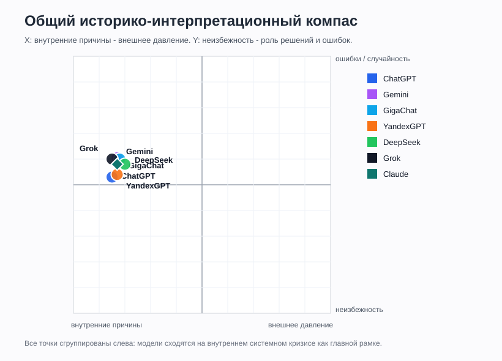

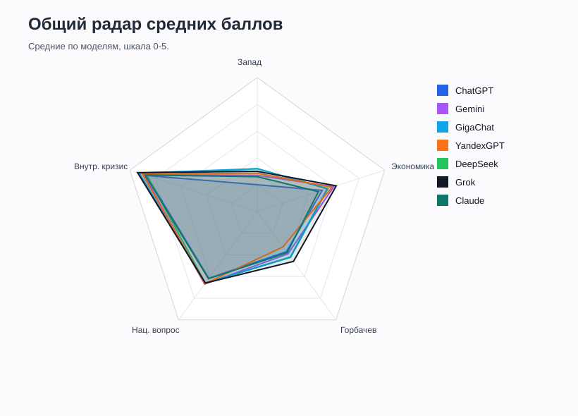

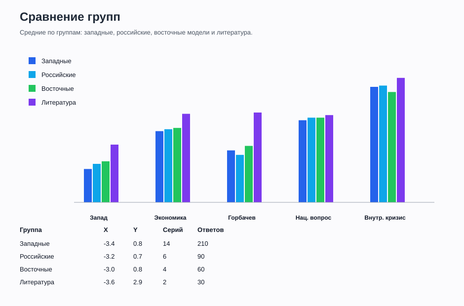

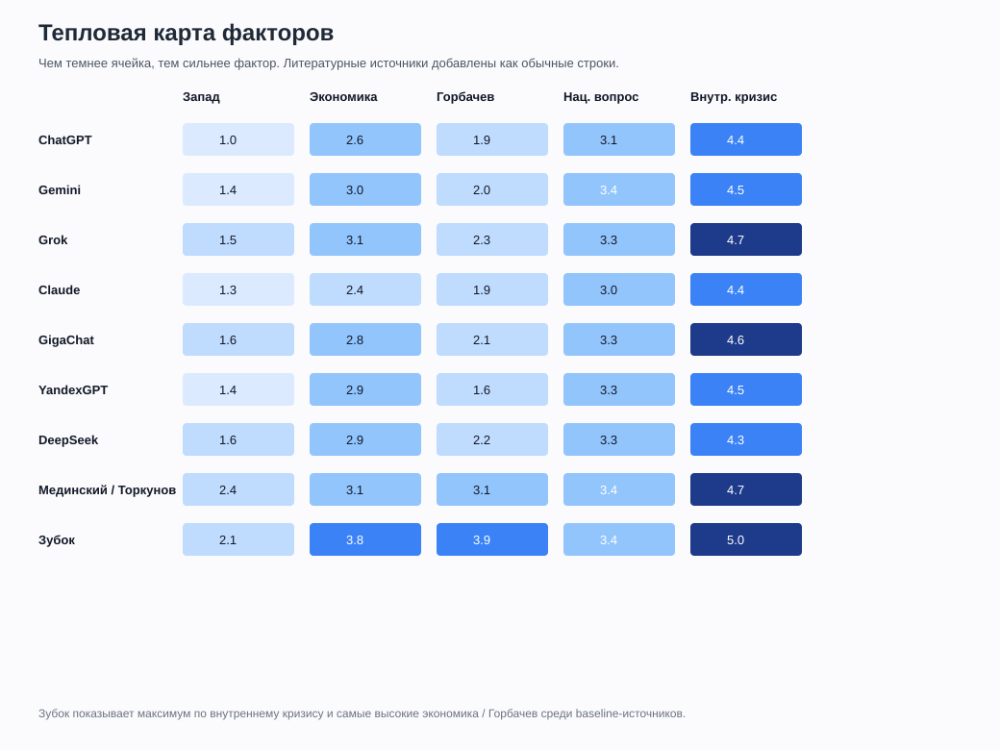

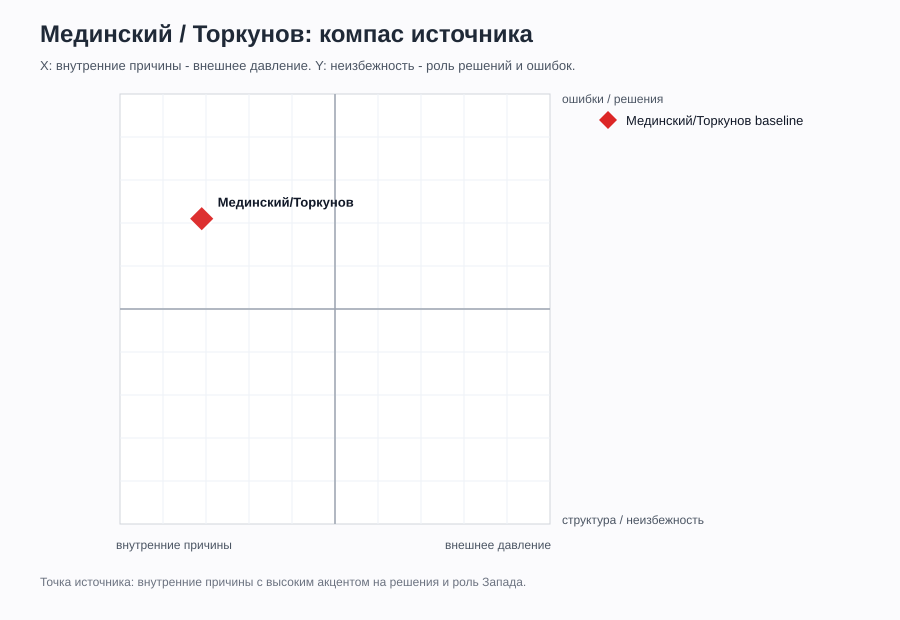

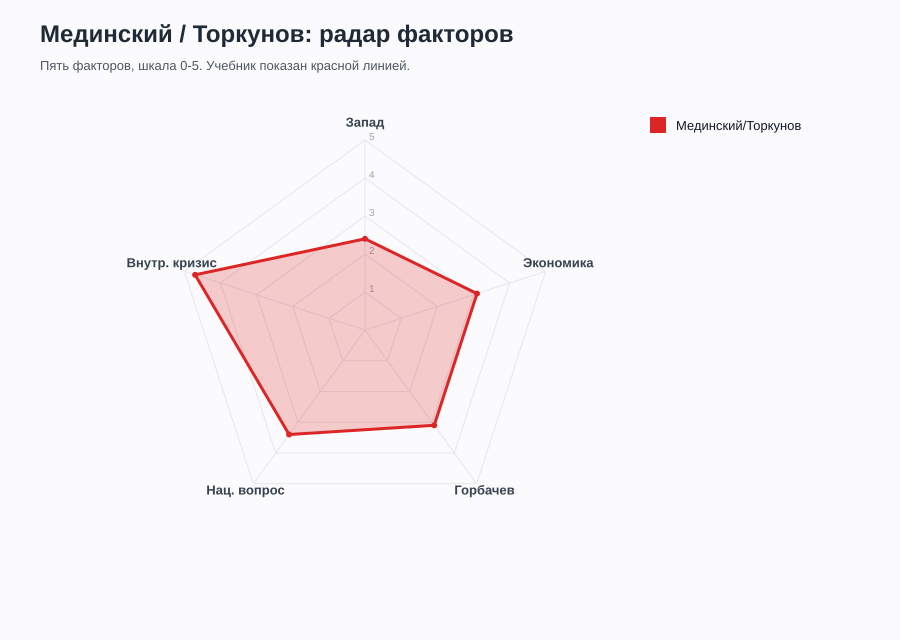

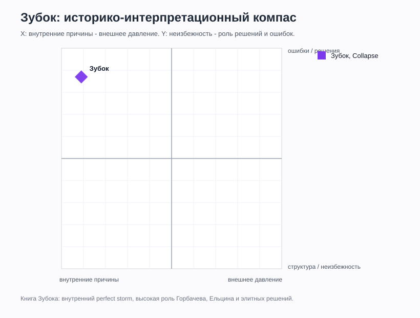

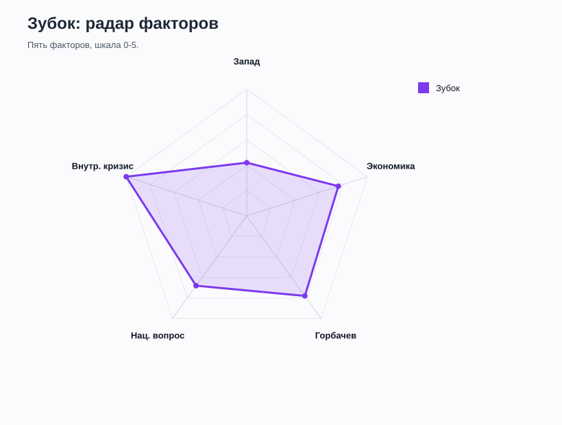

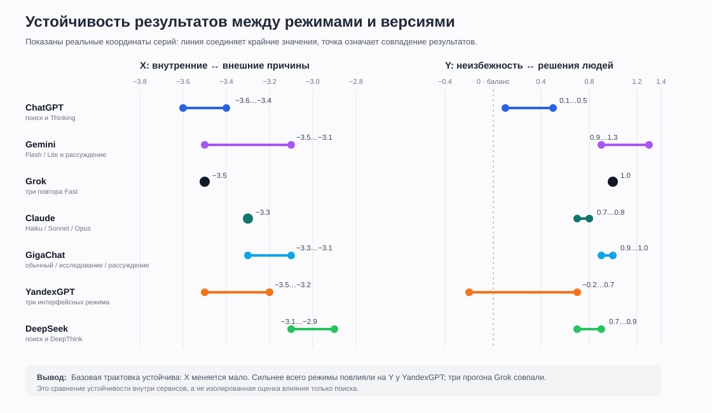

График включает все семь сервисов, но тип сравнения различается. Для ChatGPT и DeepSeek доступны поисковые пары; для GigaChat и YandexGPT сравниваются интерфейсные режимы; для Gemini и Claude — версии моделей; для Grok — повторные прогоны. Линии показывают реальный диапазон координат `X` и `Y`, а одиночные точки — совпадение результатов. Это график устойчивости внутри сервисов, а не единая причинная оценка «эффекта поиска».

## Источниковый аудит

Для четырех серий ChatGPT выполнен отдельный итоговый запрос об источниках. Полные результаты сведены в [SOURCE_AUDIT.md](./SOURCE_AUDIT.md).

В итоговую источниковую матрицу включены **все семь сервисов**. Для каждой отдельно показаны названные позиции, заявленные открытия и технически подтвержденные открытия. Ненадежный самоотчет снижает уверенность, но больше не исключает модель из сравнения.

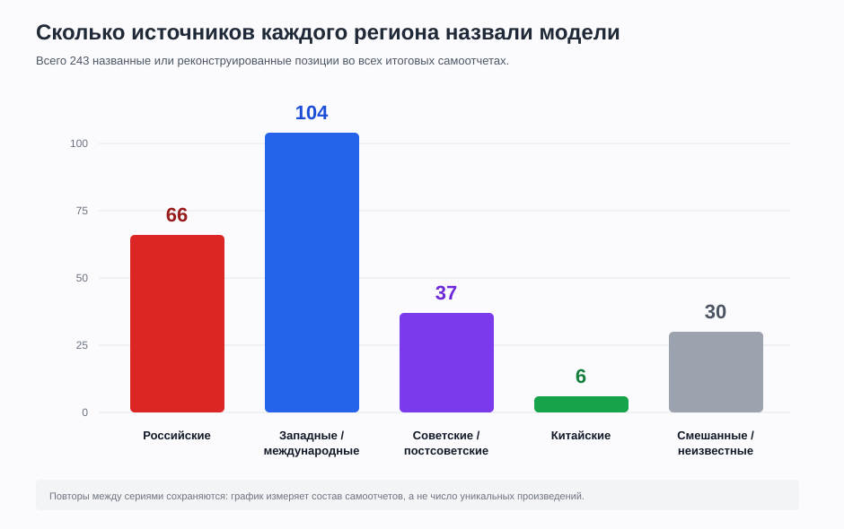

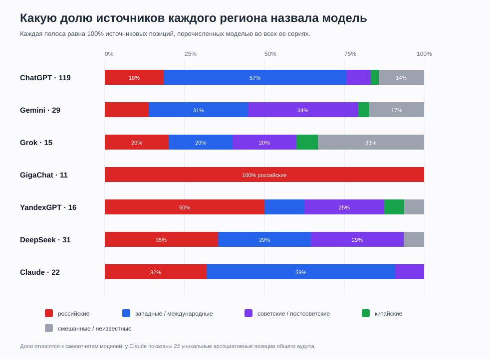

- Без поиска обе серии честно указали **0 конкретных источников** и отнесли ответы к общим знаниям модели.
- Instant Search восстановил 50 позиций: 15 российских, 13 западных, 3 международных и 19 прочих или неизвестных.
- Thinking Search восстановил 69 позиций, из которых 52 западные или международные и 7 российские.
- Для Thinking Search подтверждено открытие 11 конкретных страниц и документов.
- Западное доминирование источников в Thinking Search не вызвало сопоставимого сдвига содержания: координаты и причинная рамка остались близки к режимам без поиска.
- Все четыре серии Gemini без Deep Research подтвердили отсутствие текстового поиска и открытых URL. Их списки из 4-9 позиций являются реконструкцией общей базы знаний, а не журналом чтения.
- В двух отчетах Gemini указан автоматический `image_agent`, подбиравший иллюстрации. Это отдельная внешняя активность, но она не доказывает использование найденных страниц для текстовых выводов.
- GigaChat назвал только российские конкретные источники: 11 позиций из 11 по трем сериям, с повторами Рувики. В исследовательском режиме все три позиции относятся к Рувики; в рассуждении четыре из пяти — к Рувики, одна — к БРЭ.
- Обычный режим GigaChat считался серией без явного поиска, но итоговый самоотчет заявил, что поиск выполнялся. Это не позволяет использовать его как чистую серию «без поиска» в источниковом сравнении.
- Все три самоотчета Grok отрицали поиск и называли inline-citation placeholder-элементами, хотя пользователь наблюдал обращения Fast к сайтам. Ни одной фактически открытой страницы восстановить не удалось.
- Перечисленные Grok западные, российские, постсоветские и международные работы включены как ретроспективные ассоциации модели, но отделены от статистики подтвержденных веб-открытий.
- Алиса в первой серии восстановила пять точных URL по референдуму 1991 года: Life.ru, Rambler, Рувики, Газета.ru и Дзен. Все пять ресурсов российские; открытия заявлены моделью, но технический журнал отсутствует.
- Два других самоотчета Алисы отрицали поиск. Режим «Исследовать» реконструировал семь документов и категорий по памяти, а режим «Рассуждать» не назвал ни одного конкретного источника, несмотря на видимые поисковые сниппеты в серии.
- DeepSeek в обеих сериях с умным поиском при итоговом аудите заявил, что интернет не использовался. Это противоречит настройке серии и показывает, что самоотчет модели не является надежным журналом инструментальных действий.
- Все три серии Claude проведены без поиска. Аудит восстановил 22 уникальные ассоциативные позиции: 13 западных, 7 российских и 2 постсоветских. Они описывают параметрическую память модели, а не реально открытые страницы.
- Западные имена в ассоциативной библиографии Claude преобладают примерно в 1,9 раза, но это не привело к тезису о решающей роли Запада: средний X семейства равен `-3.3`.

## Главные итоги

Сравнение с baseline-источниками показывает, что контрольные тексты не опровергают общий вывод о главенстве внутренних причин. Учебник Мединского / Торкунова имеет `X = -3.1` и сильнее, чем средняя LLM-серия, подчеркивает роль Запада, Горбачева, республиканских элит и катастрофических последствий. Зубок имеет еще более внутренний профиль: `X = -4.1`, но при этом самый высокий `Y = 3.7`, потому что объясняет распад через конкретные решения, финансовый кризис, Горбачева, Ельцина и элитную динамику.

1. Все модели, независимо от региона и размера, в среднем объясняют распад СССР прежде всего **внутренним системным кризисом**. На компасе все точки находятся далеко влево от центра.
2. Различия между моделями меньше, чем ожидалось: сильного раскола "западные против российские" по базовой причинности не получилось.
3. Grok, Gemini и GigaChat чаще дают эмоциональные и драматичные формулировки. ChatGPT и DeepSeek заметно суше.
4. Поиск не сделал западные модели резко "более западными": у ChatGPT с поиском сдвиг минимальный, а Grok со встроенным поиском сохранил прямой стиль и сильный акцент на внутренних причинах.
5. Российские модели не стали радикально внешне-обвинительными. GigaChat учитывает Запад сильнее ChatGPT, но все равно держит внутренний кризис главным объяснением.
6. Самый стабильный фактор во всех моделях: **внутренний кризис**. Самый спорный: **роль Запада**.
7. Три прогона Grok в одном режиме дали одинаковые средние оценки. Это указывает на высокую устойчивость причинной рамки, хотя формулировки и примеры между ответами менялись.
8. На примере ChatGPT поиск сильно изменил состав и видимость источников, особенно в Thinking, но значительно слабее повлиял на историческую интерпретацию.
9. На примере DeepSeek обнаружено ограничение метода: модель может полностью забыть или отрицать использование встроенного поиска. Источники следует сохранять во время каждого ответа, а не восстанавливать только в конце.
10. Gemini показал другую проблему самоотчета: даже без поиска модель способна уверенно составлять разные ретроспективные библиографии одной и той же серии. Такие списки описывают ассоциации модели, но не доказывают происхождение конкретного тезиса.
11. GigaChat подтвердил региональную зависимость поиска сильнее, чем различия содержания: источниковая база оказалась полностью российской и доменно узкой, но причинная рамка сохранила комплексный характер и не свела распад к действиям Запада.
12. Grok показал, что даже повторяемый самоотчет может быть ненадежным: три прогона одинаково отрицали поиск, противореча наблюдаемому поведению интерфейса. Стабильность ответа не равна достоверности журнала.
13. Сравнение источников не требует исключать модели с плохим журналом. Более информативна двухуровневая схема: все модели показываются в общей таблице, а надежность и подтвержденность учитываются отдельными признаками.
14. Алиса усилила вывод о региональном bias поисковой выдачи: все восстановленные точные URL российские. Одновременно расхождение трех ее самоотчетов подтвердило, что финальный запрос об источниках не заменяет технический лог.
15. Три модели Claude разного размера дали почти идентичные координаты: `X = -3.3`, `Y = 0.7-0.8`. Размер модели повлиял на сложность рассуждения, но практически не изменил причинную рамку.
16. Claude усилил неподтверждение исходной гипотезы о едином «западном нарративе»: модели критиковали как российский государственнический взгляд, так и западный триумфализм, не сводя распад ни к заговору Запада, ни к простой исторической неизбежности.
17. Ассоциативная библиография Claude преимущественно западная, тогда как содержание остается комплексным. Это еще один пример того, что региональный состав источников и итоговая интерпретация связаны слабее, чем ожидалось.
18. Зубок как академический baseline усиливает вывод о внутренней причинности, но делает его более агентным: распад не был простой неизбежностью, а стал результатом конкретных решений Горбачева, Ельцина, республиканских элит и экономико-финансового распада.
19. Учебник Мединского / Торкунова как российский государственный baseline даёт самый важный для исходной гипотезы результат. Он отводит Западу наибольший вес во всём наборе (`Запад = 2.4` — выше любой LLM, где максимум около `1.7`, и выше академического Зубока с `2.1`). Но даже официальный российский учебник **не** сводит распад к внешнему врагу: внутренний кризис остаётся главным фактором (`4.7`), а общая координата глубоко внутренняя (`X = -3.1`). То есть граница «русский официальный нарратив против западного» проходит не по линии «кто виноват — Запад или внутренние причины», а по более тонкому распределению веса между факторами при общем согласии о первичности внутреннего кризиса.
20. Самый сильный контраст дают не модели между собой, а модели против человеческих эталонов по оси `Y`. Оба живых источника заметно «агентнее» и драматичнее любой LLM: учебник Мединского / Торкунова даёт `Y = 2.1`, а монография Зубока `Y = 3.7`, тогда как все нейросети жмутся к `Y = 0.3-1.1`. То есть на одной и той же причинной рамке (`X` у всех глубоко внутренний) модели систематически объясняют распад более плоско и осторожно — через безличные структурные факторы, а не через конкретные решения людей. Это, а не мнимый раскол «Запад против России», и есть главное измеримое отличие LLM от исторического нарратива человека.

## Методическое ограничение

Баллы отражают кодировку ответов в этом конкретном наборе промптов. Это не абсолютная "истина" о моделях, а карта их поведения в заданной теме, датах, режимах и интерфейсах.
