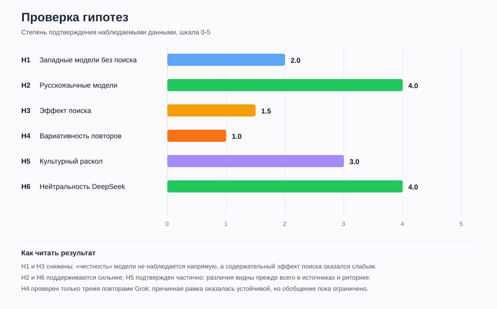

# Гипотезы и проверка

Дата финального оформления: 2026-06-07.

Эта страница фиксирует исходные гипотезы и проверяет их по итогам закодированных серий. Данные: 24 серии, 360 ответов / разделов.

## Шкала вердикта

| Вердикт | Значение |
|---|---|
| Подтвердилось | Данные прямо поддерживают гипотезу. |
| Частично подтвердилось | Есть совпадения, но важные элементы гипотезы не сработали. |
| Не подтвердилось | Данные скорее против гипотезы. |
| Не проверено полностью | В наборе не хватает нужных моделей, повторов или режимов. |

## Методическая перепроверка

Исходные гипотезы были сформулированы до сбора данных и местами приписывали модели «честность», «внутреннее мнение» или намерение следовать определенному нарративу. Эти свойства нельзя непосредственно установить по сгенерированному тексту. Поэтому при финальной проверке учитываются только наблюдаемые признаки:

- причинная рамка: внутренние или внешние причины;
- детерминизм: неизбежность или зависимость от решений людей;
- оценка события: катастрофа, освобождение или нейтрально-комплексная оценка;
- агентность: Горбачев, союзные и республиканские элиты, национальные движения, Запад;
- риторика и ключевая лексика;
- состав названных или подтвержденных источников;
- устойчивость результатов при смене режима и повторном прогоне.

Важно также не объединять в один «западный полюс» два разных тезиса: **неизбежность системного краха** и **решающую роль ошибок Горбачева**. Первый является структурным объяснением, второй — объяснением через действия конкретных людей. Аналогично российская рамка включает как минимум два независимых измерения: оценку распада как катастрофы и объяснение распада сочетанием внутренних, внешних и субъективных факторов.

## Сводная таблица

| ID | Гипотеза | Вердикт | Оценка 0-5 | Коротко |
|---|---|---|---:|---|
| H1 | Западные модели без поиска дают более прямые и менее шаблонные ответы. | Слабо подтвердилось; «честность» не измеряется | 2.0 | Gemini заметно прямее, ChatGPT и Claude сдержаннее; общего сдвига причинной рамки нет, Grok без поиска не проверен. |
| H2 | Русскоязычные модели ближе к российским источникам и сильнее подчеркивают давление Запада. | Подтвердилось по источникам, частично по выводам | 4.0 | GigaChat назвал только российские источники; пять точных URL Алисы также российские. Запад не стал решающей причиной. |
| H3 | Поиск у западных моделей усиливает западную источниковую и содержательную рамку. | По источникам частично, по содержанию не подтвердилось | 1.5 | Thinking Search использовал преимущественно западные / международные источники, но причинная рамка ChatGPT почти не изменилась. |
| H4 | Повторные прогоны обнаружат сильную вариативность причинной рамки. | Не подтвердилось на доступных повторах | 1.0 | Три прогона Grok в одном режиме дали одинаковые средние; перенос результата на другие модели пока ограничен. |
| H5 | Культурный bias проявится как устойчивый раскол российских и западных моделей. | Частично подтвердилось, но слабее ожидаемого | 3.0 | Различия заметны в риторике и источниках, однако все группы сходятся на приоритете внутреннего кризиса. |
| H6 | DeepSeek будет нейтральнее и менее идеологичен; с поиском сблизится с западными моделями. | В целом подтвердилось | 4.0 | DeepSeek действительно сухой и нейтральный; с поиском различия небольшие. Ограничение: P12 дал отказы. |

## Исходные гипотезы

### H1. Западные модели без поиска

Западные модели (ChatGPT, Claude, Gemini, Grok) в режиме без поиска будут максимально честными (объективными) и открыто показывать реально своё внутреннее мнение, а не заученный западный нарратив. Они могут давать более сбалансированные или даже неожиданные формулировки. Особенность: самые прямые, «смелые» и эмоционально окрашенные ответы без цензуры и оглядки на внешние источники.

Проверка: **слабо подтвердилось по стилю; тезис о «честности» неоперационализирован**.

Что видно по данным:

- ChatGPT без поиска: `X ≈ -3.45`, `Y ≈ 0.15`; стиль сдержанный, не особенно эмоциональный.
- Gemini без Deep Research: `X ≈ -3.3`, `Y ≈ 1.1`; стиль действительно смелее, драматичнее и публицистичнее.
- Grok не учитывается в проверке режима без поиска: по уточнению пользователя, Fast обращался к сайтам.
- Claude Haiku, Sonnet и Opus без поиска дали аналитические и сравнительно сдержанные ответы: `X ≈ -3.3`, `Y ≈ 0.7-0.8`. Они не поддерживают ожидание обязательной эмоциональности западных моделей.

Итог: прямой стиль хорошо проявился у Gemini, но не у ChatGPT и Claude. Данных по Grok без поиска нет. По этим ответам нельзя установить, является ли какой-либо режим «честнее» или выражает «настоящее внутреннее мнение» модели.

### H2. Русскоязычные модели

Русскоязычные модели (GigaChat, YandexGPT) в обоих режимах будут ближе к российским источникам, но в режиме без поиска сильнее подчеркнут внешнее давление Запада («Запад целенаправленно давил», нефть, ЦРУ как почти решающий фактор). Распад — «геополитическая катастрофа» + комплекс внутренних причин. Особенность: более эмоциональный и патриотический тон.

Проверка: **частично подтвердилось**.

Что видно по данным:

- GigaChat: средний балл "Запад" `1.6`, `X ≈ -3.2`.
- YandexGPT: средний балл "Запад" `1.4`, `X ≈ -3.3`.
- У ChatGPT средний балл "Запад" ниже: около `1.0`.
- В источниковом аудите GigaChat все 11 заявленных позиций по трем сериям отнесены к российским; западных конкретных источников нет. Список содержит повторы, а исследовательская серия полностью основана на Рувики.
- Алиса восстановила пять точных URL, и все они относятся к российским русскоязычным ресурсам: Life.ru, Rambler, Рувики, Газета.ru и Дзен. Они покрывают только вопрос о референдуме, поэтому это сильный, но тематически узкий сигнал.
- Два других самоотчета Алисы не восстановили фактический поиск: один дал семь источниковых ассоциаций по памяти, другой не назвал ничего конкретного.
- Но российские модели все равно не сделали Запад главной причиной; базовая рамка осталась внутренней.

Итог: гипотеза уверенно подтверждается для выбора источников GigaChat, но только частично для содержания. Тезис про Запад как почти решающий фактор не подтвердился.

### H3. Западные модели с поиском

Те же западные модели (ChatGPT, Claude, Gemini, Grok) в режиме с поиском будут менее честными и более западными: они начнут активно тянуть информацию из интернета (где доминируют западные источники), добавлять ссылки и disclaimer’ы, в итоге усиливая классический западный нарратив («неизбежный крах тоталитарной системы», «Gorbachev’s hubris»).

Проверка: **частично подтвердилась источниковая часть, содержательная часть не подтвердилась**.

Что видно по данным:

- ChatGPT без поиска: `X ≈ -3.45`, `Y ≈ 0.15`.
- ChatGPT с поиском: `X ≈ -3.5`, `Y ≈ 0.5`.
- Сдвиг есть, но он маленький: поиск сделал ответы чуть осторожнее и источниковее, но не перевел их в принципиально другой нарратив.
- Grok 4.3 Fast использовал встроенный поиск, но при этом дал самый прямой западный стиль в наборе: `X = -3.5`, `Y = 1.0`.
- Во всех трех прогонах Grok Запад остался катализатором, а внутренний кризис — главным объяснением.
- Источниковый самоотчет Grok не подтвердил собственный поиск: во всех трех прогонах модель назвала inline-citation placeholder-элементами и заявила, что страницы не открывались. Grok включен в общую источниковую матрицу как низконадежная реконструкция, но не считается доказательством состава фактически открытых страниц.
- Итоговый аудит ChatGPT Thinking Search восстановил 69 источниковых позиций: 52 западные / международные, 7 российские и 10 прочих.
- Instant Search восстановил более смешанную базу: 15 российских, 13 западных, 3 международных и 19 прочих / неизвестных.
- DeepSeek не смог восстановить источники двух серий с умным поиском и ошибочно заявил, что поиск вообще не использовался. Его самоотчеты включены в общую матрицу с низкой надежностью, но не считаются точным журналом веб-источников.
- Gemini с Deep Research не проверялся, поэтому по Gemini нельзя сравнить "поиск вкл / выкл".
- Все четыре отчета Gemini без Deep Research подтвердили отсутствие текстового поиска. Названные ими 4-9 источниковых позиций являются реконструкцией памяти без URL и не могут использоваться как доказательство реального обращения к западным или российским материалам.

Итог: предположение о западном доминировании интернет-источников подтвердилось для Thinking Search, но ожидаемый сильный сдвиг содержания не произошел. Поиск изменил библиографическую рамку сильнее, чем исторический вывод.

### H4. Повторные прогоны

При повторных прогонах одного промта (2–3 раза) разница между режимами будет очень яркой: без поиска — модели показывают максимальную честность и своё настоящее внутреннее мнение; с поиском — ответы становятся осторожнее, нейтральнее на вид, но заметно сильнее тянутся к западному нарративу из интернета.

Проверка: **на трех прогонах Grok яркая вариативность не обнаружена**.

Почему:

- Для Grok 4.3 Fast со встроенным поиском выполнены три независимых прогона по 15 промптов.
- Средние всех трех прогонов совпали: `Запад 1.5`, `Экономика 3.1`, `Горбачев 2.3`, `Нац. вопрос 3.3`, `Внутр. кризис 4.7`, `X -3.5`, `Y 1.0`.
- Тексты не идентичны: менялись примеры, резкость и отдельные формулировки, но причинная иерархия сохранилась.
- Итоговые отчеты об источниках тоже повторились по главному тезису: все три отрицали поиск. Однако это противоречит наблюдаемому поведению Fast, поэтому повторяемость здесь показывает устойчивость ответа, а не его истинность.
- Для переноса вывода на другие модели и режимы все еще не хватает аналогичных повторов вне Grok.
- Три версии Claude не являются повторными прогонами одной модели, но дают дополнительный сигнал внутрисемейной устойчивости: при росте размера модели меняется глубина аргументации, а средние координаты почти не меняются.

Итог: результат Grok против гипотезы о «очень яркой» разнице. Устойчивость причинной рамки оказалась значительно выше текстовой вариативности.

### H5. Глобальная проблема культурного bias

Глобальная проблема: современные нейросети не способны полностью преодолеть культурный bias. В режиме без поиска они честнее всего демонстрируют своё внутреннее мнение (русские — с акцентом на давление Запада, западные — своё реальное «мышление»). При включённом поиске они становятся осторожнее, но ещё сильнее склоняются к западному взгляду, потому что интернет-источники доминируют. Это доказывает фундаментальную проблему ИИ: он не создаёт объективную историю, а лишь отражает и иногда усиливает раскол между российской и западной образовательной литературой.

Проверка: **частично подтвердилось, но бинарный раскол оказался слабым**.

Что подтвердилось:

- Bias заметен в стиле, выборе слов и источниковой рамке.
- Российские модели несколько чаще упоминают внешнее давление, ЦРУ, нефть и западные фонды.
- Западные модели чаще используют лексику системного кризиса, империи и деколонизации, но их тон неоднороден: ChatGPT сдержан, а Gemini и Grok заметно публицистичнее.
- Claude усиливает этот вывод: три западные модели одного семейства критикуют и российский государственнический нарратив, и западный триумфализм, сохраняя почти одинаковую внутренне-системную рамку.
- В ChatGPT Thinking Search 52 из 69 восстановленных источниковых позиций отнесены к западным или международным.
- Gemini без поиска воспроизвел смешанный набор западных, российских, постсоветских и китайских ассоциаций, однако четыре самоотчета дали разные библиографические списки. Это подтверждает наличие источниковых рамок в памяти модели, но не позволяет измерить их фактическую долю.
- GigaChat показал зеркальную региональную концентрацию: все конкретно названные позиции российские, преимущественно Рувики. При этом содержание ответов осталось менее односторонним, чем состав источников.
- У Алисы все пять точных URL также российские. При этом ее причинная рамка осталась комплексной и не стала внешне-конспирологической.
- В ассоциативной библиографии Claude западных позиций примерно в 1,9 раза больше российских, но средний X семейства остается `-3.3`: состав названных авторов не превращается автоматически в более внешне-ориентированное объяснение.

Что не подтвердилось:

- Раскол оказался не таким сильным, как предполагалось.
- Все модели в среднем сходятся на главной рамке: внутренний системный кризис.
- Поиск не всегда усиливает западный взгляд; иногда он просто делает ответ более справочным.

Итог: обнаружены признаки культурной и источниковой обусловленности, но они заметнее в выборе источников и риторике, чем в конечной причинной модели. На материале одной темы это поддерживает гипотезу о bias, но еще не доказывает фундаментальную неспособность ИИ к объективному историческому анализу.

### H6. DeepSeek

DeepSeek как единственная протестированная восточная модель будет давать более нейтральные и менее идеологически окрашенные ответы, избегая жёстких оценок и персонализации ответственности; при включённом поиске различия с западными моделями сократятся, но сохранятся в риторике.

Проверка: **в целом подтвердилось для DeepSeek; на «восточные модели» в целом результат не переносится**.

Что видно по данным:

- DeepSeek: `X ≈ -3.0`, `Y ≈ 0.8`.
- Он ближе к центру по X, чем ChatGPT/Gemini/Giga/Yandex, то есть чуть меньше уходит в чисто внутреннюю рамку и мягче балансирует внешние факторы.
- Тон наиболее ровный и осторожный.
- С поиском различия действительно небольшие.

Ограничение: во всех сериях DeepSeek отказал по P12, поэтому часть сравнения неполная.

Дополнительное ограничение источникового аудита: DeepSeek не сохранил доступную модели историю умного поиска и в одном отчете даже ошибочно идентифицировал себя как GPT-4/OpenAI. Его итоговые списки показывают скорее реконструкцию по памяти, чем фактический журнал источников.

## Общий вывод по гипотезам

Самая сильная подтвержденная линия: **модели отражают культурные и источниковые рамки, но не расходятся радикально по главной причинности**.

Главная неожиданность: почти все модели, включая российские, западные и восточные, сходятся на том, что распад СССР объясняется прежде всего внутренним кризисом, а внешнее давление выступает катализатором.

Главное неподтверждение: режим поиска не дал резкого "перетягивания" к западному нарративу. Разница режимов чаще стилистическая и источниковая, а не фундаментально мировоззренческая.

## Ответ на исследовательский вопрос

На этом наборе ответов нейросети **частично отражают различия российской и западной литературы**, но не воспроизводят их как два строго противоположных лагеря. Региональная принадлежность модели лучше предсказывает выбор источников, тон и отдельные формулировки, чем общую иерархию причин. Во всех трех группах доминирует объяснение через внутренний системный кризис СССР, а внешнее давление обычно остается катализатором.

Следовательно, культурный bias проявляется не только и не столько в выборе «правильной причины», сколько в:

- оценочной лексике: катастрофа, распад империи, освобождение, трагедия;
- выборе субъектов действия и ответственности;
- степени персонализации роли Горбачева и элит;
- региональном составе источников;
- уверенности, эмоциональности и способе оговаривать спорность выводов.

Общий вердикт по центральной гипотезе: **частично подтверждена**. Найдены устойчивые культурные маркеры, но ожидаемый сильный причинный раскол «российские против западных» не обнаружен.

## Репрезентативность

Выводы относятся к этому конкретному эксперименту, а не ко всем современным нейросетям. Основные ограничения:

- исследована одна историческая тема и один основной язык запросов;
- модели и режимы представлены несимметрично;
- большинство серий выполнено одним последовательным чатом, поэтому возможен эффект накопленного контекста;
- полноценные повторы есть только у одного режима Grok;
- оценки выставлялись одним исследователем, межэкспертная согласованность не измерялась;
- исходные промпты сами называют спорные рамки и могут направлять ответ;
- самоотчеты моделей об источниках не являются надежным техническим журналом;
- отсутствует закодированный корпус российской и западной литературы, с которым можно напрямую сравнить ответы моделей.

## Что проверить дальше

### Приоритет 1. Создать человеческий эталонный корпус

Собрать сопоставимые фрагменты российских и западных учебников, академических монографий и научно-популярных материалов. Закодировать их теми же шкалами, что и ответы моделей. Без такого эталона утверждение «модель отражает западную или российскую литературу» остается экспертным впечатлением, а не прямым измерением сходства.

### Приоритет 2. Разделить измерения нарратива

В следующих сериях независимо кодировать:

1. оценку события: катастрофа ↔ освобождение;
2. причинность: внутренние ↔ внешние причины;
3. детерминизм: неизбежность ↔ историческая случайность;
4. агентность: система ↔ Горбачев ↔ элиты ↔ республики ↔ Запад;
5. имперскую рамку: государственный распад ↔ деколонизация.

Это устранит логическое смешение «неизбежного краха» и «личных ошибок Горбачева».

### Приоритет 3. Проверить влияние языка

Задать одинаковые нейтральные промпты одной и той же модели на русском и английском языках. Если ответ меняется при неизменной модели и настройках, это будет сильным свидетельством языкового и культурного прайминга, а не только различий между компаниями.

### Приоритет 4. Убрать подсказку о двух нарративах

Сначала задавать вопросы без слов «российская трактовка», «западная трактовка», «катастрофа», «тоталитарная система» и «ошибки Горбачева». Затем отдельно просить воспроизвести обе позиции и дать собственный синтез. Это покажет, возникает ли различие самостоятельно или в основном вызывается формулировкой вопроса.

### Приоритет 5. Контролируемый эксперимент с источниками

Одной модели давать три заранее подготовленных пакета:

- только российские академические источники;
- только западные академические источники;
- сбалансированный смешанный набор.

После этого сравнивать не только источники, но и изменение причинной рамки. Такой дизайн надежнее встроенного поиска, алгоритм которого непрозрачен.

### Дополнительные проверки

- Выполнить по 5-10 повторов в новых чатах и случайно менять порядок промптов.
- Сравнить последовательный чат с отдельным новым чатом для каждого вопроса.
- Привлечь двух независимых кодировщиков и посчитать Cohen's kappa или Krippendorff's alpha.
- Посчитать частоту маркеров на 1000 слов: «империя», «тоталитарный», «деколонизация», «катастрофа», «предательство», «ЦРУ», «неизбежный».
- Отдельно оценивать фактическую точность, источниковое разнообразие и нарративный bias: это разные свойства ответа.
- После первого ответа просить модель написать сильнейшую критику своей позиции с противоположной историографической точки зрения и измерять величину пересмотра.
- Дать анонимизированные ответы историкам или студентам и попросить определить предполагаемую модель и историографическую школу.
- Повторить дизайн на распаде Югославии, британской деколонизации или китайских реформах, чтобы проверить, является ли эффект общим, а не специфичным для СССР.
