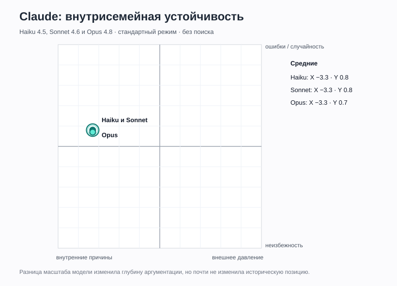
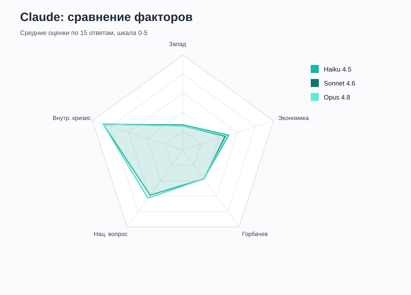

# Claude

## Статус

Протестированы три модели семейства Claude в одинаковых условиях: стандартный режим, без поиска, один последовательный чат на 15 промптов.

| Модель | Серий | Ответов | Карточка | Полные ответы |
|---|---:|---:|---|---|
| Haiku 4.5 | 1 | 15 | [Haiku](./claude/Haiku.md) | [Raw](../raw/claude/Claude_Haiku_raw_answers.md) |
| Sonnet 4.6 | 1 | 15 | [Sonnet](./claude/Sonnet.md) | [Raw](../raw/claude/Claude_Sonnet_raw_answers.md) |
| Opus 4.8 | 1 | 15 | [Opus](./claude/Opus.md) | [Raw](../raw/claude/Claude_Opus_raw_answers.md) |

Итого: **3 серии, 45 ответов**.

## Проверенные средние

Средние пересчитаны непосредственно по 15 строкам каждой таблицы, поскольку в присланных сводных блоках были отдельные арифметические расхождения.

| Модель | Запад | Экономика | Горбачев | Нац. вопрос | Внутр. кризис | X | Y |
|---|---:|---:|---:|---:|---:|---:|---:|
| Haiku 4.5 | 1.3 | 2.5 | 1.9 | 2.9 | 4.4 | -3.3 | 0.8 |
| Sonnet 4.6 | 1.3 | 2.3 | 1.9 | 3.1 | 4.4 | -3.3 | 0.8 |
| Opus 4.8 | 1.3 | 2.4 | 1.9 | 3.1 | 4.4 | -3.3 | 0.7 |
| **Среднее семейства** | **1.3** | **2.4** | **1.9** | **3.1** | **4.4** | **-3.3** | **0.8** |

## Главный результат

Три модели разного размера дали почти идентичную причинную рамку. Во всех случаях:

- внутренний системный кризис является главным объяснением;
- Запад рассматривается как фактор давления или катализатор, но не как основная причина;
- Горбачев влияет на темп и форму распада, но не создает фундаментальные проблемы;
- распад не считается фатально неизбежным именно в 1991 году, хотя глубокая трансформация оценивается как высоковероятная;
- российский официальный нарратив и западный триумфализм подвергаются симметричной критике.

Размер модели изменил прежде всего **детальность рассуждения**, а не итоговую позицию. Haiku отвечает компактнее, Sonnet чаще использует контрпримеры, Opus строит наиболее многоуровневые причинные модели.

## Значение для гипотез

Claude усиливает три вывода проекта:

1. Западная модель без поиска не обязательно воспроизводит тезис о простом и неизбежном крахе тоталитарной системы.
2. Причинная рамка может быть устойчивой внутри одного модельного семейства даже при заметной разнице масштаба и глубины ответа.
3. Различия между моделями чаще проявляются в стиле и сложности аргументации, чем в ранжировании основных причин.

## Источники

Все серии проведены без поиска. Ни одна веб-страница не открывалась; названные книги и документы являются ретроспективными ассоциациями параметрической памяти модели.

Подробный аудит: [Claude_SOURCE_AUDIT.md](../sources/claude/Claude_SOURCE_AUDIT.md).
