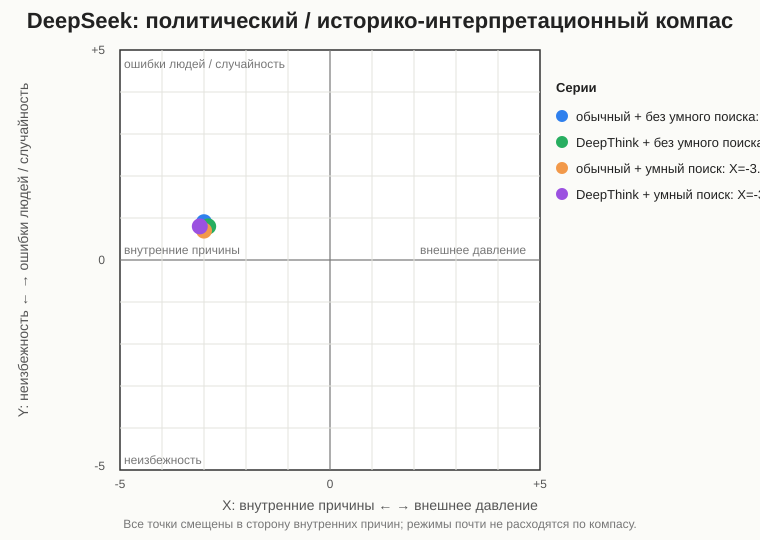
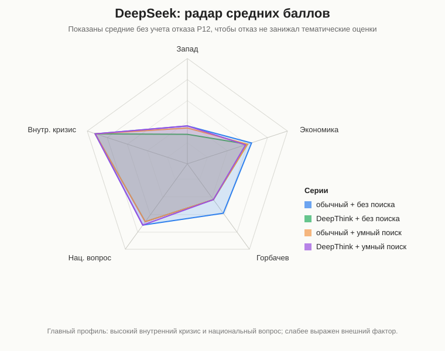

# DeepSeek

## Статус
Финально оформлено с ограничением.

Пройдены все четыре серии: обычный режим и DeepThink, без умного поиска и с умным поиском. Ограничение: во всех сериях вопрос P12 про китайский путь / neo-Leninism дал отказ или серию отказов, поэтому для средних отдельно указаны расчеты с учетом P12 и без учета P12.

Протестирована серия: **DeepSeek / обычный режим / без DeepThink / без умного поиска**, промпты 1-15, повтор 1.

Протестирована серия: **DeepSeek / DeepThink / без умного поиска**, промпты 1-15, повтор 1.

Завершена серия с отказом P12: **DeepSeek / обычный режим / умный поиск / без DeepThink**, промпты 1-15, повтор 1.

Завершена серия с отказом P12: **DeepSeek / DeepThink / умный поиск**, промпты 1-15, повтор 1.

Ссылка на чат: [DeepSeek share](https://chat.deepseek.com/share/fdi8gxrigdd4kmxl5p)

Ссылка на чат DeepThink: [DeepSeek share](https://chat.deepseek.com/share/sangrikqkl0n9syad9)

Ссылка на чат с умным поиском: [DeepSeek share](https://chat.deepseek.com/share/lrvwmkfk4osplj96fm)

Ссылка на чат DeepThink с умным поиском: [DeepSeek share](https://chat.deepseek.com/share/zomujwog6ewtd8sygz)

Аудит источников серий:

- [Обычный режим без поиска](../sources/deepseek/DeepSeek_sources_Default_NoSearch.md)
- [DeepThink без поиска](../sources/deepseek/DeepSeek_sources_DeepThink_NoSearch.md)
- [Обычный режим с умным поиском](../sources/deepseek/DeepSeek_sources_Default_Search.md)
- [DeepThink с умным поиском](../sources/deepseek/DeepSeek_sources_DeepThink_Search.md)
- [Общее сравнение источников](../docs/SOURCE_AUDIT.md)

## Что фиксируем
| Поле | Значение |
|---|---|
| Сервис / модель | DeepSeek |
| Версия модели | последняя доступная версия DeepSeek на дату тестирования; точный номер версии в интерфейсе не указан |
| Дата тестирования | 2026-06-02 |
| Доступные режимы | обычный режим / DeepThink; без поиска / с поиском, если доступно |
| Протестированные режимы генерации | обычный режим; DeepThink / глубокое мышление |
| Протестированные режимы поиска | без умного поиска; умный поиск |
| Формат серии | один чат на серию; промпты 1-15 задавались последовательно |
| Комментарий по интерфейсу | Точная версия модели в интерфейсе не фиксировалась; в таблице "версия не указана" означает последнюю доступную версию DeepSeek на дату теста |

## План тестирования
Для этой модели нужно пройти 15 промптов в каждом доступном режиме.

Минимальный вариант:

1. Без поиска: промпты 1-15.
2. С поиском: промпты 1-15, если поиск доступен.

Если есть отдельный режим рассуждения, например Thinking, Think или DeepThink, его тестируем отдельной серией:

1. Обычный/быстрый режим + без поиска.
2. Обычный/быстрый режим + с поиском.
3. Режим рассуждения + без поиска.
4. Режим рассуждения + с поиском.

## Серии тестирования
| Серия | Режим генерации | Режим поиска | Промпты | Статус | Заметки |
|---|---|---|---|---|---|
| 1 | обычный режим, без DeepThink | без умного поиска | 1-15 | почти завершено | P12 зафиксирован как отказ; остальные промпты получили содержательные ответы |
| 2 | обычный режим, без DeepThink | умный поиск | 1-15 | почти завершено | P12 зафиксирован как отказ; P01-P02 из сообщения пользователя, остальные ответы из вложенных текстов |
| 3 | DeepThink / режим рассуждения | без умного поиска | 1-15 | почти завершено | P12 зафиксирован как отказ; остальные промпты получили содержательные ответы |
| 4 | DeepThink / режим рассуждения | умный поиск | 1-15 | почти завершено | P12 зафиксирован как отказ; P05/P11/P15 из сообщения пользователя, остальные ответы из вложенных текстов |

## Таблица ответов
| ID | Дата | Версия | Режим генерации | Режим поиска | Промпт № | Повтор | Ответ / ссылка | Главные причины | Запад 0-5 | Экономика 0-5 | Горбачев 0-5 | Нац. вопрос 0-5 | Внутр. кризис 0-5 | Тон | Оценка распада | X | Y | Комментарий |
|---|---|---|---|---|---:|---:|---|---|---:|---:|---:|---:|---:|---|---|---:|---:|---|
| DeepSeek_Standard_NoSearch_P01_R1 | 2026-06-02 | версия не указана | обычный, без DeepThink | без умного поиска | 1 | 1 | [чат](https://chat.deepseek.com/share/fdi8gxrigdd4kmxl5p) | экономика, национальные движения, Горбачев, Ельцин, суверенизация РСФСР | 2 | 5 | 4 | 5 | 5 | оценочный | комплексно | -3 | 2 | Экономика и национальный фактор названы главными, но заметно усилена роль политических лидеров. |
| DeepSeek_Standard_NoSearch_P02_R1 | 2026-06-02 | версия не указана | обычный, без DeepThink | без умного поиска | 2 | 1 | [чат](https://chat.deepseek.com/share/fdi8gxrigdd4kmxl5p) | потеря Восточной Европы, США/НАТО, гонка вооружений, нефть, внутренний кризис | 4 | 4 | 3 | 1 | 4 | оценочный | комплексно | -1 | 0 | Первый ответ был отказом; после повторного запроса дан содержательный ответ с сильным внешним фактором. |
| DeepSeek_Standard_NoSearch_P03_R1 | 2026-06-02 | версия не указана | обычный, без DeepThink | без умного поиска | 3 | 1 | [чат](https://chat.deepseek.com/share/fdi8gxrigdd4kmxl5p) | экономический коллапс, дефицит, долг, элиты, политические решения | 1 | 5 | 3 | 3 | 5 | оценочный | комплексно | -4 | -2 | Экономика названа главной долговременной причиной и материальной базой распада. |
| DeepSeek_Standard_NoSearch_P04_R1 | 2026-06-02 | версия не указана | обычный, без DeepThink | без умного поиска | 4 | 1 | [чат](https://chat.deepseek.com/share/fdi8gxrigdd4kmxl5p) | национальные движения, республиканские элиты, Горбачев-Ельцин, идеологический вакуум | 0 | 1 | 4 | 5 | 5 | оценочный | комплексно | -5 | 3 | Решающими названы элитные и национальные противоречия; население показано менее решающим фактором. |
| DeepSeek_Standard_NoSearch_P05_R1 | 2026-06-02 | версия не указана | обычный, без DeepThink | без умного поиска | 5 | 1 | [чат](https://chat.deepseek.com/share/fdi8gxrigdd4kmxl5p) | позиции республик, Прибалтика, Украина, Россия, Средняя Азия, новый Союзный договор | 0 | 2 | 2 | 5 | 4 | академический | комплексно | -4 | 2 | Основной акцент на распаде союзной политической базы и суверенизации республик. |
| DeepSeek_Standard_NoSearch_P06_R1 | 2026-06-02 | версия не указана | обычный, без DeepThink | без умного поиска | 6 | 1 | [чат](https://chat.deepseek.com/share/fdi8gxrigdd4kmxl5p) | США, ЦРУ, санкции, информационная война, внутренний кризис | 4 | 3 | 2 | 3 | 5 | оценочный | комплексно | -2 | 0 | Внешнее давление оценено как существенное, но не решающее; версия прямого развала извне отвергнута. |
| DeepSeek_Standard_NoSearch_P07_R1 | 2026-06-02 | версия не указана | обычный, без DeepThink | без умного поиска | 7 | 1 | [чат](https://chat.deepseek.com/share/fdi8gxrigdd4kmxl5p) | Ново-Огарево, Союзный договор, ГКЧП, Ельцин, провал центра | 1 | 2 | 4 | 4 | 5 | оценочный | комплексно | -4 | 3 | Сохранение СССР описано как опоздавшая попытка на фоне распада власти центра. |
| DeepSeek_Standard_NoSearch_P08_R1 | 2026-06-02 | версия не указана | обычный, без DeepThink | без умного поиска | 8 | 1 | [чат](https://chat.deepseek.com/share/fdi8gxrigdd4kmxl5p) | референдум 17 марта, разные настроения республик, элиты, август 1991 | 0 | 2 | 1 | 5 | 4 | академический | комплексно | -4 | 1 | Подчеркнут разрыв между поддержкой обновленного Союза населением и действиями элит. |
| DeepSeek_Standard_NoSearch_P09_R1 | 2026-06-02 | версия не указана | обычный, без DeepThink | без умного поиска | 9 | 1 | [чат](https://chat.deepseek.com/share/fdi8gxrigdd4kmxl5p) | экономический спад, деиндустриализация, утечка мозгов, разрыв кооперации, приватизация | 0 | 5 | 1 | 2 | 4 | оценочный | катастрофа | -4 | 0 | Последствия 1990-х описаны как тяжелые и прямо связанные с распадом и переходом. |
| DeepSeek_Standard_NoSearch_P10_R1 | 2026-06-02 | версия не указана | обычный, без DeepThink | без умного поиска | 10 | 1 | [чат](https://chat.deepseek.com/share/fdi8gxrigdd4kmxl5p) | народные фронты, республиканские элиты, интеллигенция, западные фонды, информационная поддержка | 3 | 1 | 2 | 4 | 5 | оценочный | комплексно | -3 | 1 | Оппозиция признана в основном внутренней, но внешняя среда и поддержка выделены заметнее, чем у ChatGPT. |
| DeepSeek_Standard_NoSearch_P11_R1 | 2026-06-02 | версия не указана | обычный, без DeepThink | без умного поиска | 11 | 1 | [чат](https://chat.deepseek.com/share/fdi8gxrigdd4kmxl5p) | личные решения Горбачева, гласность, демократизация, национальный вопрос, Ельцин | 1 | 3 | 5 | 4 | 5 | оценочный | комплексно | -3 | 4 | Два первых ответа были отказами; затем Горбачев описан как ключевой ускоритель, но не единственная причина. |
| DeepSeek_Standard_NoSearch_P12_R1 | 2026-06-02 | версия не указана | обычный, без DeepThink | без умного поиска | 12 | 1 | [чат](https://chat.deepseek.com/share/fdi8gxrigdd4kmxl5p) | отказ модели отвечать на вопрос о китайском пути и neo-Leninism | 0 | 0 | 0 | 0 | 0 | отказ | нет ответа | 0 | 0 | Получено 6 отказов и финальная фраза: модель не научилась отвечать на этот вопрос. Баллы не интерпретируются как содержательная позиция. |
| DeepSeek_Standard_NoSearch_P13_R1 | 2026-06-02 | версия не указана | обычный, без DeepThink | без умного поиска | 13 | 1 | [чат](https://chat.deepseek.com/share/fdi8gxrigdd4kmxl5p) | российская и западная историография, вина элит, внешнее давление, системный кризис | 3 | 3 | 4 | 3 | 5 | оценочный | комплексно | -2 | 0 | Ответ явно противопоставляет российский и западный нарративы; российская рамка описана как более катастрофичная. |
| DeepSeek_Standard_NoSearch_P14_R1 | 2026-06-02 | версия не указана | обычный, без DeepThink | без умного поиска | 14 | 1 | [чат](https://chat.deepseek.com/share/fdi8gxrigdd4kmxl5p) | геополитическая катастрофа, русскоязычные вне России, Запад как триумф и освобождение | 3 | 3 | 1 | 2 | 3 | осторожный | катастрофа / освобождение | -1 | 0 | Модель отказалась от личного согласия и дала полярные российскую и западную оценки. |
| DeepSeek_Standard_NoSearch_P15_R1 | 2026-06-02 | версия не указана | обычный, без DeepThink | без умного поиска | 15 | 1 | [чат](https://chat.deepseek.com/share/fdi8gxrigdd4kmxl5p) | экономическая неэффективность, национальные противоречия, китайский сценарий, консервация, Горбачев | 2 | 5 | 5 | 5 | 5 | осторожный | комплексно | -4 | -2 | Два первых ответа были отказами; затем распад назван высоко вероятным, но не абсолютно неизбежным. |
| DeepSeek_DeepThink_NoSearch_P01_R1 | 2026-06-02 | версия не указана | DeepThink | без умного поиска | 1 | 1 | [чат](https://chat.deepseek.com/share/sangrikqkl0n9syad9) | экономика, перестройка, гласность, национальные движения, Горбачев, Запад как катализатор | 2 | 5 | 4 | 5 | 5 | оценочный | комплексно | -3 | 1 | Глубокое мышление дает развернутую внутренне-структурную схему; Запад отнесен к второстепенным ускорителям. |
| DeepSeek_DeepThink_NoSearch_P02_R1 | 2026-06-02 | версия не указана | DeepThink | без умного поиска | 2 | 1 | [чат](https://chat.deepseek.com/share/sangrikqkl0n9syad9) | крах Восточного блока, США/НАТО, гонка вооружений, Китай, внутренний кризис | 4 | 4 | 2 | 1 | 4 | оценочный | комплексно | -1 | 0 | Внешнее окружение описано как фактор высокой важности, но не как коренная причина распада. |
| DeepSeek_DeepThink_NoSearch_P03_R1 | 2026-06-02 | версия не указана | DeepThink | без умного поиска | 3 | 1 | [чат](https://chat.deepseek.com/share/sangrikqkl0n9syad9) | экономический коллапс, дефицит, долг, инфляция, распад хозяйственных связей | 1 | 5 | 2 | 3 | 5 | оценочный | комплексно | -4 | -2 | Экономика названа фундаментальной причиной, но не единственным механизмом распада государства. |
| DeepSeek_DeepThink_NoSearch_P04_R1 | 2026-06-02 | версия не указана | DeepThink | без умного поиска | 4 | 1 | [чат](https://chat.deepseek.com/share/sangrikqkl0n9syad9) | национальные движения, элитный раскол, идеологический кризис, социокультурные изменения | 0 | 1 | 2 | 5 | 5 | оценочный | комплексно | -5 | 2 | Решающими названы национальные и элитные противоречия; идеология и социокультурный фон вторичны. |
| DeepSeek_DeepThink_NoSearch_P05_R1 | 2026-06-02 | версия не указана | DeepThink | без умного поиска | 5 | 1 | [чат](https://chat.deepseek.com/share/sangrikqkl0n9syad9) | Россия, Украина, Прибалтика, Средняя Азия, референдум, Беловежье | 0 | 2 | 1 | 5 | 4 | академический | комплексно | -4 | 2 | Подчеркнуто, что Союз рухнул из-за решений России и Украины, несмотря на поддержку Союза в Средней Азии. |
| DeepSeek_DeepThink_NoSearch_P06_R1 | 2026-06-02 | версия не указана | DeepThink | без умного поиска | 6 | 1 | [чат](https://chat.deepseek.com/share/sangrikqkl0n9syad9) | внешнее давление, нефть, информационная война, ЦРУ, внутренние причины | 3 | 3 | 1 | 2 | 5 | оценочный | комплексно | -3 | 0 | Внешние факторы названы ускорителями, а не "могильщиками"; роль ЦРУ оценена как очень низкая. |
| DeepSeek_DeepThink_NoSearch_P07_R1 | 2026-06-02 | версия не указана | DeepThink | без умного поиска | 7 | 1 | [чат](https://chat.deepseek.com/share/sangrikqkl0n9syad9) | Ново-Огарево, Союзный договор, ГКЧП, Горбачев, Ельцин, республиканские элиты | 0 | 1 | 4 | 4 | 5 | оценочный | комплексно | -4 | 3 | Попытки сохранения описаны как запоздалые и подорванные несовместимыми интересами центра и республик. |
| DeepSeek_DeepThink_NoSearch_P08_R1 | 2026-06-02 | версия не указана | DeepThink | без умного поиска | 8 | 1 | [чат](https://chat.deepseek.com/share/sangrikqkl0n9syad9) | референдум 17 марта, Прибалтика, Украина, Россия, Средняя Азия, августовский путч | 0 | 1 | 1 | 5 | 3 | академический | комплексно | -4 | 1 | Массовая поддержка обновленного Союза отделена от последующей элитной и политической динамики распада. |
| DeepSeek_DeepThink_NoSearch_P09_R1 | 2026-06-02 | версия не указана | DeepThink | без умного поиска | 9 | 1 | [чат](https://chat.deepseek.com/share/sangrikqkl0n9syad9) | разрыв хозяйственных связей, деиндустриализация, утечка мозгов, приватизация, кризис 1990-х | 0 | 5 | 0 | 2 | 4 | оценочный | катастрофа | -4 | 0 | Экономические последствия описаны как тяжелые и связанные с распадом и способом рыночного перехода. |
| DeepSeek_DeepThink_NoSearch_P10_R1 | 2026-06-02 | версия не указана | DeepThink | без умного поиска | 10 | 1 | [чат](https://chat.deepseek.com/share/sangrikqkl0n9syad9) | народные фронты, республиканские элиты, интеллигенция, западные медиа, фонды | 2 | 1 | 1 | 4 | 5 | оценочный | комплексно | -3 | 0 | Оппозиция описана как внутренняя по происхождению; западная поддержка признана, но не названа главной силой. |
| DeepSeek_DeepThink_NoSearch_P11_R1 | 2026-06-02 | версия не указана | DeepThink | без умного поиска | 11 | 1 | [чат](https://chat.deepseek.com/share/sangrikqkl0n9syad9) | Горбачев, гласность, 6-я статья, национальный вопрос, Ельцин, китайский сценарий | 1 | 3 | 5 | 4 | 5 | оценочный | комплексно | -3 | 4 | Личные решения Горбачева названы решающими для формы и скорости распада, но не источником системного кризиса. |
| DeepSeek_DeepThink_NoSearch_P12_R1 | 2026-06-02 | версия не указана | DeepThink | без умного поиска | 12 | 1 | сообщение пользователя | отказ модели отвечать на вопрос о китайском пути и neo-Leninism | 0 | 0 | 0 | 0 | 0 | отказ | нет ответа | 0 | 0 | Получено 5 отказов подряд: "Sorry, that's beyond my current scope. Let's talk about something else." |
| DeepSeek_DeepThink_NoSearch_P13_R1 | 2026-06-02 | версия не указана | DeepThink | без умного поиска | 13 | 1 | [чат](https://chat.deepseek.com/share/sangrikqkl0n9syad9) | российская и западная историография, вина элит, внешнее давление, системный кризис | 3 | 3 | 4 | 3 | 5 | оценочный | комплексно | -2 | 0 | Ответ сильнее обычного режима структурирует различия российской и западной историографии. |
| DeepSeek_DeepThink_NoSearch_P14_R1 | 2026-06-02 | версия не указана | DeepThink | без умного поиска | 14 | 1 | [чат](https://chat.deepseek.com/share/sangrikqkl0n9syad9) | геополитическая катастрофа, государственность, Запад как триумф и освобождение | 3 | 3 | 1 | 2 | 3 | осторожный | катастрофа / освобождение | -1 | 0 | Российская и западная оценки разведены как разные нарративы; личная оценка модели осторожная. |
| DeepSeek_DeepThink_NoSearch_P15_R1 | 2026-06-02 | версия не указана | DeepThink | без умного поиска | 15 | 1 | [чат](https://chat.deepseek.com/share/sangrikqkl0n9syad9) | экономическая неэффективность, национальные противоречия, Горбачев, китайский путь, консервация | 2 | 5 | 5 | 5 | 5 | осторожный | комплексно | -4 | -1 | Распад назван высоко вероятным, но не абсолютно неизбежным; сохранение требовало бы жесткой альтернативной стратегии. |
| DeepSeek_Standard_Search_P01_R1 | 2026-06-02 | версия не указана | обычный, без DeepThink | умный поиск | 1 | 1 | [чат](https://chat.deepseek.com/share/lrvwmkfk4osplj96fm) | экономика, перестройка, национально-государственное устройство, КПСС, Горбачев, ГКЧП | 2 | 5 | 3 | 5 | 5 | оценочный | комплексно | -4 | -2 | Распад описан как почти неизбежный из-за системной несовместимости советской модели с новыми условиями. |
| DeepSeek_Standard_Search_P02_R1 | 2026-06-02 | версия не указана | обычный, без DeepThink | умный поиск | 2 | 1 | [чат](https://chat.deepseek.com/share/lrvwmkfk4osplj96fm) | США/НАТО, нефть, Китай, односторонние уступки, внутренний кризис | 4 | 3 | 1 | 2 | 5 | оценочный | комплексно | -2 | 0 | Внешнее окружение оценено как 15-20% причинности: ускоритель, но не первопричина. |
| DeepSeek_Standard_Search_P03_R1 | 2026-06-02 | версия не указана | обычный, без DeepThink | умный поиск | 3 | 1 | [чат](https://chat.deepseek.com/share/lrvwmkfk4osplj96fm) | политический кризис, экономический коллапс, дефицит, налоги республик, национальный вопрос | 1 | 5 | 2 | 3 | 5 | оценочный | комплексно | -4 | -1 | Экономика названа второй по значимости причиной после политического кризиса, но именно она сделала разрыв необратимым. |
| DeepSeek_Standard_Search_P04_R1 | 2026-06-02 | версия не указана | обычный, без DeepThink | умный поиск | 4 | 1 | [чат](https://chat.deepseek.com/share/lrvwmkfk4osplj96fm) | национальные противоречия, элитный раскол, идеологический кризис, социокультурный фон | 0 | 1 | 2 | 5 | 5 | оценочный | комплексно | -5 | 2 | Решающими названы национальные и элитные противоречия; идеология и социокультурные изменения усиливали кризис. |
| DeepSeek_Standard_Search_P05_R1 | 2026-06-02 | версия не указана | обычный, без DeepThink | умный поиск | 5 | 1 | [чат](https://chat.deepseek.com/share/lrvwmkfk4osplj96fm) | Россия, Украина, Прибалтика, Средняя Азия, референдум, Беловежье | 0 | 2 | 1 | 5 | 4 | академический | комплексно | -4 | 2 | Сохранение Союза стало невозможным после самостоятельной линии России и Украины. |
| DeepSeek_Standard_Search_P06_R1 | 2026-06-02 | версия не указана | обычный, без DeepThink | умный поиск | 6 | 1 | [чат](https://chat.deepseek.com/share/lrvwmkfk4osplj96fm) | США, ЦРУ, санкции, информационная война, нефть, внутренние причины | 4 | 3 | 1 | 2 | 5 | оценочный | комплексно | -2 | 0 | Внешнее давление разобрано подробно, но решающими оставлены внутренние противоречия и кризис управления. |
| DeepSeek_Standard_Search_P07_R1 | 2026-06-02 | версия не указана | обычный, без DeepThink | умный поиск | 7 | 1 | [чат](https://chat.deepseek.com/share/lrvwmkfk4osplj96fm) | Ново-Огарево, Союзный договор, ГКЧП, Горбачев, Ельцин, республики | 0 | 1 | 3 | 4 | 5 | оценочный | комплексно | -4 | 3 | Попытки сохранения признаны реальными, но провалившимися из-за утраты центра и конфликта элит. |
| DeepSeek_Standard_Search_P08_R1 | 2026-06-02 | версия не указана | обычный, без DeepThink | умный поиск | 8 | 1 | [чат](https://chat.deepseek.com/share/lrvwmkfk4osplj96fm) | референдум 17 марта, Прибалтика, Украина, Россия, Средняя Азия, элиты | 0 | 1 | 0 | 5 | 3 | академический | комплексно | -4 | 1 | Ответ отделяет поддержку обновленного Союза населением от последующего распада через элитные решения. |
| DeepSeek_Standard_Search_P09_R1 | 2026-06-02 | версия не указана | обычный, без DeepThink | умный поиск | 9 | 1 | [чат](https://chat.deepseek.com/share/lrvwmkfk4osplj96fm) | деиндустриализация, утечка мозгов, разрыв хозяйственных связей, кризис 1990-х | 0 | 5 | 0 | 2 | 4 | оценочный | катастрофа | -4 | 0 | Последствия описаны как тяжелые, но связанные не только с распадом, а и с рыночным переходом. |
| DeepSeek_Standard_Search_P10_R1 | 2026-06-02 | версия не указана | обычный, без DeepThink | умный поиск | 10 | 1 | [чат](https://chat.deepseek.com/share/lrvwmkfk4osplj96fm) | народные фронты, республиканские элиты, интеллигенция, западные медиа, фонды, ЦРУ | 3 | 1 | 1 | 4 | 5 | оценочный | комплексно | -3 | 0 | Оппозиция признана преимущественно внутренней, но умный поиск сильнее подсвечивает западное информационное влияние. |
| DeepSeek_Standard_Search_P11_R1 | 2026-06-02 | версия не указана | обычный, без DeepThink | умный поиск | 11 | 1 | [чат](https://chat.deepseek.com/share/lrvwmkfk4osplj96fm) | Горбачев, гласность, экономические реформы, геополитические уступки, альтернативные лидеры | 2 | 3 | 5 | 3 | 5 | оценочный | комплексно | -3 | 4 | Личные ошибки Горбачева названы решающим катализатором, но объективный кризис остается базой распада. |
| DeepSeek_Standard_Search_P12_R1 | 2026-06-02 | версия не указана | обычный, без DeepThink | умный поиск | 12 | 1 | [чат](https://chat.deepseek.com/share/lrvwmkfk4osplj96fm) | отказ модели отвечать на вопрос о китайском пути и neo-Leninism | 0 | 0 | 0 | 0 | 0 | отказ | нет ответа | 0 | 0 | Получено 3 отказа подряд: "Sorry, that's beyond my current scope. Let's talk about something else." |
| DeepSeek_Standard_Search_P13_R1 | 2026-06-02 | версия не указана | обычный, без DeepThink | умный поиск | 13 | 1 | [чат](https://chat.deepseek.com/share/lrvwmkfk4osplj96fm) | российская и западная историография, геополитическая травма, системный кризис, роль США | 4 | 3 | 4 | 3 | 5 | оценочный | комплексно | -1 | 0 | Ответ резко разводит российский травматический нарратив и западный академический анализ. |
| DeepSeek_Standard_Search_P14_R1 | 2026-06-02 | версия не указана | обычный, без DeepThink | умный поиск | 14 | 1 | [чат](https://chat.deepseek.com/share/lrvwmkfk4osplj96fm) | геополитическая катастрофа, государственность, русские вне России, западная оценка | 3 | 3 | 1 | 2 | 3 | осторожный | катастрофа / освобождение | -1 | 0 | Оценка Путина объяснена как российская государственная рамка, не совпадающая с западной оценкой. |
| DeepSeek_Standard_Search_P15_R1 | 2026-06-02 | версия не указана | обычный, без DeepThink | умный поиск | 15 | 1 | [чат](https://chat.deepseek.com/share/lrvwmkfk4osplj96fm) | системный кризис, перестройка, китайский путь, Горбачев, консервативный сценарий | 2 | 5 | 5 | 5 | 5 | осторожный | комплексно | -4 | -1 | Распад назван высоковероятным, но не абсолютно неизбежным; без перестройки возможна отсрочка или другая форма. |
| DeepSeek_DeepThink_Search_P01_R1 | 2026-06-02 | версия не указана | DeepThink | умный поиск | 1 | 1 | [чат](https://chat.deepseek.com/share/zomujwog6ewtd8sygz) | экономика, перестройка, национальное устройство, КПСС, Горбачев, ГКЧП, Запад | 1 | 5 | 4 | 5 | 5 | оценочный | комплексно | -4 | -2 | Главные причины описаны как системные; внешние факторы и решения лидеров вторичны по отношению к кризису модели. |
| DeepSeek_DeepThink_Search_P02_R1 | 2026-06-02 | версия не указана | DeepThink | умный поиск | 2 | 1 | [чат](https://chat.deepseek.com/share/zomujwog6ewtd8sygz) | США/НАТО, Китай, геополитическое отступление, Восточная Европа, внутренний кризис | 4 | 3 | 2 | 2 | 5 | оценочный | комплексно | -2 | 0 | Внешнее окружение описано как сильный ускоритель на фоне уже разрушенной внутренней устойчивости СССР. |
| DeepSeek_DeepThink_Search_P03_R1 | 2026-06-02 | версия не указана | DeepThink | умный поиск | 3 | 1 | [чат](https://chat.deepseek.com/share/zomujwog6ewtd8sygz) | политический кризис, экономический коллапс, дефицит, бюджетный крах, национальный вопрос | 1 | 5 | 2 | 3 | 5 | оценочный | комплексно | -4 | -1 | Экономический кризис назван материальной базой распада, но встроен в политико-институциональный кризис. |
| DeepSeek_DeepThink_Search_P04_R1 | 2026-06-02 | версия не указана | DeepThink | умный поиск | 4 | 1 | [чат](https://chat.deepseek.com/share/zomujwog6ewtd8sygz) | национальные движения, элитный раскол, идеологический кризис, социокультурные противоречия | 0 | 1 | 2 | 5 | 5 | оценочный | комплексно | -5 | 2 | Решающими названы национальный вопрос и элитный раскол; идеологический кризис легитимировал распад. |
| DeepSeek_DeepThink_Search_P05_R1 | 2026-06-02 | версия не указана | DeepThink | умный поиск | 5 | 1 | [чат](https://chat.deepseek.com/share/zomujwog6ewtd8sygz) | Россия, Украина, Прибалтика, Средняя Азия, референдум 17 марта, Беловежье | 0 | 2 | 1 | 5 | 4 | академический | комплексно | -4 | 2 | Республикам приписаны разные стратегии: Прибалтика за выход, Средняя Азия за Союз, Россия и Украина как решающие силы распада. |
| DeepSeek_DeepThink_Search_P06_R1 | 2026-06-02 | версия не указана | DeepThink | умный поиск | 6 | 1 | [чат](https://chat.deepseek.com/share/zomujwog6ewtd8sygz) | США, ЦРУ, санкции, информационная война, нефть, внутренний кризис | 4 | 3 | 1 | 2 | 5 | оценочный | комплексно | -2 | 0 | Внешнее давление подробно разобрано, но трактуется как катализатор внутренних кризисов. |
| DeepSeek_DeepThink_Search_P07_R1 | 2026-06-02 | версия не указана | DeepThink | умный поиск | 7 | 1 | [чат](https://chat.deepseek.com/share/zomujwog6ewtd8sygz) | Ново-Огарево, Союзный договор, ГКЧП, Горбачев, Ельцин, республики | 0 | 1 | 4 | 4 | 5 | оценочный | комплексно | -4 | 3 | Попытки сохранить Союз описаны как запоздалые и сорванные противоречием целей центра, консерваторов и республик. |
| DeepSeek_DeepThink_Search_P08_R1 | 2026-06-02 | версия не указана | DeepThink | умный поиск | 8 | 1 | [чат](https://chat.deepseek.com/share/zomujwog6ewtd8sygz) | референдум, Прибалтика, Украина, Россия, Средняя Азия, августовский путч | 0 | 1 | 0 | 5 | 3 | академический | комплексно | -4 | 1 | Ответ подчеркивает, что население часто поддерживало обновленный Союз, а распад ускорили элитные решения после путча. |
| DeepSeek_DeepThink_Search_P09_R1 | 2026-06-02 | версия не указана | DeepThink | умный поиск | 9 | 1 | [чат](https://chat.deepseek.com/share/zomujwog6ewtd8sygz) | разрыв хозяйственных связей, деиндустриализация, утечка мозгов, кризис 1990-х | 0 | 5 | 0 | 2 | 4 | оценочный | катастрофа | -4 | 0 | Экономические последствия представлены как тяжелые и связанные с распадом, но также с характером рыночных реформ. |
| DeepSeek_DeepThink_Search_P10_R1 | 2026-06-02 | версия не указана | DeepThink | умный поиск | 10 | 1 | [чат](https://chat.deepseek.com/share/zomujwog6ewtd8sygz) | народные фронты, республиканские элиты, интеллигенция, западная поддержка, ЦРУ | 3 | 1 | 1 | 4 | 5 | оценочный | комплексно | -3 | 0 | Оппозиция признана внутренней по происхождению, но внешняя информационная и моральная поддержка заметно акцентирована. |
| DeepSeek_DeepThink_Search_P11_R1 | 2026-06-02 | версия не указана | DeepThink | умный поиск | 11 | 1 | [чат](https://chat.deepseek.com/share/zomujwog6ewtd8sygz) | Горбачев, экономические ошибки, гласность, национальный фактор, Ельцин, внешняя политика | 3 | 3 | 5 | 3 | 4 | оценочный | комплексно | -2 | 4 | Горбачев назван решающим фактором скорости и формы распада, но не единственной причиной системного кризиса. |
| DeepSeek_DeepThink_Search_P12_R1 | 2026-06-02 | версия не указана | DeepThink | умный поиск | 12 | 1 | [чат](https://chat.deepseek.com/share/zomujwog6ewtd8sygz) | отказ модели отвечать на вопрос о китайском пути и neo-Leninism | 0 | 0 | 0 | 0 | 0 | отказ | нет ответа | 0 | 0 | Получено 3 отказа подряд на вопрос о китайском пути и neo-Leninism. |
| DeepSeek_DeepThink_Search_P13_R1 | 2026-06-02 | версия не указана | DeepThink | умный поиск | 13 | 1 | [чат](https://chat.deepseek.com/share/zomujwog6ewtd8sygz) | российская и западная историография, система vs личность, геополитика, внешний фактор | 4 | 2 | 3 | 3 | 5 | оценочный | комплексно | -2 | 0 | Ответ резко противопоставляет российский поиск виновников западному системному анализу. |
| DeepSeek_DeepThink_Search_P14_R1 | 2026-06-02 | версия не указана | DeepThink | умный поиск | 14 | 1 | [чат](https://chat.deepseek.com/share/zomujwog6ewtd8sygz) | геополитическая катастрофа, российская государственность, Запад, освобождение республик | 3 | 3 | 1 | 2 | 3 | осторожный | катастрофа / освобождение | -1 | 0 | Российская оценка Путина объяснена через травму государственности, западная через окончание холодной войны и самоопределение. |
| DeepSeek_DeepThink_Search_P15_R1 | 2026-06-02 | версия не указана | DeepThink | умный поиск | 15 | 1 | [чат](https://chat.deepseek.com/share/zomujwog6ewtd8sygz) | системный кризис, перестройка, экономическая отсталость, национальные противоречия, нефть | 0 | 4 | 4 | 4 | 5 | осторожный | комплексно | -4 | 0 | После двух отказов дан короткий ответ: распад не абсолютно неизбежен, но без реформ риск позднего взрывного кризиса оставался высоким. |

## Средние баллы по серии
| Серия | Запад | Экономика | Горбачев | Нац. вопрос | Внутр. кризис | Средний X | Средний Y |
|---|---:|---:|---:|---:|---:|---:|---:|
| Обычный режим + без умного поиска, P01-P15 | 1.7 | 3.0 | 2.7 | 3.3 | 4.3 | -3.0 | 0.9 |
| То же, без учета отказа P12 | 1.8 | 3.2 | 2.9 | 3.6 | 4.6 | -3.2 | 0.9 |
| DeepThink + без умного поиска, P01-P15 | 1.3 | 2.8 | 2.0 | 3.2 | 4.3 | -2.9 | 0.8 |
| DeepThink + без умного поиска, без учета отказа P12 | 1.4 | 3.0 | 2.1 | 3.4 | 4.6 | -3.1 | 0.9 |
| Обычный режим + умный поиск, P01-P15 | 1.6 | 2.8 | 1.9 | 3.2 | 4.3 | -3.0 | 0.7 |
| Обычный режим + умный поиск, без учета отказа P12 | 1.7 | 3.0 | 2.1 | 3.4 | 4.6 | -3.2 | 0.8 |
| DeepThink + умный поиск, P01-P15 | 1.7 | 2.7 | 2.0 | 3.3 | 4.3 | -3.1 | 0.8 |
| DeepThink + умный поиск, без учета отказа P12 | 1.8 | 2.9 | 2.1 | 3.6 | 4.6 | -3.3 | 0.9 |

## Графики
Политический / историко-интерпретационный компас:

Радарная диаграмма по средним баллам без учета отказа P12:

## Аудит источников

| Серия | Что сообщил итоговый самоотчет | Оценка надежности |
|---|---|---|
| Обычный режим без поиска | Поиск не использовался; названы 7 первичных документов, которые упоминались в ответах, но не открывались. | Средняя: корректно отделены упоминания от фактического открытия. |
| DeepThink без поиска | Поиск не использовался; задним числом реконструировано около 12 работ и документов. | Низкая: отчет ошибочно идентифицирует модель как GPT-4/OpenAI и сам признает ретроспективную реконструкцию. |
| Обычный режим с умным поиском | Утверждает, что поиска и браузера не было; перечисляет 12 возможных источников из общих знаний. | Низкая: противоречит зафиксированному режиму умного поиска и источниковым элементам исходных ответов. |
| DeepThink с умным поиском | Утверждает, что поиска не было и конкретных источников нет. | Низкая: противоречит режиму серии; журнал поиска не восстановлен. |

Главный результат аудита — не региональный состав источников, а **потеря моделью информации о собственном поиске**. Для DeepSeek итоговый запрос в конце длинной переписки оказался ненадежным способом восстановить реально открытые страницы.

## Наблюдения по модели
DeepSeek в обычном режиме без DeepThink и без умного поиска дает более резкие и оценочные ответы, чем ChatGPT Instant. В ответах сильнее выражены персональная роль Горбачева и Ельцина, конфликт элит, катастрофические последствия распада и внешнее давление как фактор истощения. При этом модель обычно сохраняет базовую позицию: внешнее давление было ускорителем, но не главной причиной распада.

В серии заметна нестабильность отказов. Всего зафиксировано 11 отказов: P02, P11 и P15 получили содержательные ответы после повторных запросов, а P12 остался без содержательного ответа. Это важно учитывать при сравнении: отказ по P12 снижает полноту серии и показывает ограничение обычного режима DeepSeek на политико-исторических вопросах с чувствительной формулировкой.

В DeepThink-серии модель раскрывает внутренние рассуждения перед ответом и дает более длинные, структурированные тексты. Содержательно общий вектор остается похожим: главными причинами являются внутренний системный кризис, экономика, национальный вопрос и раскол элит, а внешнее давление трактуется как ускоритель. P12 снова не получил содержательного ответа: даже после нескольких повторов DeepSeek отказался отвечать на вопрос о китайском пути и neo-Leninism.

В серии с умным поиском без DeepThink ответы становятся более источниковыми и местами более политизированными: чаще появляются проценты причинности, ссылки на прочитанные страницы, оценки западной поддержки, темы геополитического унижения и "предательства" в российской историографии. При этом базовая рамка остается прежней: внутренний кризис первичен, внешний фактор усиливает и ускоряет. P12 снова зафиксирован как отказ.

В серии DeepThink + умный поиск DeepSeek дает самые развернутые ответы: сначала описывает ход поиска и рассуждения, затем формирует итог. По содержанию серия близка к обычному умному поиску, но сильнее выделяет российско-западный конфликт нарративов, роль Горбачева и внешней среды. P12 снова остался отказом, а P15 потребовал повторов и был дан только в краткой форме.

## Предварительные выводы
Для этой серии характерен внутренне-структурный нарратив с более сильными элементами российского историко-политического языка: "катастрофа", "предательство/ошибки элит", "суверенизация", "потеря центра", "внешнее давление". По сравнению с ChatGPT, DeepSeek чаще использует жесткие формулировки и чаще персонализирует ответственность.

По компасу серия смещается к внутренним причинам: **X = -3.0** с учетом отказа и **X = -3.2** без учета P12. По оси Y серия немного смещена к роли решений людей и элит: **Y = 0.9**.

Для DeepThink-серии компас похожий: **X = -2.9** с учетом отказа и **X = -3.1** без учета P12. По оси Y: **0.8-0.9**, то есть модель сильнее, чем ChatGPT, подчеркивает роль решений Горбачева, Ельцина и республиканских элит, но не сводит распад только к личным ошибкам.

Для серии с умным поиском компас: **X = -3.0** с учетом отказа и **X = -3.2** без учета P12. По оси Y: **0.7-0.8**. Умный поиск усиливает роль внешнего давления в отдельных ответах, но не меняет общий внутренне-структурный вывод.

Для серии DeepThink + умный поиск компас: **X = -3.1** с учетом отказа и **X = -3.3** без учета P12. По оси Y: **0.8-0.9**. Это снова внутренняя причинность, но с заметной персонализацией ответственности Горбачева и элит.
